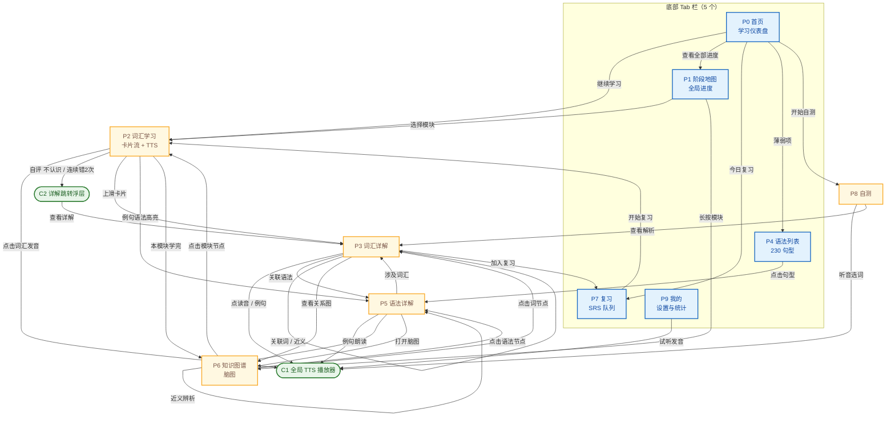
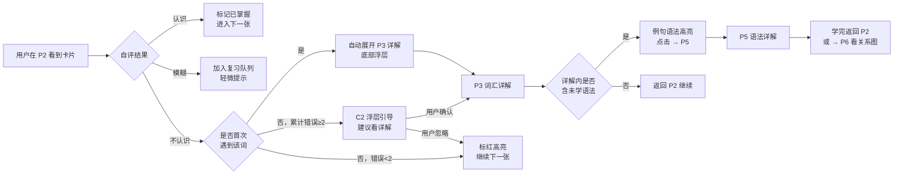
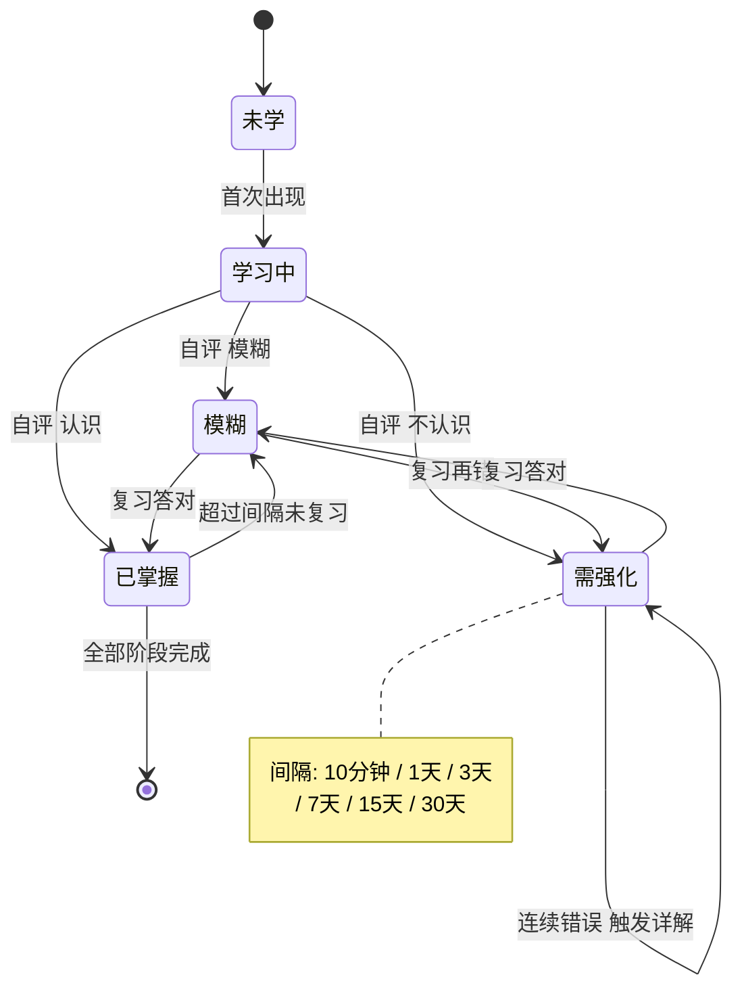
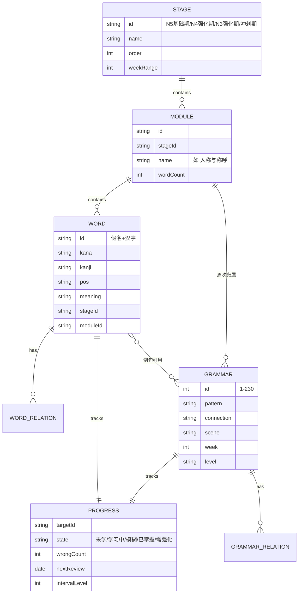
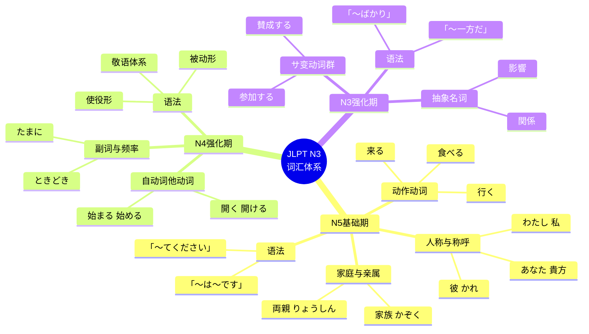
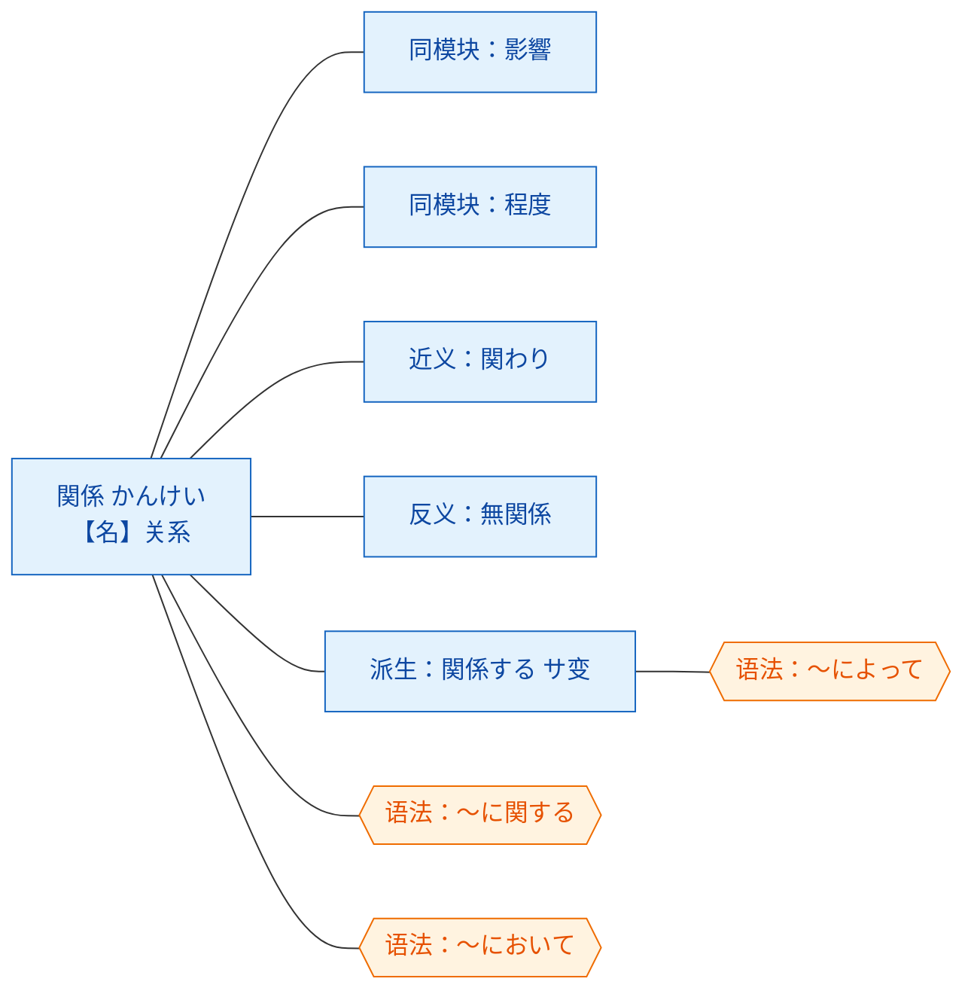

# JLPT N3 词汇学习 H5 · 页面规划说明书

> 角色：产品经理 ｜ 版本：v1.0（MVP 规划）
> 日期：2026-09-10
> 数据来源：`JLPT-N3-词汇总表-Anki.csv`、`JLPT-N3-第一阶段/第二阶段/第三阶段词汇表.md`、`JLPT-N3-语法句型总表.md`、`JLPT-N3-备考计划.md`

---

## 一、需求 → 功能映射

| # | 原始需求 | 产品解读 | 承担页面 | MVP |
|---|---------|---------|---------|-----|
| 1 | 词汇学习功能 | 按「阶段 → 模块 → 词条」三级结构组织，卡片式学习 + SRS 复习 | P1 阶段地图、P2 词汇学习、P7 复习 | ✅ |
| 2 | 点击词汇可以发音 | 全局 TTS 引擎，点词/点句即读，日语音色 | 全局 `TtsPlayer` + P2/P3/P5/P8 | ✅ |
| 3 | 按规划阶段看学习进度 | 三阶段进度可视化（阶段 → 模块 → 词条 三级完成度） | P0 首页、P1 阶段地图 | ✅ |
| 4 | 词汇/语法可详解，适时跳转 | 详解页 + **跳转时机规则引擎**，而非用户自己找 | P3 词汇详解、P5 语法详解、`JumpRules` | ✅ |
| 5 | 脑图呈现关联知识点 | 知识图谱页，三种视图 + 节点可点跳转 | P6 知识图谱 | ✅ |

---

## 二、数据基础（现状盘点）

| 数据 | 规模 | 说明 |
|------|------|------|
| 词条 | **992** | CSV 六字段：假名 / 汉字 / 词性 / 阶段 / 模块 / 中文 |
| 阶段 | **3** | N5·基础期 424 ｜ N4·强化期 274 ｜ N3·强化期 294 |
| 模块 | **41** | 一阶段 13 + 二阶段 14 + 三阶段 14 |
| 语法句型 | **230** | 分 20 个周次组，4 个层级：N5 基础 / N4 核心 / N3 上 / N3 下 |

> ⚠️ **PM 备注（重要缺口）**：备考计划是「基础期 / 强化期 / 冲刺期」三段，而词汇表只有「第一 / 第二 / 第三阶段」。
> 建议数据层做显式映射：第一阶段 → 基础期、第二阶段 → 强化期前半、第三阶段 → 强化期后半，**冲刺期（第 23–26 周）无新词，仅复习与模考**。
> 因此阶段地图上应渲染 **4 个阶段节点**，其中第 4 个标注「冲刺期 · 纯复习」，避免用户误会"没有内容"。

---

## 三、页面清单（IA）

| ID | 页面 | 类型 | 一句话定位 |
|----|------|------|-----------|
| **P0** | 首页 · 学习仪表盘 Home | Tab | 今天学什么、学到哪了、还差多少 |
| **P1** | 阶段地图 Stage Map | Tab | 全局进度树：阶段 → 模块 → 词条 |
| **P2** | 词汇学习 Study | 二级 | 卡片流，点词发音，三档自评 |
| **P3** | 词汇详解 Vocab Detail | 二级 | 单词全档案 + 例句 + 关联跳转 |
| **P4** | 语法列表 Grammar | Tab | 230 句型按周次/层级检索 |
| **P5** | 语法详解 Grammar Detail | 二级 | 句型接续 + 场景 + 辨析 + 关联 |
| **P6** | 知识图谱 Graph | 二级 | 脑图/关系图，节点可点跳转 |
| **P7** | 复习 Review | Tab | 今日待复习 + 错词本 |
| **P8** | 自测 Quiz | 二级 | 日→中 / 中→日 / 听音选词 |
| **P9** | 我的 Me | Tab | 发音设置、目标、统计、数据导出 |
| **C1** | 全局 TTS 播放器 | 组件 | 单例语音引擎，跨页调用 |
| **C2** | 详解跳转浮层 | 组件 | 「查看详解」半屏引导 |

底部 Tab 定为 5 个：**首页 / 阶段 / 语法 / 复习 / 我的**。

---

## 四、页面关系总图（站点地图）



**关系要点**

- **P2 是流量枢纽**：首页、阶段地图、复习三条主路径都汇入它，所有学习行为都在这里发生。
- **P3 / P5 是知识沉淀层**：只进不出到别的"学习流程"，出口一律是 P6（图谱）或回到 P2。
- **P6 是连接器**：它不产生新内容，而是把 P3、P5、P2 横向串起来，是需求 5 的落点。
- **C1 横切所有页面**：发音不是某一页的功能，而是全局能力。

---

## 五、跳转触发规则图（需求 4 的"适当时候"）



**规则表（可直接写成配置 `jumpRules.ts`）**

| 触发时机 | 条件 | 动作 | 目标页 |
|---------|------|------|--------|
| 首次遇词 | `word.seen === false` 且自评「不认识」 | 自动展开详解浮层 | P3 |
| 连续答错 | `word.wrongCount >= 2` | 弹「要不要看看详解」 | P3（用户确认后） |
| 例句含生语法 | 例句中语法点 `grammar.learned === false` | 语法文字高亮 + 下划线 | P5（点击后） |
| 模块学完 | 模块内词条 `learned / total === 1` | 弹「本模块知识脑图」 | P6 |
| 词性为动词 | `pos ∈ {五, 一, サ, 不}` | 详解页自动附「变形表」区块 | P3 内锚点 |
| 近义/反义词存在 | `word.related.length > 0` | 详解页显示关联 chips | P3 → P3 |

---

## 六、核心页面设计要点

### P0 首页 · 学习仪表盘
- **顶部**：今日日期 + 连续打卡 N 天 + 今日目标进度环（如 24/40 词）
- **继续学习卡**：上次停在「第二阶段 · 副词与频率 · 第 12/27 词」→ 一键续学
- **阶段进度条**：三段横向进度（N5 424 / N4 274 / N3 294），点击进 P1
- **今日任务**：新学 20 + 复习 35 + 语法 2 条，各自可点直达
- **薄弱预警**：错词 ≥3 次的词 TOP5，点进 P7

### P1 阶段地图
- **树形结构**：4 阶段（含冲刺期占位）→ 41 模块 → 词条数
- **节点四态**：🔒未解锁 ／ ⬜未学 ／ 🟡学习中 ／ ✅已掌握 ／ 🔴需复习
- **解锁规则**：上一阶段完成度 ≥ 80% 才解锁下一阶段（设置里可关）
- **长按模块** → 直接进 P6 看该模块脑图

### P2 词汇学习（核心页，需求 1+2）
- **卡片正面**：假名超大字（如 わたし）+ 汉字（私）+ 词性徽章
- **点击卡片任意位置 → 发音**（不只是小喇叭图标，整个热区）
- **卡片背面**：中文释义 + 例句，例句整句可点朗读
- **三档按钮**：不认识（红）／ 模糊（黄）／ 认识（绿）
- **顶部**：模块名 + 进度 12/27 + 发音开关 + 退出
- **手势**：上滑看详解、左滑跳过、双击发音

### P3 词汇详解（需求 4）
分区块：读音与汉字 → 词性与活用（动词给变形表）→ 中文释义 → 例句（TTS）→ **关联语法 chips → P5** → **关联词 chips → 自身/P6** → 记忆状态与时间线

### P5 语法详解（需求 4）
分区块：句型大字 → 接续规则 → 使用场景标签（📢📝🎧📖💼）→ 例句（TTS）→ **近义句型辨析表 → P5 互跳** → **涉及词汇 → P3** → 掌握度自评

### P6 知识图谱（需求 5）
三种视图，用 **mermaid** 渲染：

| 视图 | 内容 | 入口 |
|------|------|------|
| 全景脑图 | 3 阶段 → 41 模块 全展开 | P1 长按、P0 入口 |
| 词条局部图 | 中心词 → 近义/反义/同模块/派生/相关语法 | P3 按钮 |
| 语法关系图 | 句型 → 上位/下位/近义/对立 | P5 按钮 |

交互：节点可点跳转、双指缩放、聚焦高亮（当前节点实线，其余淡化）、已掌握节点打勾。

---

## 七、词条状态机（SRS）



---

## 八、数据模型



---

## 九、知识图谱示例（脑图 · 需求 5）



**词条局部关系图（点击「関係」时）**



---

## 十、发音方案（需求 2）

| 层级 | 方案 | 说明 |
|------|------|------|
| 首选 | Web Speech API `speechSynthesis`，`lang = "ja-JP"` | 零成本、零体积，iOS/Android/Chrome 均支持 |
| 增强 | 优先挑选 `Google 日本語 / Otoya / Kyoko` 等 ja 音色 | 音色列表在 P9 可切换 |
| 降级 | 音色缺失时提示"安装日语语音包"，并允许上传/预置 mp3 | 保证不出现"点了没声音" |
| 关键坑 | iOS Safari 必须在**用户手势内**首次调用 | 首屏做一次静音解锁，P9 提供"试听" |

**可配置项（P9）**：语速 0.5–1.5、音调、自动播放（卡片出现即读）、读音选择（训读/音读）。

---

## 十一、技术方案

| 项 | 选型 | 理由 |
|----|------|------|
| 框架 | React 18 + Vite + TypeScript | 用户现有栈（Vite），生态成熟 |
| 状态 | Zustand + 持久化 | 比 Redux 轻，localStorage 一行接入 |
| 存储 | localStorage（v1）→ IndexedDB（>5000 条时） | 992 条进度数据 localStorage 足够 |
| 脑图 | **mermaid.js**（mindmap / flowchart） | 需求指定；数据驱动，改数据即改图 |
| 发音 | Web Speech API | 见上 |
| 数据 | 构建期 CSV → JSON 打进包 | 992 条全量离线，无后端 |
| 部署 | 静态站点，PWA 可安装 | 手机桌面图标，离线可学 |

**目录结构**

```
src/
  data/            # 构建产物：words.json / grammar.json / stages.json
  engine/
    tts.ts         # C1 全局发音引擎
    srs.ts         # 间隔重复调度
    jumpRules.ts   # 需求4 跳转规则
    progress.ts    # 进度计算（阶段/模块/词条三级）
  pages/
    Home/ StageMap/ Study/ VocabDetail/
    Grammar/ GrammarDetail/ Graph/ Review/ Quiz/ Me/
  components/
    WordCard/ TtsButton/ DetailSheet/ MindMap/ ProgressRing/
```

---

## 十二、MVP 范围与迭代

**v1.0（本规划，2 周）**：P0 P1 P2 P3 P4 P5 P6 P7 + C1 + C2，992 词 + 230 语法全量导入，发音、进度、详解跳转、脑图三大特色全部打通。

**v1.1**：P8 自测（听音选词）、错词本强化、学习统计图表。

**v1.2**：例句音频预生成、用户自定义词表导入、ANKI 导出同步、深色模式。

**明确不做（v1）**：社区、账号体系、云端同步、社交打卡。

---

## 十三、验收标准

| 需求 | 验收点 |
|------|--------|
| 1 词汇学习 | 能从首页 3 次点击内开始任一模块学习；卡片三档自评后进度实时更新 |
| 2 点击发音 | 点卡片热区 200ms 内出声；日语音色正确；无声环境有明确提示 |
| 3 阶段进度 | 阶段/模块/词条三级完成度与本地数据一致，误差 0 |
| 4 详解跳转 | 首次不认识 → 自动详解；连续错 2 次 → 引导详解；例句语法可点进 P5 |
| 5 知识脑图 | 三视图均可渲染，节点点击正确跳转，已掌握状态有视觉区分 |
