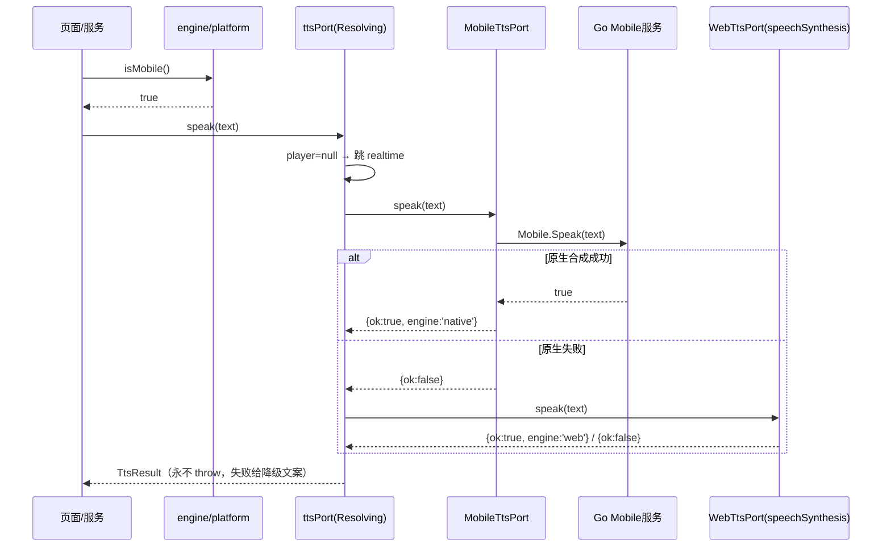
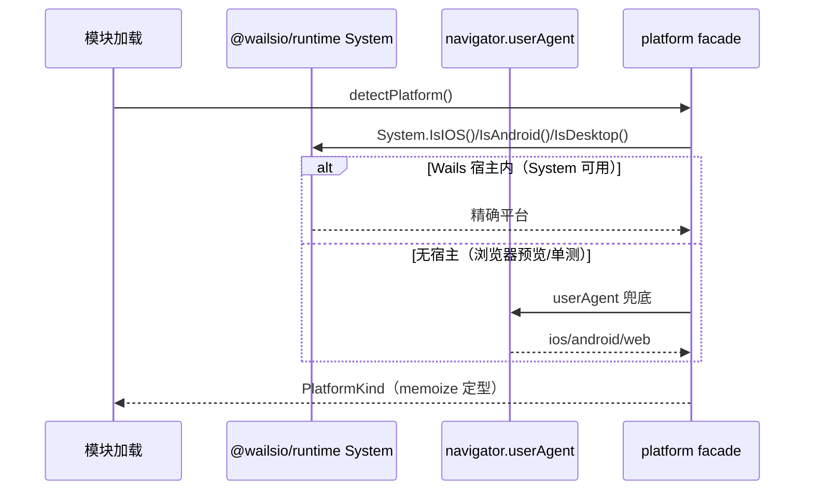
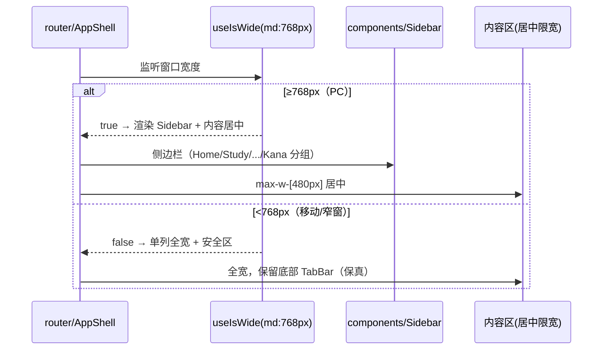

# Nijapl 多平台升级 · 系统设计 + 任务分解

> 架构师：高见远 ｜ 输入：PRD-多平台升级.md、upgrade.md、AGENTS.md 及关键源码
> 日期：2026-09-13

## 结论先行（重要）

最大风险被显著低估：实际 Tailwind 迁移范围 = **25 个 `.css` + 26 个 `.tsx`**（源码共 131 文件），**不是 2311 文件**（该数字含 node_modules / 生成产物）。据此给出「分模块、可独立验收」的 5 任务分解。

---

## 1. 实现方案 + 框架选型

- 难点：保真红线、rpx 流体缩放 vs 静态工具类、preflight 重置、移动端 TTS 离线、PC/Mobile 双形态。
- 选型：
  - `tailwindcss@^4.x` + `@tailwindcss/vite`（v4 CSS-first，无 config）。
  - 平台检测：`@wailsio/runtime` 的 `System` 优先 + UA 兜底。
  - 移动端能力走 Go `application.Mobile`（无需 build tag，桌面 no-op）。
  - 布局用 `md:768px` 断点，行为用 `isMobile()`。

### 1.3 rpx 废除策略（关键决策）

废除的是「手写 `Nrpx` 字符串 + 自定义 PostCSS 插件」，**保留 `--rpx: calc(100vw/750)` 作为流体缩放基准变量**（它本质是 750 设计宽响应式基准，与 PRD「750rpx=逻辑视口宽→token」一致，必须保留否则破坏「窗口拉伸等比缩放」保真行为）。

`@theme` 令牌定义为 `calc(N * var(--rpx))`，工具类 `p-xs` → `padding:var(--spacing-xs)` → `calc(8*var(--rpx))`，运行时逐像素一致，迁移是机械 1:1 替换零漂移。

### 1.4 `@theme` 令牌映射（写入 `frontend/src/styles/index.css`）

- 颜色 `--color-*`（同名无冲突）：`bg/surface/surface-alt/text/text-muted/primary/primary-soft/success/warning/danger/border`
- 间距 `--spacing-*`（旧名 `--space-*`）：`xs=8/sm=16/md=24/lg=32/xl=48`（rpx）
- 字号 `--text-*`（旧名 `--font-*`）：`xs=20/sm=24/md=28/lg=36/xl=56`（rpx，覆盖 Tailwind 默认 `text-sm/lg/xl`，新增 `md`）
- 圆角 `--radius-*`（同名）：`sm=8/md=16/lg=24/pill=999`（rpx）
- `:root { --rpx: calc(100vw/750) }` + 迁移期兼容别名（`--space-*/--font-*` → `--spacing-*/--text-*`，10 行，T05 删）

### 1.5 preflight 对齐

- `@layer base` 保留 `html/body/#root` 高度、body 14px 基准、日文字体栈、`overflow:hidden`。
- 迁移清单验证：`svg display:block`（Icon 在 flex 父内无害）、v4 表单控件 `font/color inherit`（KanaQuiz input 已显式声明不受影响）、`div` 仍 block（需 flex-col 处用 `flex flex-col` 维持红线）。

---

## 2. 平台抽象设计

- 前端 `engine/platform/{types.ts,index.ts}`：`PlatformKind('macos'|'windows'|'linux'|'ios'|'android'|'web')` + `FormFactor`；`detectPlatform/isMobile/isDesktop/isIOS/isAndroid/getFormFactor`；探测优先级 `System→UA→'web'`；守卫式永不 throw；模块加载 memoize。
  - 现有 `engine/wails.ts` 的 `hasWailsRuntime/isAndroid` 迁入，`storage.wails.ts` 与 `tts/index.ts` 两个调用方同步更新。
- Go `internal/services/mobile.go`（单文件无 build tag）：`Mobile{Speak(text)bool; StopSpeak(); KeepAwake(on); Haptic(kind); SafeArea()}`。
  - `application.Mobile` 官方是「编译守卫 manager，桌面 no-op」，故无需 build tag（比 build tag 更简单正确）。
  - build tag 隔离保留给后续分享/生物识别。`tts.go` 不动（原生 Speak 是实时合成通道，与 HTTP 源分属两级）。

### 2.3 TTS 移动端原生降级（移动端优先）

- 移动端链：`Mobile.Speak(native)` → `speechSynthesis(web)` → 明确失败（**不接 HTTP**，彻底规避局域网 IP）。
- 桌面链不变：`HTTP → speechSynthesis → 明确失败`。
- 装配改动在 `engine/tts/index.ts`：`isMobile()` 时 `new ResolvingTtsPort(source, null, detectRealtimePort())`，`player=null` 使 `speak()` 直接跳 realtime，M1-M3 互斥与 stop 幂等不变。
- 新增 `engine/tts/tts.mobile.ts`（`MobileTtsPort` 实现 `TtsPort`，经生成绑定 `Mobile`）。
- 移动端 `createTtsSource()` 不再需要 Android handler 分支，`tts-handler.ts` 保留但停用装配。

---

## 3. 文件列表

- **新增 7 文件**：`styles/index.css`、`platform/types.ts`、`platform/index.ts`、`tts.mobile.ts`、`router/useIsWide.ts`、`components/Sidebar/index.tsx`、`internal/services/mobile.go`。
- **修改 18 文件**（详见任务分解）。
- **删除**：`App.css` + 25 个 `*.css` + `rpxPlugin` + 迁移期别名。
- `.css` 迁移清单分 W 域（10 页 + 9 组件）/ K 域（3 页 + 3 组件）/ 外壳。

---

## 4. 类图（关键接口）

```
PlatformKind('macos'|'windows'|'linux'|'ios'|'android'|'web')
FormFactor('mobile'|'desktop')

platform facade
  detectPlatform(): PlatformKind
  isMobile/isDesktop/isIOS/isAndroid(): boolean
  getFormFactor(): FormFactor

TtsPort (接口)
  ├─ ResolvingTtsPort      # 编排：source + player + realtime（三通道互斥 M1-M3）
  ├─ MobileTtsPort         # 移动端原生（经 Go Mobile 绑定）
  ├─ WebTtsPort            # speechSynthesis
  └─ UnsupportedTtsPort    # 兜底

TtsSourcePort (接口)
  ├─ TtsHttpClient         # 浏览器直连
  ├─ TtsWailsClient        # 桌面 Go 绑定
  └─ TtsHandlerClient      # Android 同源 handler（迁移后停用装配）

StoragePort (接口)
  ├─ WailsStoragePort      # Go KVStore
  ├─ WebStoragePort        # localStorage
  └─ MemoryStoragePort     # 内存兜底

Go 侧服务：Mobile / TTS / KVStore / System
```

---

## 5. 时序图（3 张）

### 5.1 移动端 TTS 调用链（原生优先）



### 5.2 平台检测链



### 5.3 PC / Mobile 布局分支



---

## 6. 依赖包

- `tailwindcss@^4.1.0`（devDependencies）
- `@tailwindcss/vite@^4.1.0`（devDependencies）

---

## 7. 任务列表（5 个）

| 任务 | 内容 | 文件 | 依赖 | 验收 |
|---|---|---|---|---|
| **T01** | 项目基础设施 + Tailwind 接入 + 令牌/preflight | `package.json`、`vite.config.ts`(+`@tailwindcss/vite`，保留 rpxPlugin)、`styles/index.css`(新)、`main.tsx`、`App.css`(移 `:root` 令牌，保留组件样式) | 无 | build+typecheck+check+test 绿、Tailwind 加载、视觉一致、preflight 对齐 |
| **T02** | 平台抽象 + Go Mobile + TTS 原生降级 | `platform/types.ts`+`index.ts`(新)、`wails.ts`(迁)、`storage.wails.ts`、`tts/index.ts`、`tts.mobile.ts`(新)、`internal/services/mobile.go`(新)、`main.go`(注册 Mobile) | T01 | go build/vet + 前端 test 绿、桌面 TTS 无回归、模拟器 Mobile.Speak 出声、isMobile/isIOS/isAndroid 准确 |
| **T03** | CSS 迁移·W 域页面+通用组件 | 10 页(Home/StageMap/Study/VocabDetail/GrammarList/GrammarDetail/Graph/Quiz/Review/Me)+9 组件(WordCard/TtsButton/DetailSheet/ProgressRing/StatTimeline/GrammarHighlightText/GraphCanvas/NodeStateBadge/Icon)的 `index.tsx` 改 + `index.css` 删 | T01 | 每页迁移后 test:audit+视觉比对逐屏一致、无残留 Nrpx |
| **T04** | CSS 迁移·K 域页面+组件（可与 T03 并行） | 3 页(Kana/KanaStudy/KanaQuiz)+3 组件(KanaTable/KanaCanvas/KanaConfusableCard) | T01 | K 域 6 个 css 删、RK1-RK5 不受影响、test:audit+视觉一致 |
| **T05** | 外壳迁移 + PC 响应式侧栏 + 构建固化 + rpx 收尾 | `App.tsx`、`router/index.tsx`(响应式 AppShell)、`router/useIsWide.ts`(新)、`components/Sidebar/index.tsx`(新)、`TabBar`、`constants/routes.ts`(+`SIDEBAR_GROUPS`)、`constants/strings.ts`、`App.css`(删)、`vite.config.ts`(删 rpxPlugin)、`styles/index.css`(删别名)、`main.go`(窗口 1180×800/min 900×640)、`build/ios/Taskfile.yml`(补齐 iOS TTS 烘入)、`build/Taskfile.yml`(VITE_PLATFORM)、`docs/upgrade.md` | T02+T03+T04 | 三档窗口响应式+窄窗回退、移动端 TabBar 保真、rpxPlugin 移除后 build 干净、task package 各平台可产、iOS 模拟器跑通核心闭环、test:audit 绿 |

## 8. 依赖图

```
T01 → { T02, T03, T04 }
{ T02, T03, T04 } → T05
```
两层深，非过长线性链。T03/T04 可并行。

---

## 9. 共享知识（工程师必守）

- import `.js` 后缀、无路径别名。
- 不手写 `Nrpx`，一律工具类。
- token 命名对齐 `constants/theme.ts`（`bg-bg/text-text/border-border` 属有意保留）。
- `--space-*`/`--font-*` 为迁移期别名，禁新代码用。
- 写操作唯一入口 + selectors 稳定引用。
- 端口永不 throw + 平台实现文件禁外部 import。
- 平台能力隔离（六边形）。
- 布局用 `md:768px` / 行为用 `isMobile()` 分离。
- `onClick` 显式 `stopPropagation`。
- 禁硬编码、禁顺手修好。
- 改 Go 服务必须 `wails3 generate bindings -ts`。

---

## 10. 待明确事项（6 项）

1. `application.Mobile` 方法签名（尤其 Haptic 枚举 / SafeAreaJSON 结构）需对照 `go.mod` 实际版本核对。
2. `@theme` 接受 `calc(var(--rpx))` 需 T01 首件验证（回退 = `:root` 令牌 + `@layer utilities`）。
3. 保真视觉验收用 Playwright 快照还是人工逐屏？
4. PC 侧边栏 8+ 入口分组与 K 域折叠交互细节需产品确认。
5. `KeepAwake` 触发的精确页面集合（Study/Quiz/KanaStudy/KanaQuiz?）需产品确认。
6. `TtsHandlerClient` 去留（建议保留、下轮评估）。
