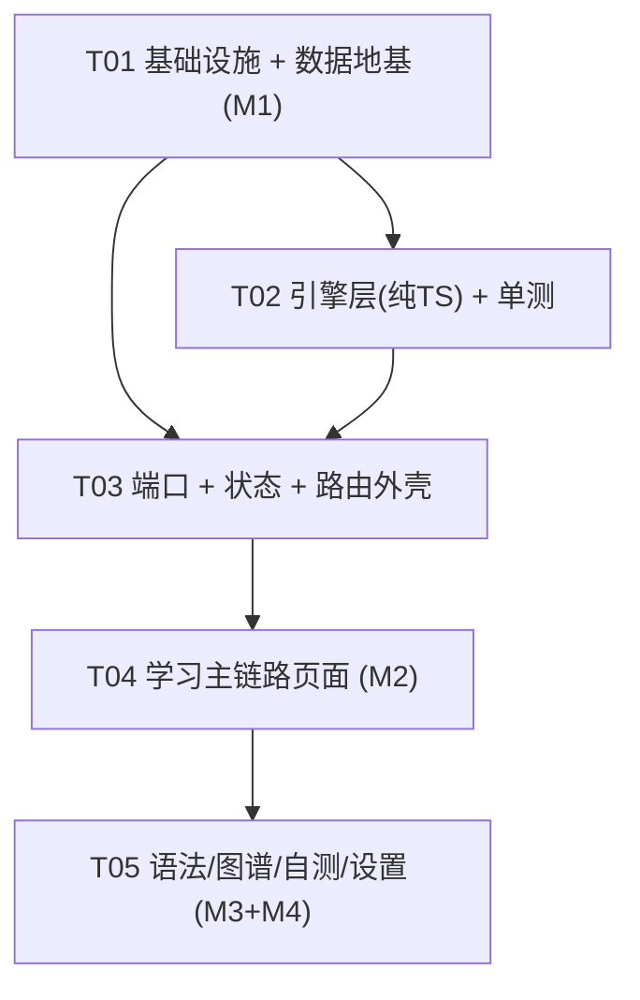

# 系统架构设计 · JLPT N3 词汇学习 App（Lynx 跨平台）

> 角色：系统架构师 高见远 ｜ 版本：v1.0 ｜ 日期：2026-09-10
> 唯一输入基线：`docs/prd/PRD-JLPT-N3-词汇学习App.md`（§四 需求池 / §五 页面与跳转 / §5.5 状态机 / §六 里程碑 / §七 数据方案）
> 补充细节：`docs/词汇学习应用-页面规划-v1.1.md`（ER 模型 / SRS / Lynx 技术方案）
> 工程约定：`AGENTS.md`、`package.json`、`lynx.config.ts`、`tsconfig.json`
> 事实核实：Lynx 官方文档（`lynxjs.org/next/...`，见 §1.0 引用）

---

## 0. 阅读指引

本文档一次交付 **Part A 系统设计** + **Part B 任务分解**。工程师按 §7 任务列表从 T01 顺序实现即可，无需回问。
配套独立文件：
- `docs/design/class-diagram.mermaid` —— 类图（可单独导入编辑器）
- `docs/design/sequence-diagram.mermaid` —— 时序图（三条主链路）

---

# Part A · 系统设计

## 1. 实现方案与框架选型

### 1.0 事实基线（Lynx 官方文档核实结论，本设计的硬约束来源）

| # | 事实 | 对本设计的影响 |
|---|------|--------------|
| F1 | `<svg>` 静态整体渲染：`<svg content={svgString}>` 整段字符串 → **单个 native view**，17 标签 / 40+ 属性，**无子节点事件**（[svg.md](https://lynxjs.org/next/api/elements/built-in/svg.md)） | 图谱**禁用 mermaid.js**；边用 SVG 背景层，节点用绝对定位 `<view>` |
| F2 | 无 `localStorage` / `<canvas>` / `<audio>`；`<video>` 实验性 | 持久化 / TTS 必须走端口 + Native Module 双实现 |
| F3 | Native Modules **仅可在 Background Thread Scripting 中使用**；通过全局 `NativeModules` 同步调用；用 `src/typing.d.ts` 的 `declare let NativeModules` 声明类型（[use-native-modules.md](https://lynxjs.org/next/guide/use-native-modules.md)） | 端口实现放后台线程（ReactLynx 业务 JS 默认后台线程）；**`'main thread'` 指令内禁止调用 Native Module** |
| F4 | 内置元素：`<list>`+`<list-item>`（回收式长列表）、`<viewpager>`+`<viewpager-item>`、`<scroll-view>`、`<image>`；纯 Lynx 页面浮层用 `position: fixed` | P4/P7 长列表用 `<list>`；P2 卡片流用 `<viewpager>`；C2 用 `position: fixed` |
| F5 | 路由：官方集成 **`react-router@6`**（ReactLynx 仅 React v17 API）；**无 `<Link>`/`<NavLink>`**，用 `useNavigate`；须用 `MemoryRouter`（[react-router.md](https://lynxjs.org/next/react/routing/react-router.md)） | 路由选型见 §1.2 |
| F6 | `<viewpager>` **Web 平台不支持**（兼容表 `Web ❌ No`）（[viewpager.md](https://lynxjs.org/next/api/elements/built-in/viewpager.md)） | **P2 卡片流在 H5 需降级方案**，见 §1.5 与 §9 风险 |
| F7 | `<list>` 子节点必须为 `<list-item>`，且 `item-key`/`key` 必填且一致，默认回收（[list.md](https://lynxjs.org/next/api/elements/built-in/list.md)） | P4/P7 列表实现规范 |

### 1.1 核心难点与技术挑战

| 难点 | 挑战 | 应对 |
|------|------|------|
| N1 可测性 | 引擎逻辑要被 QA 单测，但页面依赖 Lynx 运行时 | **引擎层（`src/engine/srs|jumpRules|progress|graph/*`）保持纯 TS、零框架、零端口依赖**，可直接被 vitest/node 引入 |
| N2 持久化 | Lynx 无 localStorage，zustand `persist` 默认依赖它 | 自建 **`StateStorage` 适配器**桥到 `StoragePort`；store 用 async persist + hydration 门控（§1.3） |
| N3 图谱 | SVG 无子节点事件、无 DOM 布局 | **静态 SVG 边 + 绝对定位 `<view>` 节点 + 外层 `transform: scale()`**；布局用纯计算力导向（§1.4） |
| N4 语音 | 无 `<audio>`、无内置 TTS，微信内置浏览器不支持 `speechSynthesis` | `tts` 端口双实现 + **能力检测 + 明确降级提示**（零静默失败） |
| N5 数据来源 | 四份源文件不存在；需 seed 可跑通 | seed 与真实数据**同 schema**，`data/build/*.json` 为唯一入口，页面/引擎零耦合来源（§6） |

### 1.2 路由方案：**`react-router@6` + `MemoryRouter`**

**决策：采用官方集成 `react-router@6`，不自研路由。**

理由：
1. Lynx 无浏览器地址栏/无 `history API`，官方明确要求用 `MemoryRouter`，`react-router@6` 是唯一被官方文档背书的方案；自研路由要重复实现嵌套路由、参数解析、返回栈，收益为负。
2. 页面数 10+，需要 `useParams`（`/vocab/:id`、`/grammar/:id`）、`useNavigate`、返回栈（`nav(-1)`）。
3. 约束：**ReactLynx 只有 React v17 API**，因此必须锁 `react-router@6`（**不得**升 v7/`react-router-dom` v7，其依赖 React 18）。
4. **不使用 `<Link>`/`<NavLink>`**（Lynx 无此组件），统一 `useNavigate()`。

路由结构（Top-level 5 个 Tab 路由 + 详情路由）：

| 路径 | 页面 | 类型 |
|------|------|------|
| `/` | P0 首页 | Tab |
| `/stages` | P1 阶段地图 | Tab |
| `/grammar` | P4 语法列表 | Tab |
| `/review` | P7 复习 | Tab |
| `/me` | P9 我的 | Tab |
| `/study/:moduleId` | P2 词汇学习 | 二级（可选 `?mode=review`） |
| `/vocab/:wordId` | P3 词汇详解 | 二级 |
| `/grammar/:grammarId` | P5 语法详解 | 二级 |
| `/graph` | P6 知识图谱 | 二级（`?view=overview|word|grammar&focus=:id`） |
| `/quiz` | P8 自测 | 二级 |

> Tab 栏不占独立路由布局层，由 App 外壳根据当前 `location.pathname` 是否命中 5 个 Tab 路径决定是否渲染 `<TabBar>`。

### 1.3 状态管理：**zustand vanilla store（v4）+ 自定义持久化适配**

**决策：`zustand@^4`（vanilla `createStore`），通过自定义 `StateStorage` 适配器接 `StoragePort` 启用 `persist`；不引入其他状态库。**

理由与关键设计：
1. **版本锁定 `zustand@^4`**：zustand v5 要求 React 18，ReactLynx 仅 React v17 API → 必须用 v4（v4 内部用 `use-sync-external-store` shim 兼容 React 17，`useStore(store, selector)`）。
2. **store 用 vanilla**（`zustand/vanilla` 的 `createStore`）而非 React 绑定，保证 store 本身可在测试/服务层直接读写。
3. **持久化怎么接（团队疑问点）**：
   - `persist` 的 `storage` 选项接受任意 `StateStorage`（`getItem/setItem/removeItem`，**支持返回 Promise**）。我们**不**用它默认的 localStorage，而是传入自建 `portableStorage`：
     ```ts
     // src/store/persistence.ts（签名示意，非实现）
     export const portableStorage: StateStorage = {
       getItem:    (name) => storagePort.get(name).then(v => v ?? null),
       setItem:    (name, value) => storagePort.set(name, value),
       removeItem: (name) => storagePort.remove(name),
     }
     ```
   - `persist` 配 `version: 1` + `migrate`（版本迁移）、`partialize`（只持久化 `progress`/`session`/`settings`，**不**持久化派生数据）、`onRehydrateStorage` 回调置 `hydrated=true`。
   - **Hydration 门控**：`App.tsx` 读取 `useHydrated()`，未完成前渲染极简启动态（避免用默认态闪一帧）。异步 native 存储的耗时由这一门控吸收。
   - 若工程师发现 `persist` 的异步 rehydrate 与 Lynx 生命周期冲突，**替代方案**（等价、更显式）：不用 `persist`，在 `src/store/persistence.ts` 手动 `hydrate()`（启动读一次）+ `subscribePersist()`（`store.subscribe` + 防抖 300ms 写回）+ 版本号字段。两种方案接口一致，任选其一实现。
4. **store 分片（slice）**：`progress`（PROGRESS map）、`session`（SESSION + 今日配额/打卡）、`settings`（发音/解锁开关）、`runtime`（**不持久化**：当前学习模块、当前索引、会话内 `wrongCount`、C2 浮层状态）。
5. **改状态的唯一入口是 `src/store/actions.ts` 的 action**，action 内部调用**纯引擎**（`srs`/`progress`/`jumpRules`）算出新值，页面只 dispatch，不自己算。

### 1.4 图谱渲染方案（P6，落实 F1）

| 关注点 | 方案 |
|--------|------|
| 连线/背景 | `src/engine/graph/svg.ts` 把边（含高亮换色）序列化成 **SVG 字符串**，`<svg content={str}>` 作背景层（静态、单 view、性能好） |
| 节点可点 | 节点用**绝对定位 `<view>`**（`left/top` 取布局坐标），`bindtap`/`bindlongpress`；节点内部显示词/语法标签 |
| 缩放/平移 | 外层容器 `transform: scale(k) translate(dx,dy)`；手势处理函数标 `'main thread'` 保证跟手（**该函数内禁止调 Native Module**） |
| 聚焦高亮 | 选中节点 → 用 `src/engine/graph/svg.ts` **重算边颜色** + 其余节点 `opacity` 降低 |
| 布局 | `src/engine/graph/layout.ts` **纯计算**（预置圆/径向/轻量力导向，确定性、不依赖 DOM），返回 `{nodes:[{id,x,y,r}], edges:[...]}` |
| 三视图 | `overview`（阶段→模块）/ `word`（中心词→1 跳关系）/ `grammar`（句型→关系）由 `graph/view.ts` 从仓库数据构造 |

> 明确**不引入 mermaid.js / d3-dom / canvas**：mermaid 依赖 DOM，原生端不可用；d3 仅取其算法思想自行实现最小力导向。

### 1.5 H5（Lynx for Web）适配边界

- H5 出包走 `@lynx-js/web-core` + 宿主 Rsbuild 工程（本期**不实现宿主工程**，仅保证端口层可替换）。
- **端口层可替换**：`tts`/`storage` 用平台后缀文件（`.web.ts`）或运行时能力检测切换。
- **不耦合原生专有 API**：页面/引擎不得直接引用 `NativeModules`（只允许 `src/engine/tts/tts.native.ts`、`src/engine/storage/storage.native.ts` 两处引用）。
- **已知 Web 差异（必须处理）**：`<viewpager>` Web 不支持 → P2 卡片流在 Web 端降级为**横向 `<scroll-view>` 分页**（`snap` 或逐页按钮），见 §9 待明确 T2。

---

## 2. 完整文件列表（相对路径 + 一句话职责）

> 图例：`[新]` 新增 ｜ `[改]` 修改现有 ｜ 括号内为任务号（见 §7）

### 2.1 工程配置与入口

| 文件 | 职责 |
|------|------|
| `package.json` `[改]` | 增加依赖（react-router@6 / zustand@4 / zod / tsx / vitest）与 scripts（test / gen:data）(T01) |
| `tsconfig.json` `[改]` | 增加 `paths` 别名（可选）、排除 `scripts` 于 src 编译之外 (T01) |
| `vitest.config.ts` `[新]` | vitest 配置：environment=node、include 引擎与脚本测试、排除 Lynx 页面 (T01) |
| `biome.json` `[改]` | 忽略 `data/build/**`、`node_modules`（保持 lint 范围干净）(T01) |
| `lynx.config.ts` `[改]` | 保持现有三插件；如需 Web 目标再增配置（本期不动产线）(T01) |

### 2.2 类型与常量

| 文件 | 职责 |
|------|------|
| `src/types/index.ts` `[新]` | 类型统一导出 barrel (T01) |
| `src/types/domain.ts` `[新]` | 领域实体：`Stage`/`Module`/`Word`/`Grammar`/`Sentence`/`SentenceWord`/`SentenceGrammar`/`WordRelation`/`GrammarRelation` (T01) |
| `src/types/progress.ts` `[新]` | `SrsState`/`Progress`/`ReviewRecord`/`Session`/`StudySettings`/`JumpContext`/`JumpDecision` (T01) |
| `src/types/graph.ts` `[新]` | `GraphNode`/`GraphEdge`/`GraphView`/`LayoutResult`/`LayoutConfig` (T01) |
| `src/types/ports.ts` `[新]` | `TtsPort`/`StoragePort`/`TtsResult`/`TtsCapability` 接口 (T01) |
| `src/typing.d.ts` `[新]` | 全局 `NativeModules` 环境声明（TTSEngine / LynxStorage）(T01) |
| `src/constants/pos.ts` `[新]` | `POS_LIST` 全词性枚举 + **`POS_VERB` 显式枚举数组** + `isVerb()` (T01) |
| `src/constants/srs.ts` `[新]` | 五态常量、`SRS_INTERVALS_MS`（10min/1d/3d/7d/15d/30d）、`MASTERED_THRESHOLD` (T01) |
| `src/constants/jumpRules.ts` `[新]` | 6 条规则 ID（J1–J6）与阈值常量（`WRONG_THRESHOLD=2` 等）(T01) |
| `src/constants/routes.ts` `[新]` | 路由路径常量 + 类型化路径构造器 (T03) |
| `src/constants/strings.ts` `[新]` | 中文 UI 文案集中（为未来 i18n 预留，本期不打 i18n 运行时）(T04) |
| `src/constants/theme.ts` `[新]` | 颜色/间距/字号/圆角设计令牌 (T03) |

### 2.3 数据层（构建产物 + 访问层，来源零耦合）

| 文件 | 职责 |
|------|------|
| `data/source/seed/stages.ts` `[新]` | seed：4 阶段（含冲刺期 `hasContent=false`）(T01) |
| `data/source/seed/modules.ts` `[新]` | seed：模块定义 (T01) |
| `data/source/seed/words.ts` `[新]` | seed：词条（`source:'seed'`，`kana` 供 TTS）(T01) |
| `data/source/seed/grammar.ts` `[新]` | seed：语法点 (T01) |
| `data/source/seed/sentences.ts` `[新]` | seed：例句 + 词/语法关联 (T01) |
| `data/source/seed/index.ts` `[新]` | seed 汇总导出 (T01) |
| `data/build/stages.json` `[新]` | 构建产物（唯一运行时数据入口）(T01) |
| `data/build/modules.json` `[新]` | 构建产物 (T01) |
| `data/build/words.json` `[新]` | 构建产物 (T01) |
| `data/build/grammar.json` `[新]` | 构建产物 (T01) |
| `data/build/sentences.json` `[新]` | 构建产物（含 SENTENCE_WORD / SENTENCE_GRAMMAR 内联）(T01) |
| `src/data/repository.ts` `[新]` | `DataRepository`：加载 JSON + 建索引（byId / byModule / sentencesByWord…），**纯查询，无来源分支** (T01) |
| `src/data/index.ts` `[新]` | 单例仓库导出 (T01) |

### 2.4 引擎层（纯 TS，零框架、零端口，QA 单测对象）

| 文件 | 职责 |
|------|------|
| `src/engine/srs.ts` `[新]` | 五态状态机 + 间隔序列推进：`initialProgress` / `applySelfEval` / `applyReviewResult` / `applySkip` / `dueWords` (T02) |
| `src/engine/jumpRules.ts` `[新]` | 6 条规则判定：`evaluate(ctx): JumpDecision`（J1–J5 见 §4；含 `POS_VERB` 判定分支）(T02) |
| `src/engine/progress.ts` `[新]` | 三级完成度：`wordCompletion` / `moduleCompletion` / `stageCompletion` / `overallCompletion`；`hasContent=false` 短路 (T02) |
| `src/engine/conjugation.ts` `[新]` | J5 动词变形表（按 `pos` 规则生成行，纯函数）(T02) |
| `src/engine/graph/layout.ts` `[新]` | 纯计算布局（径向/力导向迭代），返回确定性坐标 (T02) |
| `src/engine/graph/view.ts` `[新]` | 由仓库数据构造 `GraphView`（三视图：overview/word/grammar）(T02) |
| `src/engine/graph/svg.ts` `[新]` | 由 `GraphView`+`LayoutResult` 生成 SVG 字符串（边/高亮）(T02) |
| `src/engine/__tests__/srs.test.ts` `[新]` | srs 单测（五态 + 间隔 + 跳过）(T02) |
| `src/engine/__tests__/jumpRules.test.ts` `[新]` | J1–J6 单测（**含 POS_VERB 动词/非动词边界**）(T02) |
| `src/engine/__tests__/progress.test.ts` `[新]` | 完成度单测（含 `hasContent=false` 无 NaN）(T02) |
| `src/engine/__tests__/layout.test.ts` `[新]` | 布局确定性/边界单测 (T02) |

### 2.5 端口层（原生 / Web 双实现）

| 文件 | 职责 |
|------|------|
| `src/engine/tts/types.ts` `[新]` | TTS 端口类型与结果判别联合 (T03) |
| `src/engine/tts/index.ts` `[新]` | TTS 端口 facade：**运行时能力检测** + 委托平台实现 + 单例 (T03) |
| `src/engine/tts/tts.native.ts` `[新]` | 原生实现：调 `NativeModules.TTSEngine`；**唯一允许引用 NativeModules 的 TTS 文件** (T03) |
| `src/engine/tts/tts.web.ts` `[新]` | Web 实现：`speechSynthesis` + `ja` 前缀过滤 + `voiceschanged` 兜底 + 存在性检测 (T03) |
| `src/engine/storage/types.ts` `[新]` | 存储端口类型（异步 `get/set/remove`）(T03) |
| `src/engine/storage/index.ts` `[新]` | 存储端口 facade：能力检测 + 内存兜底（未注册原生模块时不崩）+ 单例 (T03) |
| `src/engine/storage/storage.native.ts` `[新]` | 原生实现：`NativeModules.LynxStorage`（NSUserDefaults / SharedPreferences）(T03) |
| `src/engine/storage/storage.web.ts` `[新]` | Web 实现：宿主桥接 / `sessionStorage` 降级 (T03) |

### 2.6 状态层

| 文件 | 职责 |
|------|------|
| `src/store/index.ts` `[新]` | vanilla `createStore` + 四个 slice 合并 + `persist` 挂载 (T03) |
| `src/store/persistence.ts` `[新]` | `portableStorage` 适配器（zustand↔StoragePort）+ version/migrate/partialize (T03) |
| `src/store/actions.ts` `[新]` | 所有写操作 action（自评/跳过/复习结果/续学/打卡/配额/settings），内部调纯引擎 (T03) |
| `src/store/selectors.ts` `[新]` | 派生选择器（今日队列/阶段完成度/当前模块词序/薄弱 TOP5/图谱数据源）(T03) |
| `src/store/hooks.ts` `[新]` | `useAppStore`/`useHydrated`/领域 hooks 封装 `useStore` (T03) |

### 2.7 服务层（编排，非引擎）

| 文件 | 职责 |
|------|------|
| `src/services/ttsController.ts` `[新]` | C1 单例控制器：热区点击 → 立即视觉反馈 → 调端口 → 降级 toast；语速/音调来自 settings (T04) |
| `src/services/studySession.ts` `[新]` | 学习会话编排：开始模块/取当前词/提交自评/跳过/模块完成判定（组合 store+engine）(T04) |
| `src/services/jumpService.ts` `[新]` | 把 `JumpContext` 喂给 `jumpRules` 并**驱动 UI**（开 C2、开 P3、高亮语法、弹脑图）(T04) |

### 2.8 路由与应用外壳

| 文件 | 职责 |
|------|------|
| `src/router/routes.tsx` `[新]` | 路由表（`<Routes>/<Route>` 定义）(T03) |
| `src/router/index.tsx` `[新]` | `MemoryRouter` 装配 + 导出 `AppRouter` (T03) |
| `src/router/navigation.ts` `[新]` | 类型化导航助手（`goStudy(moduleId)`…）+ 返回 (T03) |
| `src/App.tsx` `[改]` | 应用外壳：hydration 门控 + `<AppRouter>` + 条件 `<TabBar>`；**移除脚手架内容** (T03) |
| `src/App.css` `[改]` | 全局样式：CSS 变量令牌、`text` 默认色、`page` 容器 (T03) |
| `src/index.tsx` `[改]` | `root.render(<App/>)` 保持不变/微调（不再直接渲染脚手架）(T03) |
| `src/components/TabBar/index.tsx` `[新]` | 底部 5 Tab（首页/阶段/语法/复习/我的）(T03) |

### 2.9 页面（P0–P9）

| 文件 | 职责 |
|------|------|
| `src/pages/Home/index.tsx` `[新]` | P0 首页仪表盘：打卡/目标环/继续学习/阶段条/今日任务/薄弱预警/图谱入口 (T04) |
| `src/pages/Home/index.css` `[新]` | P0 样式 (T04) |
| `src/pages/StageMap/index.tsx` `[新]` | P1 阶段地图：4 阶段树 + 节点五态 + 解锁规则 + 冲刺期短路 (T04) |
| `src/pages/Study/index.tsx` `[新]` | P2 词汇学习：`<viewpager>` 卡片流 + 整卡热区发音 + 三档自评 + 上滑详解 + 语法高亮 (T04) |
| `src/pages/Study/index.css` `[新]` | P2 样式（含 Web 降级布局）(T04) |
| `src/pages/VocabDetail/index.tsx` `[新]` | P3 词汇详解：读音/词性活用（J5 变形表）/释义/例句/关联 chips/时间线 (T04) |
| `src/pages/Review/index.tsx` `[新]` | P7 复习：今日到期队列（`<list>`）+ 错词本 + 开始复习 (T04) |
| `src/pages/GrammarList/index.tsx` `[新]` | P4 语法列表：`<list>` 长列表 + 周次/层级筛选 (T05) |
| `src/pages/GrammarDetail/index.tsx` `[新]` | P5 语法详解：接续/场景/例句/近义辨析互跳/涉及词汇/自评 (T05) |
| `src/pages/Graph/index.tsx` `[新]` | P6 知识图谱：三视图切换 + GraphCanvas + 缩放 + 聚焦 (T05) |
| `src/pages/Quiz/index.tsx` `[新]` | P8 自测：三种题型 + 结果回写 (T05) |
| `src/pages/Me/index.tsx` `[新]` | P9 我的：发音设置/目标/统计/解锁开关/导出 (T05) |

### 2.10 组件（C1/C2 + 复用）

| 文件 | 职责 |
|------|------|
| `src/components/WordCard/index.tsx` `[新]` | 卡片正/背面（假名超大字+汉字+词性徽章 / 释义+例句）(T04) |
| `src/components/DetailSheet/index.tsx` `[新]` | C2 半屏引导浮层（`position: fixed`）：确认→P3 / 忽略→下一张 (T04) |
| `src/components/TtsButton/index.tsx` `[新]` | 发音按钮（点击即刻视觉反馈，调 ttsController）(T04) |
| `src/components/GrammarHighlightText/index.tsx` `[新]` | 例句内语法/目标词高亮 + 可点（J3）(T04) |
| `src/components/ProgressRing/index.tsx` `[新]` | 今日目标进度环 (T04) |
| `src/components/NodeStateBadge/index.tsx` `[新]` | 五态徽章（未解锁/未学/学习中/已掌握/需强化）(T04) |
| `src/components/GraphCanvas/index.tsx` `[新]` | 图谱画布：`<svg content>` 背景层 + 绝对定位 `<view>` 节点 + `transform: scale()` (T05) |
| `src/components/StatTimeline/index.tsx` `[新]` | P3 记忆状态时间线 (T05) |

### 2.11 数据管线脚本（离线 Node）

| 文件 | 职责 |
|------|------|
| `scripts/gen-data/schema.ts` `[新]` | zod schema（字段/类型/必填/枚举 `pos`/`source`/`reviewStatus`）(T01) |
| `scripts/gen-data/build-stages.ts` `[新]` | 产出 stages.json (T01) |
| `scripts/gen-data/build-modules.ts` `[新]` | 产出 modules.json (T01) |
| `scripts/gen-data/build-words.ts` `[新]` | 产出 words.json (T01) |
| `scripts/gen-data/build-grammar.ts` `[新]` | 产出 grammar.json (T01) |
| `scripts/gen-data/build-sentences.ts` `[新]` | 产出 sentences.json（内联词/语法关联）(T01) |
| `scripts/gen-data/validate.ts` `[新]` | schema + 引用完整性 + 枚举合法性校验（退出码非 0 即失败）(T01) |
| `scripts/gen-data/index.ts` `[新]` | 一键入口：build → validate（`npm run gen:data`）(T01) |
| `scripts/gen-data/__tests__/validate.test.ts` `[新]` | 校验器单测（坏数据应被判失败）(T01) |

### 2.12 原生模块（文档 + JS 侧声明；原生实现超出本仓库范围）

| 文件 | 职责 |
|------|------|
| `src/native/TTSEngine/README.md` `[新]` | iOS `AVSpeechSynthesizer(ja-JP)` / Android `TextToSpeech(Locale.JAPANESE)` / Harmony 注册步骤与 `methodLookup`(T03) |
| `src/native/LynxStorage/README.md` `[新]` | `NSUserDefaults` / `SharedPreferences` 注册步骤与接口签名 (T03) |

> **文件总数：≈ 78 个**（含页面/组件/引擎/端口/脚本/测试/数据）。

---

## 3. 数据结构与接口定义（类图）

完整类图见 `docs/design/class-diagram.mermaid`。核心摘要如下（字段与 PRD §7.4 一致）。

### 3.1 领域实体

| 类型 | 关键字段 |
|------|---------|
| `Stage` | `id`（N5基础期/N4强化期/N3强化期/冲刺期）、`name`、`order`、`weekRange`、**`hasContent:boolean`**（冲刺期=false） |
| `Module` | `id`、`stageId`、`name`、`wordCount` |
| `Word` | `id`、**`kana`**（TTS 依据）、`kanji`、`pos`（显式枚举）、`meaning`、`stageId`、`moduleId`、`source`、`related?: WordRelation[]` |
| `Grammar` | `id`（string，如 `"G001"`）、`pattern`、`connection`、`scene`、`week`、`level`、`stageId`、`source` |
| `Sentence` | `id`、`ja`、`zh`、`level`、`source: 'seed'\|'ai'\|'human'`、`reviewStatus: 'pending'\|'approved'`、`words: SentenceWord[]`、`grammars: SentenceGrammar[]` |
| `SentenceWord` | `sentenceId`、`wordId`、`surface`、**`start?:number`/`end?:number`**（高亮偏移，见 §9 T5） |
| `SentenceGrammar` | `sentenceId`、`grammarId` |
| `WordRelation` | `fromId`、`toId`、`type:'synonym'\|'antonym'\|'derived'\|'sameModule'` |
| `GrammarRelation` | `fromId`、`toId`、`type:'hypernym'\|'hyponym'\|'synonym'\|'antonym'` |

### 3.2 进度与会话

| 类型 | 关键字段 |
|------|---------|
| `SrsState` | `'未学'\|'学习中'\|'模糊'\|'已掌握'\|'需强化'` |
| `SelfEval` | `'不认识'\|'模糊'\|'认识'` |
| `Progress` | `targetId`、`state:SrsState`、`wrongCount`（跨会话累计）、`nextReview`、`intervalLevel`、`seen:boolean`、`history:ReviewRecord[]` |
| `ReviewRecord` | `at:number`、`result:'correct'\|'wrong'\|'skip'`、`from:SrsState`、`to:SrsState` |
| `Session` | `stageId`、`moduleId`、`lastWordIndex`、`lastStudyDate`、`todayNewCount`、`todayReviewCount`、`streakDays` |
| `StudySettings` | `rate:0.5–1.5`、`pitch`、`autoSpeakOnCard`、`unlockRuleEnabled` |

### 3.3 引擎函数签名（**纯函数，QA 单测契约**）

```ts
// src/engine/srs.ts
export function initialProgress(targetId: string): Progress
export function applySelfEval(p: Progress, evalr: SelfEval, now: number): Progress
export function applyReviewResult(p: Progress, correct: boolean, now: number): Progress
export function applySkip(p: Progress, now: number): Progress          // 学习中 → 未学
export function isDue(p: Progress, now: number): boolean
export function dueTargetIds(progressMap: Record<string, Progress>, now: number): string[]

// src/engine/jumpRules.ts
export interface JumpContext {
  word: Word; grammarById: (id: string) => Grammar | undefined
  wordProgress: Progress; grammarLearned: Record<string, boolean>
  sessionWrongCount: number; moduleLearned: number; moduleTotal: number
}
export type JumpDecision =
  | { rule: 'J1'; kind: 'autoDetailed'; target: 'P3' }
  | { rule: 'J2'; kind: 'promptDetailed'; target: 'P3' }
  | { rule: 'J3'; kind: 'highlightGrammar'; grammarIds: string[]; target: 'P5' }
  | { rule: 'J4'; kind: 'promptGraph'; target: 'P6' }
  | { rule: 'J5'; kind: 'showConjugation'; target: 'P3' }
  | { rule: 'J6'; kind: 'showRelated'; target: 'P3' }
  | { rule: 'none' }
export function evaluate(ctx: JumpContext, triggeredBy: 'selfEval'|'scene'): JumpDecision[]

// src/engine/progress.ts
export function wordCompletion(p: Progress): number                       // 0..1 或 -1 表示不参与
export function moduleCompletion(words: Word[], pm: Record<string,Progress>): number
export function stageCompletion(stage: Stage, modules: Module[],
                                words: Word[], pm: Record<string,Progress>): number  // hasContent=false → 不参与
export function overallCompletion(...): number

// src/engine/graph/layout.ts
export function layout(view: GraphView, ctx: LayoutConfig): LayoutResult   // 纯计算、确定性
```

> `wordCompletion` 在「未学」返回 0；`stageCompletion` 对 `hasContent===false` 直接返回 `NO_CONTENT`（避免 0/0=NaN）。`evaluate` 返回**数组**（一次自评可同时命中 J1+J5+J6）。

### 3.4 端口接口

```ts
// src/engine/tts/types.ts
export type TtsCapability = 'supported' | 'unsupported' | 'gesture-required'
export type TtsResult =
  | { ok: true; engine: 'native'|'web' }
  | { ok: false; reason: 'no-tts'|'no-ja-voice'|'blocked'|'error' }
export interface TtsPort {
  getCapability(): TtsCapability
  speak(text: string, opts?: { rate?: number; pitch?: number }): Promise<TtsResult>
  stop(): void
  getVoices(): Promise<Array<{ id: string; lang: string; name: string }>>
}

// src/engine/storage/types.ts
export interface StoragePort {
  get(key: string): Promise<string | null>
  set(key: string, value: string): Promise<void>
  remove(key: string): Promise<void>
}
```

> **端口契约（红线）**：端口方法**永不 throw**；失败一律通过 `TtsResult.ok=false` / 空值返回，由 UI 层给出明确提示。`getCapability()` 在未注册 `NativeModules.TTSEngine` 且无 `speechSynthesis` 时返回 `'unsupported'` → 触发「明确提示 + 复制假名」，**零静默失败**。

---

## 4. 程序调用流程（时序图）

完整版见 `docs/design/sequence-diagram.mermaid`。以下为三条主链路的要点说明。

### 4.1 主链路①：首页 → 续学 → P2 → 自评「不认识」 → J1/J2 → C2 → P3 → 点例句语法 → P5

```
P0(Home)         store/actions        studySession      engine/jumpRules      C2(DetailSheet)     P3(VocabDetail)      P5(GrammarDetail)
  | tap 继续学习 ----->|                    |                   |                    |                    |                    |
  |                    | startStudy(moduleId)                   |                    |                    |                    |
  |                    |------------------->| 取 SESSION.lastWordIndex → 词序      |                    |                    |
  | nav(`/study/:mid`) <------------------- |                    |                    |                    |                    |
  |  P2 渲染当前卡，点整卡 → ttsController.speak(word.kana)（链路②）                  |                    |                    |
  | 用户点「不认识」------>| submitSelfEval('不认识')            |                    |                    |                    |
  |                    | srs.applySelfEval() → Progress(需强化)                    |                    |                    |
  |                    | 构造 JumpContext ------>|  evaluate(ctx,'selfEval')       |                    |                    |
  |                    |                   |<-- [J1 自动详解 | J2 引导]             |                    |                    |
  |                    | 命中 J1 → 打开 C2 -------->|                    |                    |                    |
  |                    |                    |            C2 显示半屏               |                    |                    |
  | 用户点「查看详解」------------------------> nav(`/vocab/:id`) ------------->| P3 渲染            |
  |                    |                    |                   |                    |  点例句内高亮语法 → nav(`/grammar/:gid`) →| P5
  |                    |                    |                   |  J3: grammar.learned===false → 高亮+下划线  |            |
```

判定说明：
- **J1 仅在 `wordProgress.seen === false` 且自评「不认识」** 触发（自动展开 C2）；会话内重复不再打断。
- **J2 在 `sessionWrongCount >= 2`** 时弹 C2 引导（确认才跳 P3）。
- 短语「不认识」时 `evaluate` 可同时返回 J5（动词→变形表）与 J6（有关联词→chips），由 P3 渲染时使用，不改变跳转。
- **J3** 是「场景型」判定（进入 P3 渲染例句时评估），命中的 `grammarIds` 交给 `GrammarHighlightText` 渲染为可点。

### 4.2 主链路②：TTS 从点击到发声（含降级分支）

```
TtsButton/整卡       ttsController        engine/tts/index      tts.native / tts.web      UI 反馈
   | tap 热区 ---------->|                     |                        |                  |
   |                    | ① 立即置 speaking=true（≤100ms 视觉反馈）--------->| 波纹/高亮
   |                    | ② getCapability() ---->|                        |
   |                    |                       | capability?            |
   |       [unsupported]<----------------------- |                        |
   |                    | ------ 明确提示「当前浏览器不支持语音…」+「复制假名」 ----->| Toast
   |       [supported]  | speak(kana,{rate,pitch})                        |
   |                    |----------------------->| 原生: NativeModules.TTSEngine.speak(ja)
   |                    |                       | Web : speechSynthesis.speak(lang=ja-JP)
   |                    |<-- TtsResult.ok --------|                        |
   |                    | 播放结束 → speaking=false ---------------------->| 复原
   |       [gesture-required / blocked]<--------- iOS 首次非手势内         |
   |                    | 首屏静音解锁 / 提示「点击试听」--------------------->|
```

红线：
- **朗读文本恒取 `WORD.kana`**，不做训读/音读切换。
- **`'main thread'` 脚本内禁止调用 Native Module**（仅手势跟手动画用主线程）。TTS 调用一律在后台线程。
- 视觉反馈（①）**先于**能力检测与出声，保证「点击 ≤100ms 有反馈」。

### 4.3 主链路③：数据从构建期 JSON 到页面渲染

```
构建期(离线)                                  运行期
scripts/gen-data/index.ts
  ├─ build-*.ts 读 data/source/seed/*.ts
  ├─ 产出 data/build/{stages,modules,words,grammar,sentences}.json
  └─ validate.ts → schema + 引用完整性 + 枚举  ──(校验失败则阻断)
                      │
                      ▼（rspeedy 打包进 bundle）
        src/data/repository.ts  import JSON → 建索引(byId/byModule/sentencesByWord…)
                      │
                      ▼
        src/data/index.ts 导出单例 repository
                      │
   ┌──────────────────┼───────────────────────────┐
   ▼                  ▼                            ▼
 store/selectors   engine/jumpRules.evaluate   engine/graph/view+layout
   │                  │                            │
   ▼                  ▼                            ▼
 P0/P1/P2/P3 渲染   跳转决策                 P6 图谱渲染
```

> **来源零耦合**：页面/引擎只见 `DataRepository` 的查询方法，**不得**出现「如果是 CSV/如果是 seed」这类分支。真实数据到位后仅替换 `data/build/*.json`（`source` 由 `seed` 变 `ai`/`human`），代码零改动。

---

## 5. 里程碑对齐

| 里程碑 | 对应任务 | 完成判据 |
|--------|---------|---------|
| M1 数据地基 | T01 | `npm run gen:data` 一键产出 + 校验全绿；10 页面/4 引擎能读到数据 |
| M2 学习主链路 | T02/T03/T04 | P0/P1/P2/P3/P7 + C1/C2 端到端跑通；srs/jumpRules/progress 单测全绿 |
| M3 语法与图谱 | T05 | P4/P5/P6 三视图 + P8；节点跳转正确、可缩放可聚焦 |
| M4 打磨与验收 | T05 | P9 + Web 降级路径 + 验收清单逐项过 |

---

# Part B · 任务分解

## 6. 依赖包列表

### 6.1 运行时依赖（`dependencies`）

| 包 | 版本 | 理由 |
|----|------|------|
| `@lynx-js/react` | `^0.126.0` | 已存在，保持 |
| `react-router` | `^6.28.0` | 官方集成；**必须 v6**（ReactLynx 仅 React v17 API，v7 需 React 18）。仅用 `MemoryRouter`/`useNavigate`/`useParams`/`useLocation`/`Routes`/`Route` |
| `zustand` | `^4.5.5` | 框架无关 vanilla store；**必须 v4**（v5 需 React 18）。仅用 `zustand/vanilla` + `zustand` 的 `useStore` |

### 6.2 开发依赖（`devDependencies`）

| 包 | 版本 | 理由 |
|----|------|------|
| `vitest` | `^3.2.0` | **单元测试选型（推荐）**。引擎为纯 TS、零 Lynx 依赖，vitest 可直接运行，无需 DOM/原生；`environment:'node'` 即可 |
| `zod` | `^3.23.8` | 数据管线 schema/枚举校验（§6.3 职责），构建期使用、不进 bundle |
| `tsx` | `^4.19.0` | 直接运行 `scripts/*.ts`（Node 原生 strip-types 在 node20 不可用，tsx 更稳） |
| `@types/node` | `^22.10.0` | 脚本/配置文件类型 |
| `@biomejs/biome` | `2.5.3` | 已存在 |

### 6.3 「测试用什么」的关键决策

- **决策：`vitest@^3`**，理由：项目无测试框架；引擎纯 TS 可零成本接入；`package.json` 的 `type:"module"` 与 ESM 原生契合；与 `engines`（`^20.19.0 || >=22.12.0`）兼容（vitest 3 要求 node ≥18）。
- **测试范围**：仅 `src/engine/**`（srs/jumpRules/progress/graph/layout + conjugation）与 `scripts/gen-data/**`（校验器）。**不测** Lynx 页面/端口（需原生/浏览器运行时，超出本期自动化范围）。
- **npm scripts**：
  ```json
  "test": "vitest run",
  "test:watch": "vitest",
  "gen:data": "tsx scripts/gen-data/index.ts",
  "typecheck": "tsc -b"
  ```
- **零依赖替代方案**（若不允许装包）：用 Node 内置 `node --test` + `tsx` 作为 loader：
  ```json
  "test": "node --import tsx --test src/engine/__tests__/*.test.ts"
  ```
  `assert` 用 `node:assert/strict`。引擎测试若**只依赖 `node:assert`**（不引入 vitest API），可同时兼容两套 runner —— **建议测试文件只用 `node:assert/strict` + 极薄的 `describe/it` 包装**，降低切换成本。

### 6.4 明确**不引入**的依赖

`tailwindcss` / `@mui/*` / `mermaid` / `d3` / `recharts` / `axios` / `i18next` —— 理由见 §8 样式与 §9 约束。

---

## 7. 任务列表（有序，5 个任务，按实现顺序）

> 硬约束遵循：**≤5 个任务**、每任务 ≥3 个相关文件、第一个任务为「项目基础设施」、尽量降低线性依赖（T02/T03 仅依赖 T01，T04/T05 依赖 T03）。每个任务给「涉及文件 + 完成判据 + 依赖 + 优先级」。

### T01 · 项目基础设施与数据地基（M1）｜P0｜依赖：无

**涉及文件**
- 配置：`package.json`(改)、`tsconfig.json`(改)、`vitest.config.ts`(新)、`biome.json`(改)
- 类型与常量：`src/types/{index,domain,progress,graph,ports}.ts`、`src/typing.d.ts`、`src/constants/{pos,srs,jumpRules}.ts`
- seed 输入：`data/source/seed/{stages,modules,words,grammar,sentences,index}.ts`
- 数据管线：`scripts/gen-data/{schema,build-stages,build-modules,build-words,build-grammar,build-sentences,validate,index}.ts`、`scripts/gen-data/__tests__/validate.test.ts`
- 产物：`data/build/{stages,modules,words,grammar,sentences}.json`
- 数据访问：`src/data/{repository,index}.ts`

**完成判据**
1. `npm run gen:data` 单命令产出 5 个 `data/build/*.json` 并通过 `validate.ts`（schema + 引用完整性 + 枚举合法，失败退出码≠0）。
2. seed 规模：4 阶段 / 8–12 模块 / 40–60 词条 / 12–20 语法 / 配套例句；每条含 `source:"seed"`。
3. `POS_VERB` 为**显式枚举数组** `['五段動詞','一段動詞','サ変動詞','カ変動詞','不規則動詞']`，`isVerb()` 基于它（**禁止单字匹配**）。
4. `npm run typecheck` 通过；`validate.test.ts` 用坏数据断言失败。
5. `DataRepository` 可 `getStages/getModules/getModuleWords/getWordById/getGrammarById/getSentencesByWord/getSentencesByGrammar`，无来源分支。

### T02 · 引擎层（纯 TS）与单元测试（M2 基础）｜P0｜依赖：T01

**涉及文件**
- `src/engine/{srs,jumpRules,progress,conjugation}.ts`
- `src/engine/graph/{layout,view,svg}.ts`
- `src/engine/__tests__/{srs,jumpRules,progress,layout}.test.ts`

**完成判据**
1. 引擎文件**零框架依赖**：不 import `@lynx-js/react`、zustand、任何端口；可被 vitest 直接 import。
2. `srs`：五态流转全绿；间隔序列 10min/1d/3d/7d/15d/30d 推进正确；`applySkip` 使 `学习中 → 未学` 且不计分。
3. `jumpRules`：J1–J6 每条有可复现用例；**含 `POS_VERB` 动词/非动词边界用例**（验证显式枚举不漏判/误判）。
4. `progress`：三级完成度误差 0；`hasContent=false` 返回「不参与」且**无 NaN**。
5. `layout`：给定相同输入产出相同坐标（确定性）；单节点/空图不崩。
6. `npm test` 全绿。

### T03 · 端口层 + 状态层 + 路由与应用外壳｜P0｜依赖：T01、T02

**涉及文件**
- 端口：`src/engine/tts/{types,index,tts.native,tts.web}.ts`、`src/engine/storage/{types,index,storage.native,storage.web}.ts`
- 状态：`src/store/{index,persistence,actions,selectors,hooks}.ts`
- 路由/外壳：`src/router/{routes.tsx,index.tsx,navigation.ts}`、`src/App.tsx`(改)、`src/App.css`(改)、`src/index.tsx`(改)、`src/components/TabBar/index.tsx`、`src/constants/{routes,theme}.ts`
- 原生文档：`src/native/TTSEngine/README.md`、`src/native/LynxStorage/README.md`

**完成判据**
1. `tts` 端口：能力检测可用；未注册原生模块且无 `speechSynthesis` 时 `getCapability()==='unsupported'`，`speak()` 返回 `{ok:false,reason:'no-tts'}`（**不 throw、不静默**）；仅 `tts.native.ts`/`storage.native.ts` 引用 `NativeModules`。
2. `storage` 端口：native/web/内存兜底三态；异步 `get/set/remove` 不 throw。
3. store 用 zustand v4 vanilla + `persist` + `portableStorage`（或等价手动 hydrate/persist），接 `StoragePort`；`onRehydrate` 置 `hydrated`。
4. `MemoryRouter` 装配成功，5 个 Tab 路由可切换；`App.tsx` 移除脚手架内容且含 hydration 门控。
5. `npm run typecheck` 通过；`npm run build` 能出 bundle（无原生模块也能构建）。

### T04 · 学习主链路页面（P0/P1/P2/P3/P7 + C1/C2）（M2）｜P0｜依赖：T01、T02、T03

**涉及文件**
- 服务：`src/services/{ttsController,studySession,jumpService}.ts`
- 页面：`src/pages/Home/{index.tsx,index.css}`、`src/pages/StageMap/index.tsx`、`src/pages/Study/{index.tsx,index.css}`、`src/pages/VocabDetail/index.tsx`、`src/pages/Review/index.tsx`
- 组件：`src/components/{WordCard,DetailSheet,TtsButton,GrammarHighlightText,ProgressRing,NodeStateBadge}/index.tsx`
- 常量：`src/constants/strings.ts`

**完成判据**
1. 首页 → 任一模块 **≤3 次点击** 进入 P2；「继续学习」读 SESSION 回到上次词条位（断点续学命中）。
2. P2：整卡热区点击发音（≤100ms 视觉反馈）；左右滑（`<viewpager>`）翻页、左滑=跳过；三档自评后进度实时更新。
3. 自评「不认识」→ J1 命中自动展开 C2 → 确认进 P3；连错 ≥2 → J2 弹 C2 引导。
4. P3：动词展示变形表（J5）；关联 chips 可点（J6）；例句语法高亮可点进 P5（J3）。
5. P7：今日到期队列 + 错词本与 PROGRESS 状态一致，可开始复习。
6. P1：4 阶段树 + 节点五态；解锁规则「上一含词阶段 ≥80%」（可在设置关）；冲刺期短路无 NaN。

### T05 · 语法 · 图谱 · 自测 · 设置（M3 + M4）｜P1/P2｜依赖：T01–T04

**涉及文件**
- 页面：`src/pages/GrammarList/index.tsx`、`src/pages/GrammarDetail/index.tsx`、`src/pages/Graph/index.tsx`、`src/pages/Quiz/index.tsx`、`src/pages/Me/index.tsx`
- 组件：`src/components/{GraphCanvas,StatTimeline}/index.tsx`

**完成判据**
1. P4：`<list>`+`<list-item>`（`item-key`/`key` 一致）长列表流畅，周次/层级筛选即时。
2. P5：接续/场景/例句 TTS/近义辨析（可互跳 P5）/涉及词汇（进 P3）/自评回写。
3. P6 三视图（overview/word/grammar）均可渲染：**静态 SVG 边 + 绝对定位可点 `<view>` 节点 + `transform:scale()` 缩放**；点词→P3、语法→P5、模块→P2；高亮聚焦可用；无 mermaid。
4. P8：日→中 / 中→日 / 听音选词三题型可完成并回写进度；听音走 C1。
5. P9：发音设置即时生效并持久化；移除「读音选择」；含试听与数据导出（导出为 JSON 文本复制）。
6. 微信/无 TTS 环境降级提示人工确认；`npm run build` 产线通过；验收清单逐项过。

### 任务依赖图



> 依赖链刻意扁平化：T02 只依赖 T01；T04/T05 汇聚于 T03，避免长线性依赖。

---

## 8. 共享知识 / 跨文件约定

### 8.1 命名与目录
- 页面目录 `src/pages/<PascalName>/index.tsx` + 同名 `index.css`；组件 `src/components/<PascalName>/index.tsx`。
- 引擎/端口/服务文件 camelCase（`srs.ts`、`tts.native.ts`）；类型/常量导出 PascalCase / `UPPER_SNAKE`。
- 平台后缀：`.native.ts` / `.web.ts`；facade 为 `index.ts`（**页面只 import facade，不 import 平台文件**）。
- 文件内 import 一律带 `.js` 后缀（现有工程约定，见 `src/App.tsx`）。

### 8.2 类型与常量归属
- 领域/进度/图谱/端口类型统一放 `src/types/`，`src/types/index.ts` 汇总导出；**禁止在页面内重复定义领域类型**。
- 词性枚举唯一来源 `src/constants/pos.ts`；SRS 间隔唯一来源 `src/constants/srs.ts`；跳转规则 ID 唯一来源 `src/constants/jumpRules.ts`；路由路径唯一来源 `src/constants/routes.ts`；设计令牌唯一来源 `src/constants/theme.ts`。

### 8.3 错误处理约定
- **端口层永不 throw**：一律返回判别联合（`TtsResult`）或空值；UI 层据 `ok/reason` 给明确提示。
- **引擎层不 throw**：非法输入返回安全值/`none` 决策；`hasContent=false` 等边界短路。
- **数据层**：`DataRepository` 对缺失 id 返回 `undefined`，调用方须处理（不假设存在）。
- 用户可见失败必须**有文案**（`src/constants/strings.ts`），禁止空 catch 静默。

### 8.4 样式方案（明确）
- **无 Tailwind / MUI**。Lynx 样式 = 内联 `style` + 类名 `.css`（[styling.md](https://lynxjs.org/next/guide/ui/styling.md)）。
- 约定：**结构性布局用内联 `style`**（需按数据动态计算时更直接），**主题/复用样式用 `className` + 同目录 `.css`**；设计令牌用 CSS 变量写在 `src/App.css` 的 `:root`（`--color-*`、`--space-*`、`--font-*`），`src/constants/theme.ts` 提供 JS 侧同名常量供内联样式复用。
- 单位：优先 `rpx`（响应式），字号/间距用令牌；文本必须置于 `<text>` 内（Lynx 无 inline/block 切换）。
- 浮层（C2）：**`position: fixed`**，不用 `<overlay>`。

### 8.5 线程与指令（红线）
- ReactLynx 业务 JS 默认**后台线程**，端口（Native Module）调用即在此，无需额外指令。
- `'main thread'` **仅**用于手势跟手（图谱拖拽/缩放）。**该函数内禁止**调用 Native Module / TTS / Storage。
- 跨线程间接调用需显式 `'background only'` 指令（原示例 `src/useFlappy.ts` 已随脚手架清理移除；**约定本身仍然有效**，新增跨线程调用时仍须标注）。

### 8.6 i18n 决策
- **本期不引入 i18n 运行时**：界面为中文静态文案（集中 `src/constants/strings.ts`），日语为**数据内容**（来自 JSON），二者分离。
- 保留 `strings.ts` 作为唯一文案入口，便于未来接 i18n（不改调用点）。

### 8.7 数据契约（冻结）
- `data/build/*.json` 是**唯一数据入口**；`source` 字段 `seed|ai|human`，`reviewStatus` `pending|approved`。
- 页面/引擎**不得**感知数据来源；真实数据替换只改 JSON。

---

## 9. 待明确事项

### 9.1 承接 PRD §九（产品侧，需用户拍板）
- Q1 真实数据何时到位（决定 seed→真实切换时点）
- Q2 词性枚举实际取值（校正 `POS_VERB`）
- Q3 真实规模是否仍为 992 词 / 230 句型 / 41 模块（影响图谱 ≤1.5s 与抽样）
- Q4 语法 20 组 ↔ 备考 26 周映射（影响 P4 筛选口径）
- Q5 是否接受首版全 seed 例句作为演示基线
- Q6 H5 是否需宿主 Rsbuild + Service Worker

### 9.2 技术侧新增（本设计发现，需拍板）
| # | 问题 | 影响 | 建议 |
|---|------|------|------|
| T1 | **`<viewpager>` Web 不支持**（F6） | P2 卡片流在 H5 无法用原生翻页 | 采用「平台探测 → Web 走横向 `<scroll-view>` 分页」；需确认可接受体验差异 |
| T2 | 首帧 hydration 门控 | 异步存储 rehydrate 前需极简启动态 | 接受一帧启动态即可（非阻塞） |
| T3 | 原生模块未注册（LynxExplorer 调试常见） | TTS/Storage 需降级不崩 | 已设计能力检测 + 内存兜底；请确认调试期体验可接受 |
| T4 | `MemoryRouter` 无深链/系统返回键语义 | 无法从外部链接直达详情 | 本期接受；如需深链留到 H5 宿主层 |
| T5 | **`SENTENCE_WORD` 缺高亮偏移** | 「例句语法高亮」靠 `surface` 子串搜索可能重词误高亮 | 建议 schema 增可选 `start/end` 偏移；否则用「首个匹配 + 目标词优先」降级 |
| T6 | 图谱布局：预计算 vs 运行时 | 影响首屏 ≤1.5s | 采用**运行时纯计算确定性布局**（数据在 bundle 内，无 IO） |
| T7 | 全量数据打进 bundle 的体积 | 992 词 + ~2000 例句可能增大 bundle | 维持离线内置；若过大，考虑分片懒加载（留待 Q3 定规模后决策） |
| T8 | 动词变形表来源 | J5 | 采用 `conjugation.ts` 规则生成（纯函数）；如真实数据自带变形列，则优先取数据 |

---

## 10. 附：Mermaid 源文件

- 类图：`docs/design/class-diagram.mermaid`
- 时序图：`docs/design/sequence-diagram.mermaid`

*本设计以 PRD 为唯一输入基线；若 PRD 变更，任务列表需重新评估。*
