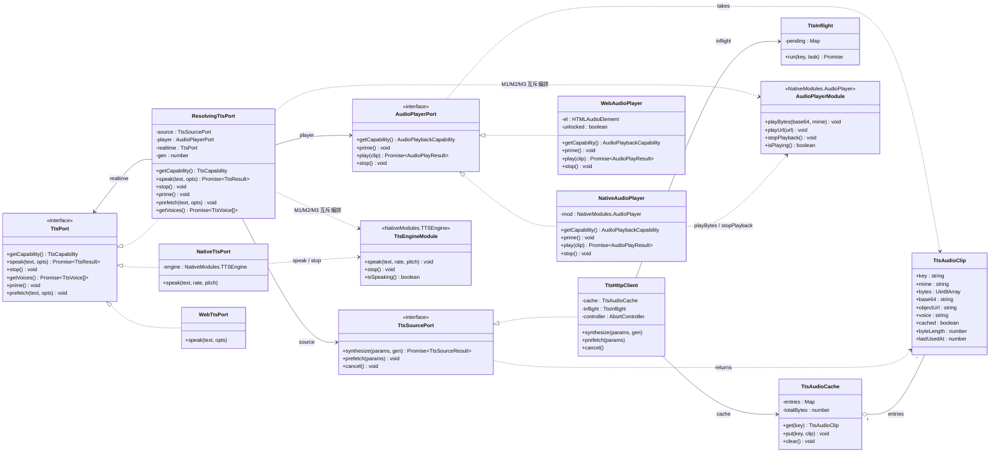
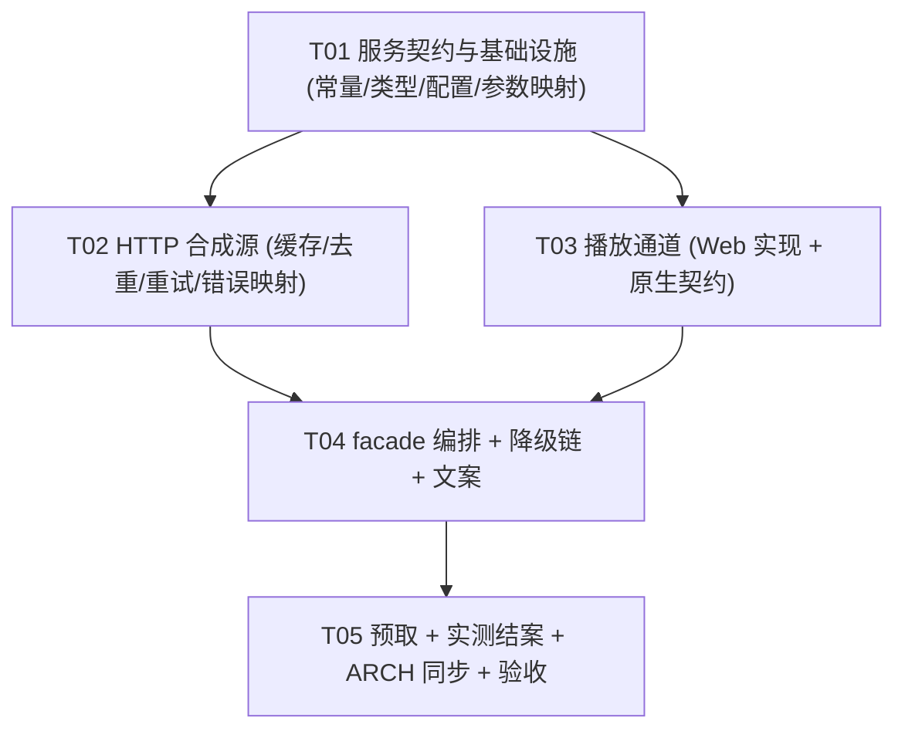

# TTS 集成方案 · HTTP 接入自建 TTS 服务（增量架构设计）v2.0

> 角色：系统架构师 高见远 ｜ 版本：**v2.0**（替换 v1.1）｜ 日期：2026-09-13
> 性质：**增量设计**，承接 `docs/design/ARCH-系统设计.md`（v1.0，下文简称「ARCH」），沿用其事实基线 / 编号 / `[新]`·`[改]` 图例 / 端口-适配器（六边形）风格。
> 上游输入：① 用户自建 TTS 服务 `ttsedservice` 的接入文档 `/Users/champliu/workspace/apps/ttsedservice/docs/tts.md`（**本文 §2 的事实来源，已逐条核实**）；② 用户拍板决策（§1.4）。
> 本次交付：**仅设计，不写实现代码，不改动 `src/**`**。
> 配套独立文件：
> - `docs/design/tts-class-diagram.mermaid` —— v2.0 类图
> - `docs/design/tts-sequence-diagram.mermaid` —— v2.0 时序图（三条链路）

---

## 0. 阅读指引

- 本文**整体替换** `docs/design/TTS-集成方案.md` 的 v1.1 内容（路径不变，保持文档连续性）。v1.1 的**主干方案作废**，废弃内容集中在 §1.2 决策记录里，其余章节不再作为设计依据。
- 本文只描述**相对 ARCH v1.0 的增量**：新增/修改的文件、类型、时序、任务。未提及的 ARCH 章节**继续有效，不作废**。
- **落地现状**：v1.1 虽已写进设计，但**工程侧零落地** —— `scripts/gen-tts/**`、`src/types/audio.ts`、`src/engine/tts/audio-catalog.ts`、`data/build/audio*/**` 在仓库中**均不存在**（已核实）。因此 v2.0 是**纯设计替换**，无回滚成本、无产物清理成本。
- 本文对 ARCH 的 **3 处显式修订**（实施时必须同步改 ARCH 源文件，见 §12.6）：
  - **修订 R1**：允许引用全局 `NativeModules` 的文件集合 `2 → 3`（ARCH §1.5 / §2.5 / §2.12 / §8.5）。
  - **修订 R2**：`TtsResult` 判别联合加宽（ARCH §3.4）。
  - **修订 R3**：`src/services/ttsController.ts` 接线（2 行最小改动，ARCH §4.2）。
- 本文另含 **1 处主理人仲裁后的方案决策**：原生播放采用**独立 `NativeModules.AudioPlayer` 模块**（而非扩展既有 `TTSEngine`），决策记录见 **§1.5**；由此引出的**双通道互斥编排**为硬性约定，落在 **§4.5.2**（播放通道设计侧）与 **§12.7**（跨文件共享约定侧）两处。
- 红线不变量（**继续成立，不得违反**）：端口永不 throw；引擎层纯 TS 零框架；页面/store/service 只 import `src/engine/tts/index.js`；朗读文本恒取 `word.kana`；无 Tailwind/MUI；无 `localStorage`；`data/build/*.json` 为唯一数据入口；运行期**零新增依赖**。

---

# Part A · 系统设计

## 1. 方案总览

### 1.1 v2.0 一句话

> **客户端用平台 `fetch` 调用自建 TTS 服务的 HTTP 接口拉取日语假名/例句的 MP3 字节，交给「播放器」出声；拿不到或播不了时，依次降级到原生 TTS → Web `speechSynthesis` → 「明确文案 + 复制假名」。**

### 1.2 v1.x 为何被推翻（决策记录）

| 项 | v1.1（旧） | v2.0（新） |
|---|---|---|
| **前提** | 客户端**无法**直连 Edge 朗读端点（Lynx 无 WebSocket / 端点要求自定义 WS 头） | 前提**消失**：用户已自建 `ttsedservice`（Go + Kratos，内部 edge-tts-go），**对外提供 HTTP 接口** |
| **合成时机** | **构建期**离线预生成（`scripts/gen-tts/*` + `msedge-tts`） | **运行期**按需 HTTP 拉取 |
| **音频来源** | `data/build/audio/<hash>.mp3` 随包分发 + `audio-manifest.json` 清单 | 服务端实时合成，客户端**内存 LRU** 缓存 |
| **播放** | 读包内文件 / H5 `AUDIO_ASSET_BASE + file` | 原生 `playBytes(base64)` / Web DOM `<audio>` + Blob URL |
| **语速/音调** | 构建期冻结局速（单档中性），越界回落实时合成 | **服务端参数**（`rate` / `pitch`）→ 每次请求携带，天然连续 |
| **包体** | seed ≈0.4MB、目标规模 ≈28–40MB（**核心权衡点**） | **无音频产物、无包体增量** |
| **网络依赖** | 无（纯离线） | 有（HTTP），因此引入超时/重试/降级设计（§6） |

**废弃产物清单（一律不再新增；已核实仓库中本就不存在）**：

| 作废项 | 说明 |
|---|---|
| `scripts/gen-tts/**`（`schema/corpus/client/synth/pool/build-manifest/validate/list-voices/index/**`） | 整套离线预生成管线作废 |
| `data/build/audio-manifest.json`、`data/build/audio/<hash>.mp3`、`data/build/audio/`、`data/build/audio-failures.json`、`data/build/audio-voices.json` | 音频产物与清单全部作废 |
| `src/types/audio.ts`、`src/engine/tts/audio-catalog.ts` | 「清单来源解析」概念作废，改为「HTTP 合成源」（`TtsSourcePort`） |
| devDependency `msedge-tts` / `https-proxy-agent` | **不引入** |
| npm scripts `gen:tts` / `gen:tts:check` / `gen:tts:prune` | **不新增** |
| v1.1 任务 **T01–T04** | **全部作废**，以本文 §11 的 T01–T05 为准 |
| v1.1 事实基线 G1–G14（`Sec-MS-GEC` / `OUTPUT_FORMAT` 三档 / 内容哈希命名 / 403 时钟纠偏 / 随包 vs 分片下载） | **不再作为设计依据**；仅在本节留痕 |
| v1.1 修订 R1 / R2 的具体取值 | 被本文 R1 / R2 取代（`audio-local`/`audio-remote`/`audio-error` → `http` / `service-unavailable` 等） |

**v1.1 中被保留下来的正确设计（继续有效）**：
1. **来源 / 播放分离**（v1.1 §3.1）：`AudioSourcePort` + `AudioPlayerPort` + facade 编排。v2.0 只是把「来源」从「清单查表」换成「HTTP 拉取」，三层的职责边界与「引擎层可单测」的目标完全一致。
2. **向后兼容红线**：`TtsPort` 对外签名不变，页面 / `ttsController` / `TtsButton` 调用方式零改动，改动集中在 `src/engine/tts/index.ts`。
3. **来源 / 播放分离**（v1.1 §3.1 的延伸，但**模块形态已改**）：v1.1 主张「扩展 `NativeModules.TTSEngine` 承载播放」，v2.0 **改为新增独立 `NativeModules.AudioPlayer`** —— 仲裁结论与四条理由见 **§1.5**。v1.1 原本靠「同一模块 → 单一音频会话 → 天然互斥」获得的互斥性，改由 **facade / 播放器层显式编排**完整补偿（§4.5.2、§12.7），能力不丢失。
4. **零静默失败**：每一级降级要么成功、要么给出文案。

### 1.3 本期做 / 不做（明确边界）

- **做**：HTTP 合成源（参数映射 + 传输 + 错误映射）、内存 LRU 缓存 + 并发去重 + 超时/重试/取消、Web 播放通道（DOM `<audio>`）、原生播放器**契约**、facade 降级链与文案、预取。
- **不做**：
  - 原生播放器**实现**（iOS/Android/Harmony 原生代码超出本仓库范围，本期只定 JS 侧契约与 README）。
  - 持久化音频缓存（需原生文件能力；`StoragePort` 只存字符串、建议 <1MB）。
  - 客户端熔断（无跨会话状态），列为后续优化（§13）。
  - 音色可选项 UI（P9 不新增音色选择；默认 `ja-JP-NanamiNeural`，仅常量可配）。
  - `/v1/tts/languages` 调用（语种与音色固定，不引入额外网络依赖）。
  - gRPC（Lynx 只能用 HTTP）。
- **保持不动**：`TtsButton`、`Study`、`VocabDetail`、`Quiz`、`Me` 的**调用方式**（一律 `ttsController.speak(word.kana, settings)`）。

### 1.4 用户已拍板的决策（本文硬约束）

| # | 决策 | 本文落点 |
|---|------|---------|
| D1 | 本轮**只交付 v2.0 设计方案**，不实现代码 | 本文档；不触碰 `src/**` |
| D2 | **Web/H5 优先保证能出声**：做到「HTTP 拉取 → 播放」全链路可用、可验证 | §4.4 + T03/T05 判据 |
| D3 | **原生端本期只定契约**：定义 `NativeModules` 播放器方法签名与降级行为，不要求原生实现落地；原生端本期降级为「提示 + 复制假名」 | §4.5 + §4.7 链路③ |

### 1.5 决策记录：为何选独立 `AudioPlayer` 而非扩展 `TTSEngine`

> **仲裁结论（主理人已拍板）：采纳「新增独立 `NativeModules.AudioPlayer` 模块」。** 本节是两版设计唯一实质分歧的结案依据，后续评审 / 回溯以本节为准。

| # | 方案 | 一句话 |
|---|---|---|
| **A（采纳）** | **新增独立 `NativeModules.AudioPlayer`** | 合成与播放**各自注册、各自探测**；互斥由 facade 显式编排 |
| B（未采纳） | 扩展既有 `NativeModules.TTSEngine`（加 `playBytes` / `playUrl` / `stopPlayback` / `isPlaying`） | 一个模块同时承载「合成 + 播放」，依赖单一音频会话天然互斥 |

**采纳 A 的四条理由**：

1. **v2.0 下「合成」与「播放」的能力生命周期不同**：主路径是「HTTP 拉流 + 播放」；**原生 TTS 合成（`TTSEngine`）只是降级兜底**（§4.7 链路②③）。一个是主链路、一个是兜底通道，不该绑在同一个模块注册开关上。
2. **方案 B 会导致能力检测误判（硬伤）**：若把 `playBytes` 塞进 `TTSEngine`，当原生侧**只实现了「播放」但模块已注册**时，JS 侧 `createNativeTts()` 会因 `NativeModules.TTSEngine` 存在而**误判「实时合成也可用」**，直到真正调用 `speak()` 才失败 —— 这正是把两个能力耦合在一个注册开关上的代价。独立模块下 `player.native.ts` 只看 `NativeModules.AudioPlayer`、`tts.native.ts` 只看 `NativeModules.TTSEngine`，**检测粒度与真实能力一一对应，零误判**。
3. **原生侧可分阶段落地**：独立模块后，原生同学**先只实现 `AudioPlayer` 播放**即可打通 HTTP 主链路；`TTSEngine` 合成可后补。契合「原生实现不在本仓库、落地节奏不可控」的现实（§1.3、D3）。方案 B 下两者必须同批交付，任一缺失都会阻塞另一项的能力判定。
4. **与方案 B「单一音频会话互斥」的优点并不冲突**：B 的核心优点（不会两个声音同时响）在 A 下由 **facade / 播放器层显式互斥编排**完整保留 —— 见 **§4.5.2 的 M1–M5** 与 **§12.7**。

**补偿措施（采纳 A 的代价与对冲）**：

| 代价 | 对冲 |
|---|---|
| 失去「同一模块内的天然互斥」 | **M1–M5 显式互斥编排**（§4.5.2）；写进 `resolve.test.ts` 断言，属完成判据（T04） |
| 三端需注册两个模块（注册成本 ×2） | 注册是原生侧一次性成本；`AudioPlayer` 仅 4 个方法，**`TTSEngine` 保持 3 个方法零改动**（§4.5.1） |
| `src/typing.d.ts` 多一个 interface | 属**声明**扩展，**不新增 `NativeModules` 引用点**（§4.6 附注），红线计数仍为 3 |

**附带口径（全文强制一致）**：`TtsResult` 成功时的 `engine` 取值**统一为 `'http'`**（`TtsEngine = 'http' | 'native' | 'web'`）。**不采纳 `'remote'` 等其它命名**；类型定义（§4.2）、编排伪代码（§4.3）、时序图（§9 / `tts-sequence-diagram.mermaid`）、文案映射（§4.8）、单测断言（T04）全部使用 `'http'`。

---

## 2. 事实基线

### 2.1 承接 ARCH §1.0（F1–F7）

| # | 事实 | 对 v2.0 的影响 |
|---|------|--------------|
| F2 | 无 `localStorage` / `<canvas>` / **`<audio>`**；`<video>` 实验性 | Lynx 原生端**无 DOM 播放器** → 播放必须走 Native Module；持久化缓存不做 |
| F3 | Native Modules **仅后台线程**可用；`'main thread'` 指令内禁止调用 | `player.native.ts` 在后台线程；`prime()` 也必须在后台线程（手势回调内同步执行） |
| F7 | 全局网络 API **只有 `fetch` / `EventSource`，无 WebSocket** | HTTP 源只用 `fetch`；**不引入 axios**（ARCH §6.4） |
| F6 | `<viewpager>` Web 不支持 | 与 TTS 无关；但 Web 端降级思路同构（能力探测 → 降级） |

补充既有的**平台探测事实**：`SystemInfo.platform`（`'iOS'` / `'Android'` / `'Harmony'`；Lynx for Web 下为 `undefined`）已在 `src/services/platform.ts` 中使用并可被 vitest 单测 —— v2.0 用它做「平台 → 传输/格式」的可选分支（默认不分支，见 §3.6）。

### 2.2 新增 HTTP 接入事实基线（H1–H13）

> 来源：`/Users/champliu/workspace/apps/ttsedservice/docs/tts.md`（已逐条核实）。
> **服务端契约已实测结案（2026-09-12，服务在 `127.0.0.1:8000` 真实运行，主理人实跑）**：三端点可用、参数与错误码符合 H3/H5、`lang` 缺失时中文兜底（H4 成立）、`rate` 真实生效、JSON 与裸流两条传输路径均可用 —— 实测明细见 §3.8 与 §13.1 V-15。**仍未实测的只有 Lynx/客户端侧能力**（V-1~V-4、V-6）与 iOS 覆盖率/部署域名（V-5、V-9、V-14）。

| # | 事实 | 对本设计的影响 |
|---|------|--------------|
| **H1** | 服务形态：HTTP/1.1 + gRPC 双协议，**无鉴权**；默认 HTTP `0.0.0.0:8000`、gRPC `9000`；地址可配。客户端**只用 HTTP** | 客户端不传 token；base URL **必须配置化**（§6.1）；生产若补鉴权，需扩展 header（列为后续） |
| **H2** | 三个端点：`GET/POST /v1/tts/speech`（**裸音频字节流**）、`POST /v1/tts/synthesize`（**JSON**：`audio` base64 / `content_type` / `voice` / `cached`）、`GET /v1/tts/languages` | 客户端默认走 **JSON 接口**（决策见 §3.7），裸流作为可选传输；`languages` **不调用** |
| **H3** | 参数：`text`（trim，上限 2000 rune）、`lang`（BCP-47，支持别名 `ja`/`jp`）、`voice`（**优先于 lang**，不做目录校验）、`rate`（`^[+-]\d+%$`）、`volume`（同 rate）、`pitch`（`^[+-]\d+(Hz\|%)$`）、`format`（`webm`/`mp3`/`mp3-hq`） | 客户端必须**自行做参数格式化与边界 clamp**（§3）；`voice` 不校验 → 错音色会 503 → 需「去 voice 重试」（§6.4） |
| **H4** | 音色解析顺序：`voice` → `lang` 默认音色 → 服务端 `default_voice`（**`zh-CN-XiaoxiaoNeural`，中文**）；三者都不给 → 中文音色 | **本项目恒显式传 `lang=ja-JP`**（或 `voice=ja-JP-NanamiNeural`）。**绝不省略**，否则日语假名被中文音色朗读 —— 这是本设计最强约束，写进单测 |
| **H5** | 错误模型（Kratos）：响应体 `{"code":400,"reason":"TTS_INVALID_ARGUMENT","message":"..."}`；400 `TTS_INVALID_ARGUMENT` / 400 `TTS_LANGUAGE_UNSUPPORTED` / 503 `TTS_UPSTREAM_UNAVAILABLE` / 504 `TTS_UPSTREAM_TIMEOUT` | 客户端按 `reason` 做**分类重试与文案**（§4.8）；**裸流路由出错也返回 JSON** → 调用方必须先判状态码 |
| **H6** | 服务端缓存：`golang-lru/v2`，**容量 256 条**，单条上限 1MiB，key = `sha256(format\0voice\0rate\0volume\0pitch\0text)`；`singleflight` 防击穿；**进程内缓存，重启失效** | 客户端缓存 key **与服务端语义对齐**（§5.2）；服务端缓存不保证命中 → 客户端仍要有自己的缓存 |
| **H7** | **不是边生成边推流**：一次性写出，**首字节延迟 = 整段合成时间**；单次合成 deadline **20s**；server http timeout 30s | ① 客户端超时必须**早于**服务端（8s，§6.3）；② 客户端需要**内存缓存 + 预取**（§5）；③ `<audio src>` 直连没有「边下边播」收益 |
| **H8** | **无鉴权、无限流**；上游 Edge 端点**无 SLA** | 客户端必须做**超时 + 重试 + 降级**；熔断本期不做（§13） |
| **H9** | 响应头：`Content-Type`（`audio/webm` / `audio/mpeg`）、`Content-Length`、**`X-TTS-Cache: hit\|miss`**、**`X-TTS-Voice`**、`Cache-Control: private, max-age=86400`；跨域读 `X-TTS-*` 需网关补 `Access-Control-Expose-Headers` | `cached` / `voice` 视为**可选元数据**，读不到置 `undefined`，**不影响播放**；JSON 接口的 `voice`/`cached` 在**响应体**里 → 不受 CORS 限制（§5.5） |
| **H10** | 语料特征（项目实测）：词假名**均 3.0 字**、例句**均 14.4 字** | 音频量级 **10–60KB**；base64 +33% 的开销、内存缓存容量、GET query 长度**均无压力**；8s 超时有充分余量 |
| **H11** | Lynx 侧 `fetch` 能力子集未知：`Blob`/`FormData` **不支持**；`arrayBuffer()` / `AbortController` / POST+JSON body / `response.headers` 读取 **待实测**（V-1~V-4） | 必须**双传输路径 + 能力降级矩阵**（§3.7、§6.5）；`generation token` 兜底**必须实现**（不依赖 AbortController） |
| **H12** | Lynx 原生端无 `<audio>`；Lynx for Web 的后台线程（Worker）中是否可用 DOM `Audio` / `URL.createObjectURL` **待实测**（V-6） | `player.web.ts` 用**能力探测**（`typeof globalThis.Audio === 'function'`），探测不到即返回 `null` → 降级，不崩 |
| **H13** | **query 参数编码（GET / 裸流路径独有的坑）**：`+` 在 URL query 中会被解码为**空格**，`%` 若不转义为 `%25` 属非法转义 —— 二者都会让服务端正则 `^[+-]\d+%$`（rate/volume）与 `^[+-]\d+(Hz\|%)$`（pitch）**匹配失败 → 400 `TTS_INVALID_ARGUMENT`**。**JSON POST 路径无此问题**（参数在 body 里，无 query 解码） | **实测（2026-09-12）**：`?rate=+0%` / `?rate=-50%`（未编码）→ **400**；`?rate=%2B0%25` → 200（9348 字节，与基准一致）；`?rate=-50%25` → 200（**18228 字节**，语速变慢、音频变长，证明 `rate` 生效）；`?pitch=-50Hz`（连字符安全，未编码）→ 200。**对本设计的影响**：① `buildSpeechUrl` **禁止字符串拼接**，必须用 `URLSearchParams`（§3.8）；② 进一步**加强 §3.7「默认 JSON 传输」的理由**（见该节理由 ⑤）；③ `+`/`-` 只在 query 路径需编码，`cacheKey` 用**未编码**的参数串（与服务端 key 语义对齐，§5.2） |

---

## 3. 接口参数映射（字段级）

### 3.1 总表（客户端字段 → 服务参数）

| 客户端来源 | 服务参数 | 取值规则 | 边界 / 格式 |
|---|---|---|---|
| `word.kana`（P2 整卡 / P3 / C1 发音按钮）<br>`sentence.ja`（P3 / P5 例句朗读）<br>`STRINGS.me.previewText`（P9 试听） | `text` | 原样传递（服务端会 trim） | 空字符串 → **不发起请求**，直接走降级（避免必 400）；>2000 rune → 400（本项目语料不会触发，**不截断**：宁可降级也不朗读被截断的错误内容） |
| **常量** | `lang` | **恒 `'ja-JP'`** | **禁止省略**（省略会落到服务端中文兜底音色，见 H4） |
| `src/constants/tts.ts` 的 `TTS_DEFAULT_VOICE`（可配置） | `voice` | 默认 `'ja-JP-NanamiNeural'` | 服务端**不校验**音色 → 上游不识别时 503 → 重试时**去掉 voice**（§6.4） |
| `StudySettings.rate`（`[0.5, 1.5]`，step 0.1，默认 `1`） | `rate` | `pct = Math.round((rate - 1) * 100)` → `${pct>=0?'+':'-'}${abs(pct)}%` | 格式 `^[+-]\d+%$`；0.5→`-50%`、1.0→`+0%`、1.5→`+50%` |
| `StudySettings.pitch`（`[0.5, 1.5]`，step 0.1，默认 `1`） | `pitch` | `delta = Math.round((pitch - 1) * 100)` → `${delta>=0?'+':'-'}${abs(delta)}${TTS_PITCH_UNIT}` | 格式 `^[+-]\d+(Hz\|%)$`；单位常量默认 `Hz`：0.5→`-50Hz`、1.0→`+0Hz`、1.5→`+50Hz` |
| **无对应设置** | `volume` | **省略**（服务端默认 `+0%`） | 本期不暴露音量设置 |
| 平台 / 常量 | `format` | **`mp3`** | 见 §3.6（iOS WebM/Opus 兼容性） |

> ⚠️ **编码纪律（H13）**：上表 `rate` / `pitch` / `volume` 的取值含 **`+`** 与 **`%`**。经 **JSON body**（默认路径）传递时原样写入即可；若走 **GET query 裸流路径**，**必须由 `URLSearchParams` 自动编码**（`+`→`%2B`、`%`→`%25`），手工拼接会得到 400。实现与单测要求见 **§3.8**。

### 3.2 `text`

```ts
// src/engine/tts/request.ts（纯函数，可单测）
/** 朗读文本归一：trim 后判空；不做任何截断 / 替换。 */
export function normalizeText(text: string): string {
  return text.trim()
}
```
- 朗读依据红线（ARCH §4.2）：**词恒取 `word.kana`**，句恒取 `sentence.ja`；语法点 `Grammar.pattern` **不直接朗读**（走其关联例句）。
- 空文本 → `TtsSourceResult.ok=false, reason='bad-request'`（不发请求），facade 直接进入降级链。

### 3.3 `lang` 与 `voice`

```ts
export const TTS_LANG = 'ja-JP'            // 恒显式，禁止省略（H4）
export const TTS_DEFAULT_VOICE = 'ja-JP-NanamiNeural'  // 日語女声，可配置
export const TTS_VOICE: string = TTS_DEFAULT_VOICE      // 置空串 → 只传 lang（服务端映射到 Nanami）
```

**决策：两个参数都传。**
- 理由：`voice` 优先于 `lang`；两者都传时，即使未来 `TTS_VOICE` 配错（503），也能通过「重试去 voice」回落到 `lang=ja-JP` 的默认音色（§6.4），形成双保险。
- **替代方案**（未采用）：只传 `voice`。理由不成立 —— 少了 `lang` 的兜底，且 503 时无法自动降级音色。
- 单测断言：`buildSynthesisParams()` 的输出**必须**包含 `lang === 'ja-JP'`，任何分支都不允许 `lang` 为空。

### 3.4 `rate` 映射

```ts
/** StudySettings.rate(0.5~1.5，1.0 为正常) → 服务 rate 字符串。 */
export function toRateParam(rate: number | undefined): string {
  const r = clamp(rate ?? 1, 0.5, 1.5)          // undefined / NaN → 1
  const pct = Math.round((r - 1) * 100)         // -50 .. +50
  return `${pct >= 0 ? '+' : '-'}${Math.abs(pct)}%`
}
```

| `StudySettings.rate` | 0.5 | 0.8 | 1.0 | 1.2 | 1.5 | 越界(0.2/3.0) | `undefined`/NaN |
|---|---|---|---|---|---|---|---|
| `rate` 参数 | `-50%` | `-20%` | `+0%` | `+20%` | `+50%` | `-50%` / `+50%`（clamp） | `+0%` |

> 说明：Edge 侧 `rate` 的可接受区间通常为 `-100% ~ +100%`，本项目 `±50%` 安全。

### 3.5 `pitch` 映射

```ts
/** 音调单位：'Hz'（默认）| '%'。放 src/constants/tts.ts。 */
export const TTS_PITCH_UNIT: 'Hz' | '%' = 'Hz'

export function toPitchParam(pitch: number | undefined): string {
  const p = clamp(pitch ?? 1, 0.5, 1.5)
  const delta = Math.round((p - 1) * 100)       // -50 .. +50
  return `${delta >= 0 ? '+' : '-'}${Math.abs(delta)}${TTS_PITCH_UNIT}`
}
```

| `StudySettings.pitch` | 0.5 | 0.8 | 1.0 | 1.2 | 1.5 |
|---|---|---|---|---|---|
| `pitch` 参数（`Hz`） | `-50Hz` | `-20Hz` | `+0Hz` | `+20Hz` | `+50Hz` |
| `pitch` 参数（`%`，备选） | `-50%` | `-20%` | `+0%` | `+20%` | `+50%` |

**单位决策：默认 `Hz`。** 理由：Edge 朗读服务对音调的习惯表达是 Hz 偏移（`±50Hz` 是常见安全区间，服务文档示例即 `-50Hz`）；百分比音调在部分音色上表现不稳定。**替代方案**：`%`（与 `rate` 同构，心智更统一）—— 常量可切换，切换无需改代码结构。此项标**待实测 V-13**（主观听感，T05 验收时确认）。

### 3.6 `format` 选型（含 iOS WebM/Opus 兼容性）

| 平台 / 宿主 | `webm`（Opus） | `mp3` | `mp3-hq`（96kbps） |
|---|---|---|---|
| iOS Safari / WKWebView | ❌ **历史上不支持 WebM/Opus**（**待实测 V-5**） | ✅ | ✅ |
| Android WebView / Chrome | ✅ | ✅ | ✅ |
| Harmony WebView | 待实测 | ✅ | ✅ |
| 桌面 Chrome / Firefox | ✅ | ✅ | ✅ |
| 桌面 Safari | 部分版本支持（待实测） | ✅ | ✅ |
| 原生 iOS（`AVAudioPlayer`） | ❌ 不支持 WebM/Opus | ✅ | ✅ |
| 原生 Android（`MediaPlayer`/ExoPlayer`） | ✅ | ✅ | ✅ |
| 原生 Harmony（`AVPlayer`） | 待实测 | ✅ | ✅ |

**决策：全平台统一 `format = 'mp3'`**（常量 `TTS_FORMAT`，不做平台分支）。

理由：
1. **iOS 是硬阻塞**：Web 侧（iOS Safari）与原生侧（`AVAudioPlayer`）两端都不可靠支持 WebM/Opus，而 iOS 是必保平台。
2. **语料极短**：词 3 字 / 例句 14.4 字（H10），mp3 与 opus 的绝对体积差在 **几 KB ~ 几十 KB**，不值得为此引入平台分支与兼容性风险。
3. **单一常量**降低测试面与缓存 key 维度（缓存 key 含 `format`，分支会让缓存命中率下降）。

**代价**：48kbps 单声道 mp3 的音质略低于同等码率 Opus（语音朗读场景主观差异极小）。
**替代 / 逃生舱**：
- `TTS_FORMAT_BY_PLATFORM?: Partial<Record<'iOS'|'Android'|'Harmony'|'web', TtsAudioFormat>>` —— 默认 `undefined`（不启用）。仅当实测发现某平台 mp3 有问题时启用。
- `mp3-hq`：本期**不**做成 P9 开关（避免设置面膨胀），保留常量即可。

> **待实测 V-5**：iOS Safari 各版本对 WebM/Opus 的支持边界；**待实测 V-14**：mp3（24kHz/48kbps）在三端 WebView 与原生解码器的实际可播性。两者只需确认「mp3 全平台可播」即可结案（WebM 已不采用）。

### 3.7 传输方式决策：JSON 接口 vs 裸流

| 方案 | 做法 | 优点 | 缺点 |
|------|------|------|------|
| **A 裸流** `GET /v1/tts/speech?...` | `fetch` → `arrayBuffer()` → 字节 | ① 传输体积小（无 base64 +33%）；② 可把远端 URL 直接给 `<audio src>`（一行出声）；③ 浏览器 HTTP 缓存可命中（`Cache-Control: max-age=86400`） | ① **原生端播放需要 base64** → 必须 `arrayBuffer()`（能力未知 V-1）+ 手写 base64 编码；② `X-TTS-*` 需 CORS `Access-Control-Expose-Headers`（V-4）；③ **出错时返回的是 JSON 不是音频**，调用方必须先判状态码再决定解析方式（服务文档明确警示，易错）；④ 长文本 URL 可能超长；⑤ **query 编码坑（H13）**：`rate`/`pitch`/`volume` 的 `+`/`%` 必须手工编码，漏编码即 400（实测见 H13） |
| **B JSON** `POST /v1/tts/synthesize` **（默认）** | `fetch(POST, JSON body)` → `{audio(base64), content_type, voice, cached}` | ① **原生端零转换**（`audio` 就是 base64）；② `voice`/`cached` 在**响应体**内，不受 CORS 限制；③ 成功/失败响应**同构**（都是 JSON），解析分支少；④ 不受 URL 长度限制；⑤ **无 query 编码坑**（H13）：`+`/`%` 在 body 里不参与 query 解码，`rate='+0%'` 原样送达；走 GET query 则必须手工把 `+`→`%2B`、`%`→`%25`，漏一个就 400 | ① base64 **+33%** 传输体积（30KB → 40KB 量级，可忽略）；② 无法给 `<audio src>` 直连（我们本也不用，见 §4.4）；③ 需要 `fetch` 支持 POST + JSON body（V-3） |

**决策：默认 B（JSON），常量 `TTS_TRANSPORT: 'json' | 'stream' = 'json'`；两条路径都实现（同一 `synthesize()` 内分支），T01 实测后锁定默认值。**

**能力矩阵（实测后按格锁定常量，不改架构）**：

| Lynx `fetch` 实测能力 | Web 端 | 原生端 |
|---|---|---|
| 支持 POST + JSON body + `json()`（**默认假设**） | B（JSON）→ atob → `Uint8Array` → Blob | B（JSON）→ `playBytes(base64)` |
| 仅支持 GET，但支持 `arrayBuffer()` | A（`GET /speech`）→ Blob | A → `arrayBuffer()` → 手写 base64 → `playBytes` |
| 仅支持 GET，且**不支持** `arrayBuffer()` | A → `<audio src={url}>` **直连**（不需要 arrayBuffer） | **放弃 HTTP 路径** → 原生 TTS / 复制假名（符合 D3） |

> 直连 `<audio src>` 是 A 的**降级预案**（非常规路径），仅在 V-1 失败时使用；届时放弃「读 `X-TTS-*`」与「精确错误分类」（按 `audio.onerror` 归为 `play-error`）。

### 3.8 请求构造与冒烟示例

```ts
// src/engine/tts/request.ts（纯函数）
export interface SynthesisParams {
  text: string; lang: string; voice?: string
  rate: string; pitch: string; format: TtsAudioFormat
}
export function buildSynthesisParams(
  text: string,
  opts: { rate?: number; pitch?: number },
): SynthesisParams
export function buildSpeechUrl(base: string, p: SynthesisParams): string   // transport='stream'
export function buildSynthesizeRequest(p: SynthesisParams): { url: string; init: RequestInitLike } // 'json'
export function cacheKey(p: SynthesisParams): string                        // §5.2
```

**curl 冒烟（T01 完成判据第 1 条）—— 已由主理人于 2026-09-12 实测通过，脚本如下（复制粘贴即可跑通）**：

> ⚠️ **query 路径必读（H13）**：`rate` / `pitch` / `volume` 里的 `+` 与 `%` **必须 URL 编码**，否则服务端解码后拿到 `" 0%"`（含空格）→ 正则不匹配 → **400 `TTS_INVALID_ARGUMENT`**。
> 两条等价写法（脚本内都给出）：**写法 A** 显式 `%2B0%25`；**写法 B** `curl -G --data-urlencode`（curl 自动编码）。**JSON POST 路径不存在此问题**。

```bash
C() { curl -s --noproxy '*' "$@"; }
BASE=http://127.0.0.1:8000

# ── ① 基准：日语词裸流（默认 webm）── 实测 200 / audio/webm / 9348 字节 / X-Tts-Voice: ja-JP-NanamiNeural
$C -D /tmp/h1.txt -o /tmp/w1.webm "$BASE/v1/tts/speech?text=%E3%81%AD%E3%81%93&lang=ja-JP"
wc -c /tmp/w1.webm; grep -iE '^HTTP|content-type|x-tts' /tmp/h1.txt

# ── ② 客户端实际 format：mp3 ── 实测 200 / Content-Type: audio/mpeg
$C -D - -o /tmp/w1.mp3 "$BASE/v1/tts/speech?text=%E3%81%AD%E3%81%93&lang=ja-JP&format=mp3" \
  | grep -iE '^HTTP|content-type|x-tts'

# ── ③ rate 写法 A：显式百分号编码（+ → %2B，% → %25）──
#   +0%：实测 200，字节数与基准一致（常态语速）
$C -o /tmp/r_plus.webm "$BASE/v1/tts/speech?text=%E3%81%AD%E3%81%93&lang=ja-JP&rate=%2B0%25"
#   -50%：实测 200，18228 字节（语速变慢 → 音频变长，证明 rate 真实生效）
$C -o /tmp/r_minus.webm "$BASE/v1/tts/speech?text=%E3%81%AD%E3%81%93&lang=ja-JP&rate=-50%25"
wc -c /tmp/r_plus.webm /tmp/r_minus.webm     # 期望：+0% ≈ 9348 字节 vs -50% = 18228 字节（后者明显更长）

# ── ④ rate 写法 B：--data-urlencode 让 curl 自动编码（与写法 A 等价）──
$C -G -o /tmp/r_plus2.webm \
   --data-urlencode 'text=ねこ'   --data-urlencode 'lang=ja-JP' \
   --data-urlencode 'rate=+0%'    --data-urlencode 'pitch=+0Hz' \
   "$BASE/v1/tts/speech"
# 期望：200，与 ③ 的 +0% 结果一致

# ── ⑤ 编码回归（漏编码必须 400）──
$C -o /dev/null -w '未编码 rate=+0%%   → %{http_code}\n' \
   "$BASE/v1/tts/speech?text=%E3%81%AD%E3%81%93&lang=ja-JP&rate=+0%&format=mp3"     # 实测 400
$C -o /dev/null -w '未编码 rate=-50%%  → %{http_code}\n' \
   "$BASE/v1/tts/speech?text=%E3%81%AD%E3%81%93&lang=ja-JP&rate=-50%&format=mp3"    # 实测 400
$C -o /dev/null -w '已编码 rate=-50%%25 → %{http_code}\n' \
   "$BASE/v1/tts/speech?text=%E3%81%AD%E3%81%93&lang=ja-JP&rate=-50%25&format=mp3"  # 实测 200
# 注：pitch=-50Hz 的连字符本身在 query 中安全，未编码也实测 200；但**统一交给 URLSearchParams 编码**最稳妥

# ── ⑥ JSON 接口（客户端默认路径）── 实测 200，返回 {"audio":"GkXfowEAAA… (base64)
$C -X POST "$BASE/v1/tts/synthesize" -H 'Content-Type: application/json' \
   -d '{"text":"ねこ","lang":"ja-JP","voice":"ja-JP-NanamiNeural","rate":"+0%","pitch":"+0Hz","format":"mp3"}' \
   | head -c 120
# 注意：body 里的 "+0%" **原样写**（不编码），JSON 路径无 query 解码 → 实测正常

# ── ⑦ 端点探活 ── 实测 200
$C -o /dev/null -w 'languages → %{http_code}\n' "$BASE/v1/tts/languages"

# ── ⑧ 不传 lang 的反例（验证 H4）── 实测 X-Tts-Voice: zh-CN-XiaoxiaoNeural（中文兜底！）
$C -D - -o /dev/null "$BASE/v1/tts/speech?text=test" | grep -i x-tts-voice
# 结论：省略 lang 真的会落到中文音色 → 「lang=ja-JP 恒传」是硬约束，非推演

# ── ⑨ 错误码回归 ── 实测：空文本 400、坏 lang 400、坏 voice 503
$C -o /dev/null -w '空文本       → %{http_code}\n' "$BASE/v1/tts/speech"
$C -o /dev/null -w '坏 lang=xx-YY → %{http_code}\n' "$BASE/v1/tts/speech?text=hi&lang=xx-YY"
$C -o /dev/null -w '坏 voice      → %{http_code}\n' "$BASE/v1/tts/speech?text=hi&voice=ja-JP-NotExistNeural"
```

> 实测期望值汇总（2026-09-12）：基准 webm **9348 字节**；`rate=+0%` 同量级；`rate=-50%` **18228 字节**（≈ 2 倍，语速生效）；未编码 `rate` → **400**；`format=mp3` → `audio/mpeg`；不传 `lang` → `zh-CN-XiaoxiaoNeural`。

**实现纪律：query 必须交给 `URLSearchParams`，禁止字符串拼接**

H13 是**真实事故点**（实测 400），因此 `buildSpeechUrl()` 的 `transport='stream'` 分支必须：

```ts
// src/engine/tts/request.ts（纯函数，可单测）
export function buildSpeechUrl(base: string, p: SynthesisParams): string {
  // ✅ 唯一正确写法：URLSearchParams 自动编码（+ → %2B、% → %25）
  const q = new URLSearchParams()
  q.set('text', p.text)
  q.set('lang', p.lang)
  if (p.voice) q.set('voice', p.voice)
  q.set('rate', p.rate)       // 值为 '+0%'，编码后 → '%2B0%25'
  q.set('pitch', p.pitch)     // 值为 '+0Hz'，编码后 → '%2B0Hz'
  q.set('format', p.format)
  return `${base}/v1/tts/speech?${q.toString()}`

  // ❌ 禁止：模板串拼接 —— rate='+0%' 会原样进 URL → 服务端解成 " 0%" → 400
  // return `${base}/v1/tts/speech?text=${p.text}&lang=${p.lang}&rate=${p.rate}&pitch=${p.pitch}&format=${p.format}`
}
```

- `URLSearchParams` 会把空格编码为 `+`：本项目 `text` 已 `trim`（§3.2）且 `rate`/`pitch`/`volume` 取值不含空格，故**安全**。
- **`cacheKey()` 用未编码的参数串**（值恒为 `'+0%'` / `'+0Hz'`），与服务端 key 语义对齐（§5.2）—— 编码只发生在 URL 组装的最外层，**不污染 `SynthesisParams` 内部值**。

**单测断言（T01 完成判据第 3 条要求）**：

```ts
// src/engine/tts/__tests__/request.test.ts
expect(toRateParam(1.0)).toBe('+0%')                    // ① 语义层：值本身带 '+'
const url = buildSpeechUrl('http://x', buildSynthesisParams('ねこ', { rate: 1.0, pitch: 1.0 }))
expect(url).toContain('rate=%2B0%25')                   // ② 编码层：'+' → '%2B'、'%' → '%25'
expect(url).toContain('pitch=%2B0Hz')
expect(url).not.toMatch(/[?&]rate=[^&]*\+/)             // ③ 最终 query 中**不得出现裸 '+'**（回归 H13）
expect(url).not.toMatch(/%[^0-9A-Fa-f]/)                // ④ 不得有非法 '%' 转义
```

---

## 4. 端口与播放通道设计（本设计核心）

### 4.1 职责划分（三层 + 编排）

| 关注点 | 端口 | 实现 | 位置 | 原生依赖 |
|--------|------|------|------|---------|
| **合成源（HTTP）** | `TtsSourcePort` | `TtsHttpClient`（参数映射 → `fetch` → 错误映射 → 缓存 → 并发去重 → 重试） | `src/engine/tts/tts-client.ts` `[新]` | **无**（仅平台 `fetch`） |
| **缓存** | `TtsAudioCache` | 内存 LRU（条目 + 字节双限） | `src/engine/tts/audio-cache.ts` `[新]` | 无 |
| **并发去重** | `TtsInflight` | 客户端 singleflight | `src/engine/tts/inflight.ts` `[新]` | 无 |
| **播放** | `AudioPlayerPort` | `NativeAudioPlayer` | `src/engine/tts/player.native.ts` `[新]` | **有**（`NativeModules.AudioPlayer`，**独立模块**，§1.5） |
| | | `WebAudioPlayer` | `src/engine/tts/player.web.ts` `[新]` | 无（DOM `Audio`） |
| | （facade） | `createAudioPlayer()` 探测 native → web → `null` | `src/engine/tts/player.ts` `[新]` | 无 |
| **合成（既有）** | `TtsPort` | `NativeTtsPort` / `WebTtsPort` / `UnsupportedTtsPort` | 保持不变 | 有（`tts.native.ts`） |
| **编排** | `TtsPort`（对外**不变**） | `ResolvingTtsPort` | `src/engine/tts/index.ts` `[改]` | 无 |

**页面 / store / service 一律只 import `src/engine/tts/index.js`**（ARCH §8.1）；`tts-client.ts` / `audio-cache.ts` / `inflight.ts` / `player*.ts` / `request.ts` 均为 **engine 内部文件**，外部禁止 import。

### 4.2 类型定义（字段级）

新增 `src/types/tts.ts` `[新]`（**取代 v1.1 的 `src/types/audio.ts`，后者不再新增**）：

```ts
/** 服务侧音频格式（三档，见 H3）。 */
export type TtsAudioFormat = 'webm' | 'mp3' | 'mp3-hq'

/** 传输方式：'json'=POST /v1/tts/synthesize（默认）；'stream'=GET /v1/tts/speech。 */
export type TtsTransport = 'json' | 'stream'

/** 合成请求参数（已格式化为服务侧字符串）。 */
export interface TtsSynthesisParams {
  text: string
  lang: string                 // 恒 'ja-JP'
  voice?: string               // 可省略；省略时服务端按 lang 取默认音色
  rate: string                 // '+0%' / '-50%'
  pitch: string                // '+0Hz' / '-50Hz'
  format: TtsAudioFormat       // 默认 'mp3'
}

/** 音频片段（缓存条目）。Web 端持 bytes+objectUrl；原生端持 base64。 */
export interface TtsAudioClip {
  key: string
  mime: string                 // 'audio/mpeg'（mp3/mp3-hq）| 'audio/webm'
  bytes?: Uint8Array           // Web：Blob 播放用
  base64?: string              // 原生：playBytes 用
  objectUrl?: string           // Web：URL.createObjectURL 结果（淘汰时 revoke）
  voice?: string               // 可选元数据（JSON 接口可靠，裸流需 Expose-Headers）
  cached?: boolean             // 服务端是否命中缓存；读不到为 undefined
  byteLength: number
  lastUsedAt: number           // LRU 时间戳
}

/** 合成源失败原因（内部）。 */
export type TtsSourceFailure =
  | 'empty-text'      // 空文本，未发请求
  | 'bad-request'     // 400：参数/语种非法（程序 bug，不重试）
  | 'unavailable'     // 503：上游不可用（可重试）
  | 'timeout'         // 504 或客户端超时（可重试）
  | 'network'         // fetch reject / DNS / 断网（可重试）
  | 'error'           // 其他（解析失败、未知状态码）

/** 合成源结果（判别联合；**永不 throw**）。 */
export type TtsSourceResult =
  | { ok: true; clip: TtsAudioClip }
  | { ok: false; reason: TtsSourceFailure; status?: number; serviceReason?: string }

/** 合成源端口（纯逻辑 + 平台 fetch；不触碰 NativeModules / DOM）。 */
export interface TtsSourcePort {
  /** 合成（带缓存 + 并发去重 + 重试）。gen 为调用序号，用于丢弃迟到响应（§6.5）。 */
  synthesize(params: TtsSynthesisParams, gen: number): Promise<TtsSourceResult>
  /** 预取（fire-and-forget；不 throw、不返回）。 */
  prefetch(params: TtsSynthesisParams): void
  /** 取消在途请求（用户连点 / 切卡）。 */
  cancel(): void
}

/** 播放能力。 */
export type AudioPlaybackCapability = 'supported' | 'unsupported'

/** 播放失败原因。 */
export type AudioPlayFailure = 'no-player' | 'play-error' | 'blocked'

/** 播放结果（判别联合；**永不 throw**）。 */
export type AudioPlayResult =
  | { ok: true; channel: 'native' | 'web' }
  | { ok: false; reason: AudioPlayFailure }

/** 播放器端口（**只播放，不合成**；永不 throw）。 */
export interface AudioPlayerPort {
  getCapability(): AudioPlaybackCapability
  /** 在用户手势调用栈内**同步**解锁自动播放（Web 必需；原生实现为空操作）。 */
  prime(): void
  play(clip: TtsAudioClip): Promise<AudioPlayResult>
  stop(): void
}
```

`src/types/ports.ts` `[改]`（**修订 R2，纯加宽**）：

```ts
/** 出声来源（加宽：新增 'http'）。 */
export type TtsEngine = 'http' | 'native' | 'web'

/** 失败原因（加宽：新增 service-unavailable / service-rejected / no-player）。 */
export type TtsFailureReason =
  | 'no-tts' | 'no-ja-voice' | 'blocked' | 'error'
  | 'service-unavailable' | 'service-rejected' | 'no-player'

export type TtsResult =
  | { ok: true; engine: TtsEngine }
  | { ok: false; reason: TtsFailureReason }

export interface TtsPort {
  getCapability(): TtsCapability
  speak(text: string, opts?: TtsOptions): Promise<TtsResult>
  stop(): void
  getVoices(): Promise<TtsVoice[]>
  /** 可选：手势内同步解锁（仅 facade 实现，向后兼容）。 */
  prime?(): void
  /** 可选：预取（fire-and-forget）。 */
  prefetch?(text: string, opts?: TtsOptions): void
}
```

> **兼容性审计（逐点核对）**：`src/services/ttsController.ts` 只用 `ok` / `reason`，`describeTtsFailure` 的 `switch` **带 `default`** → 加宽安全；`src/components/TtsButton/index.tsx` 只读 `ttsController` 状态 → 零影响；`src/pages/Study`、`Quiz`、`Me` 只调 `ttsController.speak(text, settings)` → 零影响；`src/engine/tts/tts.native.ts` / `tts.web.ts` 返回 `{ok:true, engine:'native'|'web'}` → 仍是合法 `TtsEngine`。**结论：加宽为纯加宽，破坏性为零。**

### 4.3 向后兼容（本设计核心收益）

`src/engine/tts/index.ts` `[改]`：把现有「三选一探测」升级为「**探测 + 编排**」。对外仍是同一个 `ttsPort: TtsPort` 单例，**导出签名不变**（额外方法为**可选**，既有调用方无需感知）。

```ts
// 伪代码（非实现），展示路由顺序
class ResolvingTtsPort implements TtsPort {
  constructor(
    private source: TtsSourcePort,       // 新：HTTP
    private player: AudioPlayerPort | null,  // 新：播放
    private realtime: TtsPort,           // 既有 native / web / unsupported
    private settings: { voice?: string; format: TtsAudioFormat },
  ) {}

  getCapability(): TtsCapability {
    // 播放通道可用 = HTTP 路径可用 → supported；否则回落到既有合成能力
    if (this.player?.getCapability() === 'supported') return 'supported'
    return this.realtime.getCapability()
  }

  async speak(text, opts): Promise<TtsResult> {
    const gen = ++this.gen                       // ① 迟到响应丢弃（必须）
    this.realtime.stop()                         // ★ M1 互斥：进入 HTTP 播放前，先停实时合成
    // ② HTTP 合成 + 播放（仅当播放器可用；否则跳过，不浪费网络）
    if (this.player?.getCapability() === 'supported') {
      const params = buildSynthesisParams(text, opts)   // lang 恒 ja-JP
      const s = await this.source.synthesize(params, gen)
      if (s.ok) {
        const r = await this.player.play(s.clip)
        if (r.ok) return { ok: true, engine: 'http' }
        if (r.reason === 'blocked') { /* 继续降级，最终文案 blocked */ }
        // play-error / no-player → 降级
      } else if (s.reason !== 'empty-text') {
        // 网络/超时/5xx → 降级；400 也降级但记 warn
      }
    }
    this.player?.stop()                          // ★ M2 互斥：进入实时合成前，先停播放通道
    // ③ 原生 TTS 实时合成
    if (this.realtime.getCapability() !== 'unsupported') {
      const r = await this.realtime.speak(text, opts)
      if (r.ok) return r
    }
    // ④ 全部不可用 → 明确失败（零静默）
    return { ok: false, reason: this.finalReason() }
  }

  stop(): void { this.source.cancel(); this.player?.stop(); this.realtime.stop() }  // ★ M3：三通道都停（缺一即可能留残声）
  prime(): void { this.player?.prime() }
  prefetch(text, opts): void { /* 见 §5.4 */ }
  getVoices(): Promise<TtsVoice[]> { return this.realtime.getVoices() }
}
```

**向后兼容结论**：
- `TtsPort` 接口**零改动**（`prime` / `prefetch` 为可选方法）；`ttsController` / `TtsButton` / 各页面调用方式**零改动**。
- 改动集中在 `src/engine/tts/index.ts` 的编排 + `ttsController` 的 2 行接线（修订 R3）。
- 「零来源耦合」不变量在**引擎内部**得到保持：页面只知 `speak(word.kana, settings)`。

### 4.4 Web 播放实现（`player.web.ts`）

**Blob URL vs 直连远端 URL**：

| 方案 | 优点 | 缺点 |
|---|---|---|
| **Blob URL**（`fetch` → bytes → `Blob` → `createObjectURL`）**推荐** | ① **可控**：能读状态码、能按 JSON 解析错误、能区分「网络失败 / 超时 / 4xx / 5xx」给不同文案（零静默失败的前提）；② 字节可进**内存 LRU** → 「再听一次」零网络；③ 可精确 `stop()` / 取消在途请求；④ 缓存命中时可在**手势内同步 play**（见下） | ① 多一次内存拷贝（几十 KB，可忽略）；② 必须 `URL.revokeObjectURL` 防泄漏（由缓存淘汰统一处理）；③ 依赖 `arrayBuffer()`/`Blob`（V-1，失败时退直连） |
| 直连 `<audio src={url}>` | ① 少一次内存拷贝；② 代码最简；③ 浏览器 HTTP 缓存可复用 | ① **拿不到状态码与错误体** → 400/503 都变成 `MEDIA_ERR_SRC_NOT_SUPPORTED`，**无法分类文案**；② 拿不到 `X-TTS-Cache`/`X-TTS-Voice`；③ 无法取消、无法进内存缓存；④ 服务端非流式（H7）→ 没有「边下边播」收益 |

**决策：Blob URL**。理由：「零静默失败 + 精确文案 + 客户端缓存 + 可取消」是本项目的硬要求，四点都依赖拿到响应对象；而「省一次内存拷贝」在几十 KB 量级不构成收益。直连仅作为 V-1 失败时的**降级预案**。

**实现要点**：

1. **单例 `<audio>` 元素**：`ensureEl()` 惰性创建，全程复用（同一元素被解锁后可持续播放，见第 3 点）。
2. **能力探测**：`typeof globalThis.Audio === 'function'` → `supported`；否则 `unsupported`（facade 回落实时合成）。Lynx for Web 后台线程可能无 DOM（V-6）→ 探测不到即降级，**绝不崩**。
3. **自动播放解锁（iOS）**：`prime()` **同步**、**必须在用户手势调用栈内**执行 —— 由 `ttsController.speak()` 的第①步（同步块）调用（修订 R3）。实现：`el.src = SILENT_AUDIO_DATA_URI; el.play()`（10ms 静音 WAV，不设 `muted`），成功即 `unlocked = true`。
   - 理由：iOS Safari 要求**首次 `play()` 发生在手势内**；而 `speak()` 会 `await fetch`（数百 ms）后才 `play()`，手势上下文已丢失 → 首次必被 `NotAllowedError` 拦截。
   - **替代方案**（未采用）：首次失败后提示用户再点一次（既有 `blocked` 文案）。理由：首屏首次点击就失败是**可感知的质量事故**，不采用。
   - 静音片段由 T03 生成并内联为常量（**勿手写 base64**）：
     ```js
     // 一次性生成（T03），结果内联进 src/constants/tts.ts
     const data = Buffer.alloc(80, 128)                 // 8bit PCM 静音电平
     const h = Buffer.alloc(44)
     h.write('RIFF', 0); h.writeUInt32LE(36 + data.length, 4); h.write('WAVE', 8)
     h.write('fmt ', 12); h.writeUInt32LE(16, 16); h.writeUInt16LE(1, 20)
     h.writeUInt16LE(1, 22); h.writeUInt32LE(8000, 24); h.writeUInt32LE(8000, 28)
     h.writeUInt16LE(1, 32); h.writeUInt16LE(8, 34)
     h.write('data', 36); h.writeUInt32LE(data.length, 40)
     const uri = `data:audio/wav;base64,${Buffer.concat([h, data]).toString('base64')}`
     ```
4. **缓存命中 → 手势内同步播放**：`speak()` 若在缓存命中，可在同步阶段直接 `el.play()`（仍在手势栈内），延迟为零。这也是「再听一次」体验的关键。
5. `play()` 失败映射：`NotAllowedError` → `{ok:false, reason:'blocked'}`；其余 → `play-error`（**不 throw**）。
6. `stop()`：`el.pause(); el.currentTime = 0`；**不 revoke** Blob URL（缓存仍可能复用）。
7. **与既有 `tts.web.ts`（`speechSynthesis`）的排序**：**HTTP 优先**（音质与音色一致性更好，且统一走 Nanami 音色），`speechSynthesis` 退居兜底。优先级由 §4.3 的编排顺序天然实现 —— **不改动 `tts.web.ts`**。

### 4.5 原生端契约：独立 `NativeModules.AudioPlayer`（本期只定契约，D3）

> **模块名 `AudioPlayer`，与既有的 `TTSEngine` 并列、互不隶属。** 采纳理由见 §1.5；互斥补偿见 §4.5.2。

#### 4.5.1 JS 侧契约（`src/typing.d.ts` `[改]`）

在 `src/typing.d.ts` 中**新增** `NativeAudioPlayer` 接口（`NativeTtsEngine` **保持原样，不新增任何成员**），并把 `AudioPlayer?` 加进 `NativeModulesShape`：

```ts
/** 原生音频播放器（iOS AVAudioPlayer / Android MediaPlayer·ExoPlayer / Harmony AVPlayer）。 */
interface NativeAudioPlayer {
  /** 播放音频字节。base64 为音频内容（默认 mp3），mime 如 'audio/mpeg'。 */
  playBytes(base64: string, mime: string): void
  /** 播放远端音频（备用：由原生侧自行下载 / 边下边播）。 */
  playUrl(url: string): void
  /** 停止当前播放（幂等）。 */
  stopPlayback(): void
  /** 是否正在播放。 */
  isPlaying(): boolean
}

/** 原生 TTS 合成引擎（既有，**签名零改动**）。 */
interface NativeTtsEngine {
  speak(text: string, rate: number, pitch: number): void
  stop(): void
  isSpeaking(): boolean
}

interface NativeModulesShape {
  TTSEngine?: NativeTtsEngine        // 既有：实时合成（v2.0 下为降级兜底）
  AudioPlayer?: NativeAudioPlayer    // 新增：音频字节播放（HTTP 主链路）
  LynxStorage?: NativeStorage        // 既有
}
```

**方法字段级约定**：

| 方法 | 参数字段 | 语义 | 失败行为 |
|---|---|---|---|
| `playBytes(base64, mime)` | `base64`：**标准 base64，不含 `data:` 前缀**（直接取 JSON 接口 `audio` 字段）；`mime`：`'audio/mpeg'`（mp3 / mp3-hq）或 `'audio/webm'` | 播放内存音频字节；**内部先停上一次播放**再播新的（M4） | **不得抛异常**（跨线程异常会炸后台线程）；失败静默，JS 侧按 `play-error` 降级 |
| `playUrl(url)` | `url`：远端音频地址（http/https） | 原生侧自行下载并播放（**可选实现**，不影响主链路） | 同上 |
| `stopPlayback()` | — | 停止并释放当前播放；**幂等**，未播放时调用无副作用 | 同上 |
| `isPlaying()` | — | 返回当前是否正在播放 | 未播放返回 `false` |

**为什么用 base64 而不是 ArrayBuffer**：
1. Lynx Native Module 是**跨线程（JS 后台线程 ↔ 原生）同步调用**，参数需可序列化；`string` 是 iOS / Android / Harmony 三端桥**唯一稳定支持**的字节载体；`ArrayBuffer` 在部分桥实现中会被丢弃或转成 `null`（**待实测 V-12**）。
2. 与 JSON 接口（`POST /v1/tts/synthesize`）的 `audio` 字段**零转换**（默认传输路径就是 base64）。
3. 代价：+33% 体积 + base64 编解码开销 —— 在 10–60KB 量级完全可忽略（H10）。

#### 4.5.2 ★ 双通道互斥编排（独立模块后**必须**显式实现）

独立模块后，`TTSEngine`（实时合成 + 系统音频会话）与 `AudioPlayer`（HTTP 字节播放）是**两个可能同时持有音频会话的对象**，方案 B 的「天然互斥」不再成立 → 必须在 **facade（`ResolvingTtsPort`）与播放器层显式编排**，这是采纳 §1.5 方案 A 的**强制补偿项**：

| # | 触发点 | 必须执行的动作 | 落点 |
|---|---|---|---|
| **M1** | 走 **HTTP 播放**（`player.play(clip)`）**之前** | **先停实时合成通道**：`realtime.stop()`<br>原生 = `NativeModules.TTSEngine.stop()`；Web = `speechSynthesis.cancel()` | `ResolvingTtsPort.speak()` 第②步之前 |
| **M2** | 走 **实时合成**（`realtime.speak(text, opts)`）**之前** | **先停播放通道**：`player.stop()`<br>原生 = `NativeModules.AudioPlayer.stopPlayback()`；Web = `el.pause(); el.currentTime = 0` | `ResolvingTtsPort.speak()` 第③步之前 |
| **M3** | `TtsPort.stop()`（用户切卡 / 页面卸载 / 主动停止） | **两条通道同时停**：`source.cancel()` + `player.stop()` + `realtime.stop()` | `ResolvingTtsPort.stop()`（§4.3、§6.5） |
| **M4** | 同一 `AudioPlayer` 实例内连续 `playBytes` | 原生侧**内部先停后播**（方法内保证串行、覆盖上一次） | `src/native/AudioPlayer/README.md` |
| **M5** | Web 端 `speechSynthesis` 与 DOM `<audio>` 重叠 | 同 M1 / M2，由 facade 统一执行（Web 下两者共用浏览器音频输出，重叠会叠音） | `ResolvingTtsPort`；**`tts.web.ts` 本身不改** |

```ts
// 伪代码：互斥编排（ResolvingTtsPort 内，非实现）
async speak(text, opts): Promise<TtsResult> {
  const gen = ++this.gen
  // M1：进入 HTTP 播放前，先停实时合成通道
  this.realtime.stop()                       // TTSEngine.stop() / speechSynthesis.cancel()
  if (this.player?.getCapability() === 'supported') {
    const s = await this.source.synthesize(buildSynthesisParams(text, opts), gen)
    if (s.ok) {
      const r = await this.player.play(s.clip)
      if (r.ok) return { ok: true, engine: 'http' }   // 互斥已由 M1 保证
    }
  }
  // M2：进入实时合成前，先停播放通道
  this.player?.stop()                        // AudioPlayer.stopPlayback() / el.pause()
  if (this.realtime.getCapability() !== 'unsupported') {
    const r = await this.realtime.speak(text, opts)
    if (r.ok) return r
  }
  return { ok: false, reason: this.finalReason() }
}

stop(): void {
  this.source.cancel()                       // M3 之①
  this.player?.stop()                        // M3 之②（播放通道）
  this.realtime.stop()                       // M3 之③（实时合成通道）
}
```

> **「无脑先停」是安全且推荐的实现方式**：M1–M3 中的 `stop()` **全部幂等**——模块未注册时无副作用，已注册但当前未播放时亦无副作用。因此不必先查询 `isPlaying()` / `isSpeaking()` 再决定是否停止（多一次跨线程往返），直接调用即可。
> **验收**：M1–M3 必须有单测断言（fake `player` + fake `realtime` 断言调用顺序），纳入 T04 完成判据。

#### 4.5.3 三端实现要点（仅提示，本期不作为交付）

- iOS：`AVAudioPlayer(data: Data, fileTypeHint: AVFileType.mp3)`；持有单例，`playBytes` 前先 `stopPlayback()`（M4）。
- Android：`MediaPlayer` + `ByteArrayDataSource`，或 `ExoPlayer`（`ByteArrayDataSource`）；与 `TTSEngine` 共用同一 `AudioManager` 音频焦点。
- Harmony：ArkTS `@ohos.multimedia.media` 的 `AVPlayer`（`dataSrc` / `fdSrc`）。
- **跨模块互斥**：`AudioPlayer` 与 `TTSEngine` 的互斥**不在原生侧实现**，由 JS 侧 M1–M3 编排保证（§4.5.2）；原生侧只需保证**本模块内部先停后播**（M4）。
- 方法内**不得抛异常**（跨线程异常会炸后台线程），失败静默。

#### 4.5.4 原生 README 落点：建议**新增** `src/native/AudioPlayer/README.md`

**不要**把播放契约写进既有的 `src/native/TTSEngine/README.md`（该文件只描述合成，保持职责单一）。建议**新增** `src/native/AudioPlayer/README.md` `[新]`，结构与 `src/native/TTSEngine/README.md` 对齐：

| 章节 | 内容 |
|---|---|
| 1. JS 侧调用契约 | 模块注册名必须是 **`AudioPlayer`**（`NativeModules.AudioPlayer`）；§4.5.1 的 4 个方法签名与字段约定；「方法不应抛出」「未注册时 JS 侧返回 `null` → facade 降级」 |
| 2. iOS（`AVAudioPlayer`） | 单例持有、`Data` 初始化、`fileTypeHint = mp3`、先停后播 |
| 3. Android（`MediaPlayer` / `ExoPlayer`） | `ByteArrayDataSource`、音频焦点、先停后播 |
| 4. Harmony（`AVPlayer`） | `@ohos.multimedia.media`、`dataSrc` / `fdSrc`、状态机回调 |
| 5. 互斥约定 | 本模块内部先停后播（M4）；**与 `TTSEngine` 的跨模块互斥由 JS 侧 M1–M3 保证**，原生侧无需感知 |
| 6. 验收自检 | 见下方清单 |

**验收自检项**（写进 README，供原生同学自检）：

- [ ] `NativeModules.AudioPlayer` 已注册（LynxExplorer 中 `player.getCapability()` 应为 `supported`）；
- [ ] `playBytes(<ねこ 的 mp3 base64>, 'audio/mpeg')` 能出声，音色为 `ja-JP-NanamiNeural`（由服务端保证）；
- [ ] 连续两次 `playBytes` 不叠音（M4：先停后播）；
- [ ] `stopPlayback()` 立刻静音；重复调用**不崩**（幂等）；
- [ ] `isPlaying()` 在播放中为 `true`、结束后为 `false`；
- [ ] **互斥验证**：`TTSEngine.speak()` 播放中调用 `AudioPlayer.playBytes()`（或反向），JS 侧编排后应只剩一个声音（M1 / M2）；
- [ ] 未注册模块时应用**不崩**，UI 走「提示 + 复制假名」（D3）。

#### 4.5.5 本期行为（D3）

原生播放器模块未注册时 `createAudioPlayer()` 返回 `null` → facade 跳过 HTTP 路径 → 若 `TTSEngine` 也未注册 → 落到「提示 + 复制假名」。这是**当前默认可观测行为**，符合用户拍板第 3 条。
注意：**`AudioPlayer` 未注册 ≠ `TTSEngine` 未注册**，二者独立判定；仅实现其一即可获得对应通道（§1.5 理由 3）。

### 4.6 修订 R1 —— 允许引用 `NativeModules` 的文件集合 `2 → 3`

ARCH §1.5 / §2.5 / §2.12 / §8.5 中「只有 2 个 `.native.ts` 允许引用全局 `NativeModules`」的条款，**修订为 3 个**：

```
✅ src/engine/tts/tts.native.ts         （合成，既有；**只**看 NativeModules.TTSEngine）
✅ src/engine/storage/storage.native.ts （键值存储，既有；**只**看 NativeModules.LynxStorage）
✅ src/engine/tts/player.native.ts      （音频字节播放，本次新增；**只**看 NativeModules.AudioPlayer）
❌ 其他任何文件（含页面 / 服务 / store / 引擎其余部分）
```

其余约束**不变**：仅在后台线程调用；`'main thread'` 指令内**禁止**调用；端口方法**永不 throw**。

两条附注：

1. `src/typing.d.ts` 仍是**唯一的全局声明文件**；本次新增 `NativeAudioPlayer` interface 与 `NativeModulesShape.AudioPlayer?` 属**声明**扩展，**不等于新增引用点**（故计数仍为 3，而非 4）。
2. **备选路径预告（本期不落地）**：若 V-6 实测发现 Lynx for Web 的后台线程（Worker）中**没有** DOM `Audio` / `Blob`，备选方案①是「由 **Web 宿主注册 `NativeModules.AudioPlayer`**」（§13.1 V-6）。一旦采用，`src/engine/tts/player.web.ts` 将成为**第 4 个引用点**，白名单须再修订为 4。**本期仍按 3 个执行**；V-6 结案时若启用该备选，须同步回填本文 §12.3、§12.6 与 ARCH §1.5 / §8.5。

### 4.7 降级优先级链

```
点击发音（ttsController.speak(word.kana, settings)）
  │ ① 同步置视觉反馈 + ttsPort.prime?.()（≤100ms，手势内解锁）
  ▼
  ├─(1) HTTP 合成 + 播放      player.getCapability() === 'supported' 才尝试（否则跳过，不浪费流量）
  │       [M1] 互斥：先停实时合成通道 realtime.stop()
  │              （原生 NativeModules.TTSEngine.stop() ｜ Web speechSynthesis.cancel()）
  │       source.synthesize(params) → player.play(clip) → ok:true, engine:'http'
  │       ✗ 合成失败（network/timeout/unavailable/bad-request/error）→ (2)
  │       ✗ 播放失败（play-error / no-player / blocked）            → (2)
  ├─(2) 原生 TTS 实时合成      realtime.getCapability() !== 'unsupported'
  │       [M2] 互斥：先停播放通道 player.stop()
  │              （原生 NativeModules.AudioPlayer.stopPlayback() ｜ Web el.pause(); el.currentTime=0）
  │       → tts.native.speak(text, rate, pitch) → ok:true, engine:'native'
  │       ✗ 未注册 / 失败 → (3)
  ├─(3) Web speechSynthesis   H5 侧（含无日语语音检测）
  │       [M2] 同上先停播放通道（Web 下两者共用浏览器音频输出，重叠会叠音）
  │       → ok:true, engine:'web' ｜ ✗ reason:'no-ja-voice' / 'error'
  └─(4) 明确提示 + 复制假名    notice 文案 + fallbackText=kana（既有机制，零静默失败）

[stop()] [M3] 用户切卡 / 页面卸载 / 主动停止 → source.cancel() + player.stop() + realtime.stop() 三条通道全停
```

> **M1 / M2 / M3 是不可省略的互斥编排**（独立 `AudioPlayer` 模块后，「单一音频会话天然互斥」不再成立），完整定义见 **§4.5.2**，跨文件约定见 **§12.7**。

**最终对外 `reason` 的判定**：HTTP 路径失败时记录 `lastHttpFailure`，(2)(3) 也失败后按它映射文案（见 §4.8）。若 `player` 不可用（原生端）则 `lastHttpFailure` 为 `'no-player'`。

### 4.8 失败 → 文案映射（`src/constants/strings.ts` `[改]`）

`ttsController.ts` 的 `describeTtsFailure(reason)` 增补分支（**这是 `ttsController` 的唯一改动**）：

| 内部失败 | 对外 `reason` | 文案键 | 建议中文文案 |
|---|---|---|---|
| HTTP 网络失败 / 超时 / 503 / 504 | `service-unavailable` | **`tts.serviceDown`** `[新]` | 语音服务暂时不可用，已尝试系统语音；仍无声请用「复制假名」。 |
| HTTP 400（`TTS_INVALID_ARGUMENT` / `TTS_LANGUAGE_UNSUPPORTED`） | `service-rejected` | **`tts.serviceRejected`** `[新]` | 语音服务拒绝了本次请求（参数或语种异常），请用「复制假名」。 |
| 合成成功但播放器不可用 / 播放失败 | `no-player` | **`tts.noPlayer`** `[新]` | 当前环境没有可用的音频播放器，请用「复制假名」。 |
| Web 自动播放被拦截 | `blocked`（既有） | `tts.blocked`（既有） | 首次播放需在点击内触发，请再点一次「试听」。 |
| `realtime` 也无日语语音 | `no-ja-voice`（既有） | `tts.noJaVoice`（既有） | 当前环境缺少日语语音包，已降级为「复制假名」。 |
| 全通道不可用（且无 HTTP 失败记录） | `no-tts`（既有） | `tts.unsupportedBody`（既有） | 当前运行环境不支持日语语音合成，请用「复制假名」自行朗读。 |
| 其它 | `error`（既有） | `tts.error`（既有） | 语音播放失败，请重试或使用「复制假名」。 |

> 新增键一律置于既有 `tts` 分组内，**不新建分组**（ARCH §8.6）。
> **降级成功不打扰**：HTTP 失败但 (2)/(3) 成功时 `ok:true` → **不给文案**（仅在 `engine` 字段体现）。「为何音色变了」的可视化列为待明确 P-3，本期不做。

---

## 5. 客户端缓存与预取

### 5.1 是否需要内存缓存：**需要**

理由：
1. **服务端非流式**（H7）：首字节延迟 = 整段合成时间；「再听一次」/ 返回上一张卡若每次回源，体验差。
2. 服务端 LRU 仅 **256 条且进程内、重启失效**（H6）→ 命中无保证。
3. 音频量级 10–60KB（H10）→ 缓存 64 条约 2–4MB，移动端可接受。
4. `autoSpeakOnCard` 默认 `true`（卡片出现即读）→ 同一词在短会话内会多次播放。

### 5.2 缓存 key（与服务端语义对齐）

服务端 key = `sha256(format \0 voice \0 rate \0 volume \0 pitch \0 text)`（H6）。客户端**不做哈希**（语料短），拼接同序同字段：

```ts
export function cacheKey(p: TtsSynthesisParams): string {
  const text = p.text.length > 64
    ? `${p.text.length}#${p.text.slice(0, 24)}#${p.text.slice(-24)}`  // 长文本缩短（防御）
    : p.text
  return [p.format, p.voice ?? '', p.rate, '+0%', p.pitch, text].join('\u0000')
}
```

- `volume` 恒 `'+0%'`（本期不暴露音量）→ 占位置但不参与变化。
- **缓存 key 含 `rate` / `pitch`** → 改语速/音调后重新合成（不会复用错误参数的音频），因此**不需要播放期变速**（`supportsRate()` 概念在 v2.0 中取消）。

### 5.3 容量与淘汰

| 常量 | 值 | 说明 |
|---|---|---|
| `TTS_CACHE_MAX_ENTRIES` | `64` | 条目上限（约 2–4MB） |
| `TTS_CACHE_MAX_BYTES` | `4 * 1024 * 1024` | 字节上限（双限，任一超限即按 LRU 淘汰） |
| 淘汰回调 | `URL.revokeObjectURL(clip.objectUrl)` | **Web 必做**，防 Blob URL 泄漏；原生端无 URL |

- 命中时更新 `lastUsedAt`；淘汰最久未用条目。
- 进程内缓存，**不持久化**（`StoragePort` 只存字符串、建议 <1MB，且不适合二进制）。
- **持久化缓存本期不做**，明确标注：需原生文件能力（`NativeAudioCache` 契约见 §13 后续优化）。

### 5.4 预取

| 项 | 设计 |
|---|---|
| 触发时机 | ① `Study` 页切卡后预取**下一个**词的 `kana`（1 条）；② `VocabDetail` 渲染后预取前 **2** 条例句 `ja`；③ `autoSpeakOnCard=true` 时收益最大 |
| 并发上限 | `TTS_PREFETCH_MAX_CONCURRENCY = 2`（避免抢占用户点击的请求） |
| 优先级 | 用户点击请求 > 预取（预取不排队阻塞点击） |
| 失败处理 | **静默**：不写 notice、不走降级链、不给文案（预取是纯优化） |
| 前置条件 | 仅当 `player.getCapability() === 'supported'` 时预取（播放器不可用则纯浪费流量） |
| 超时 | `TTS_PREFETCH_TIMEOUT_MS = 15000`（比用户触发更宽松） |
| API | `src/services/ttsPrefetch.ts` 的 `ttsPrefetch.schedule(text, opts)` → `ttsPort.prefetch?.(text, opts)` |

> 页面改动量：`src/pages/Study/index.tsx` 与 `src/pages/VocabDetail/index.tsx` 各 **1–2 行**。若不愿改页面 → 预取可不落地（P2 优先级），仅靠内存缓存（切回上一张卡命中）。

### 5.5 `X-TTS-Cache` / `X-TTS-Voice` 能否读取

| 传输 | 能否读到 | 说明 |
|---|---|---|
| **JSON（默认）** | ✅ **可靠** | `voice` / `cached` 在**响应体**内 |
| 裸流 + 同源 | ✅ | `response.headers.get('X-TTS-Voice')` |
| 裸流 + 跨域（dev：`localhost:3000` → `127.0.0.1:8000`） | ❌ **读不到** | 需网关补 `Access-Control-Expose-Headers: X-TTS-Cache, X-TTS-Voice`（服务文档明确） |

**降级**：`clip.voice` / `clip.cached` 视为**可选元数据**，读不到置 `undefined`，**不影响播放**（仅用于调试/埋点）。这也是「默认 JSON 传输」的理由之一（§3.7）。

---

## 6. 网络配置与健壮性

### 6.1 base URL 配置化（**禁止硬编码**）

**落点**：`src/constants/tts.ts` 的 `TTS_BASE_URL`，优先取**构建期注入**的 `__TTS_BASE_URL__`（Rspeedy/Rsbuild 的 `source.define`，`lynx.config.ts`），缺省回落到本机调试地址。

```ts
// src/constants/tts.ts（[新]）
/** TTS 服务 base URL。构建期由 lynx.config.ts 的 source.define 注入；缺省为本机调试地址。 */
export const TTS_BASE_URL: string =
  typeof __TTS_BASE_URL__ === 'string' && __TTS_BASE_URL__ !== ''
    ? __TTS_BASE_URL__
    : 'http://127.0.0.1:8000'
```

```ts
// lynx.config.ts（[改]）
source: {
  define: {
    __TTS_BASE_URL__: JSON.stringify(process.env.TTS_BASE_URL ?? ''),
  },
},
```

- **唯一真相**：业务代码（页面 / 服务 / 引擎逻辑）**禁止出现 IP 或域名字面量**，一律 `import { TTS_BASE_URL } from '../constants/tts.js'`。唯一例外是 `src/constants/tts.ts` 里的调试默认值。
- `.env.example` `[新]`：`TTS_BASE_URL=http://127.0.0.1:8000`。生产：`TTS_BASE_URL=https://tts.<domain> npm run build`。
- **替代方案**（若 Rspeedy 的 `source.define` 在 Lynx 目标下不生效，**待实测 V-8**）：改 `src/constants/tts.ts` 里的默认常量（**单点一行**，构建前脚本替换亦可）。两种方案的**读取约定不变**（业务只 import 常量）。

**地址矩阵**：

| 宿主 | base URL | 备注 |
|---|---|---|
| Web dev（本机浏览器，Rspeedy dev server） | `http://127.0.0.1:8000` | 跨域；播放用 Blob 不受影响，读 `X-TTS-*` 需 Expose-Headers |
| iOS 模拟器 | `http://127.0.0.1:8000` | 可用 |
| Android 模拟器 | `http://10.0.2.2:8000` | 宿主机别名 |
| 真机（同一局域网） | `http://192.168.x.x:8000` | 服务已监听 `0.0.0.0` |
| 生产 | `https://tts.<domain>` | **原生侧事项**：Android 9+ 默认禁明文 HTTP（需 `networkSecurityConfig`）；iOS 需 ATS 例外。均非本仓库代码改动 |

### 6.2 端点与路径常量

```ts
export const TTS_PATH_SPEECH = '/v1/tts/speech'        // 裸流（transport='stream'）
export const TTS_PATH_SYNTHESIZE = '/v1/tts/synthesize' // JSON（transport='json'，默认）
// /v1/tts/languages：本期不调用（语种与音色固定）
```

### 6.3 超时

| 常量 | 值 | 理由 |
|---|---|---|
| `TTS_TIMEOUT_MS` | `8000` | 服务端 deadline 20s / server http timeout 30s → 客户端必须**早于**服务端掐断才能拿到可控降级；短文本实测预期 0.5–2s（**待实测 V-10**），8s 有 4–16× 余量且不致用户干等 |
| `TTS_PREFETCH_TIMEOUT_MS` | `15000` | 预取不阻塞 UI，可更宽松 |

### 6.4 重试策略

| 错误 | 是否重试 | 说明 |
|---|---|---|
| `network`（fetch reject / DNS / 断网） | ✅ | 退避 `300ms`，**最多 1 次重试**（共 2 次尝试） |
| `timeout`（客户端超时 / 504） | ✅ | 同上 |
| `unavailable`（503） | ✅ | **重试时去掉 `voice`**（若首次带了 `voice`）—— 音色可能不被上游识别；仍失败则正常降级 |
| `bad-request`（400） | ❌ | 属客户端参数/语种错误（程序 bug），重试无意义；记 `console.warn` 便于定位 |
| `error`（解析失败 / 未知码） | ❌ | 直接降级 |

- **为什么最多 1 次重试**：移动端网络抖动常见，重试 1 次收益最大；更多重试会把用户等待拖到 10s+，与「点击 ≤100ms 有反馈」的体验目标冲突。

### 6.5 请求取消（用户连点 / 切卡）

1. **`AbortController`（若可用）**：`fetch(url, { signal })`。Lynx `fetch` 是否支持 → **待实测 V-2**。
2. **`generation token`（必须实现，不依赖 AbortController）**：facade 每次 `speak()` 递增 `gen`；`synthesize(params, gen)` 在响应回调时比对当前 `gen`，不匹配则**丢弃结果且不出声**。
   - 这一条是**防串音的最后防线**：即便 AbortController 可用，也可能出现「请求已发出、响应在途、用户已切卡」的竞态。
3. `stop()` 同时：`source.cancel()`（abort + gen++）、`player.stop()`、`realtime.stop()` —— **三通道全停**（★ **M3**，见 §4.5.2 / §12.7；独立 `AudioPlayer` 模块后这一条是互斥的唯一保证，不可省略）。

### 6.6 同一文本并发去重（客户端 singleflight）

- `TtsInflight`：`Map<string, Promise<TtsSourceResult>>`；同 key 并发 → 复用同一 Promise（只发一次网络请求）。
- **失败结果不缓存**：`Promise` settle 后立即从 map 删除（失败也删），避免毒化。
- 成功后写入 `TtsAudioCache`。
- 与服务端 `singleflight`（H6）的关系：服务端防的是**上游击穿**，客户端防的是**用户连点/多组件同时请求**；两者互补，都要有。

### 6.7 熔断（本期不做）

客户端无跨会话状态，本期不做熔断。**后续优化**：连续 N 次（如 3 次）HTTP 失败后，在 M 秒（如 60s）内直接跳过 HTTP 路径（省一次无效等待），M 秒后恢复探测。列为 §13 待明确。

---

## 7. 文件清单（相对路径 + 一句话职责 + 任务号）

> 图例：`[新]` 新增 ｜ `[改]` 修改现有 ｜ 括号内为任务号（见 §11）

### 7.1 类型与常量

| 文件 | 职责 |
|------|------|
| `src/types/tts.ts` `[新]` | HTTP TTS 契约：`TtsAudioFormat`/`TtsTransport`/`TtsSynthesisParams`/`TtsAudioClip`/`TtsSourceFailure`/`TtsSourceResult`/`TtsSourcePort`/`AudioPlayerPort`/`AudioPlayResult`/`AudioPlaybackCapability` (T01) |
| `src/types/ports.ts` `[改]` | 加宽 `TtsEngine` / `TtsFailureReason`；`TtsPort` 增可选 `prime?()` / `prefetch?()`（修订 R2）(T01) |
| `src/constants/tts.ts` `[新]` | `TTS_BASE_URL`（含 `__TTS_BASE_URL__` 注入）、`TTS_LANG`/`TTS_DEFAULT_VOICE`、`TTS_FORMAT`、`TTS_TRANSPORT`、路径常量、超时/重试/缓存/预取常量、`SILENT_AUDIO_DATA_URI` (T01, T03 补静音常量) |
| `src/typing.d.ts` `[改]` | **新增** `NativeAudioPlayer` 接口（`playBytes`/`playUrl`/`stopPlayback`/`isPlaying`）并挂进 `NativeModulesShape.AudioPlayer?`；`NativeTtsEngine` **不改**；`declare const __TTS_BASE_URL__` (T03) |
| `.env.example` `[新]` | `TTS_BASE_URL` 环境变量文档化 (T01) |

### 7.2 引擎层（`src/engine/tts/**`，纯 TS / 平台能力）

| 文件 | 职责 |
|------|------|
| `src/engine/tts/request.ts` `[新]` | **纯函数**：参数映射（`toRateParam`/`toPitchParam`/`buildSynthesisParams`）、URL 与请求体构造（`buildSpeechUrl`/`buildSynthesizeRequest`）、`cacheKey` (T01) |
| `src/engine/tts/audio-cache.ts` `[新]` | 内存 LRU（条目 + 字节双限）+ 淘汰时 `revokeObjectURL` (T02) |
| `src/engine/tts/inflight.ts` `[新]` | 客户端 singleflight（并发去重；失败不缓存） (T02) |
| `src/engine/tts/tts-client.ts` `[新]` | `TtsSourcePort` 实现：`fetch` 封装 + 超时 + 重试 + 错误映射 + 缓存 + 去重 + `cancel()` (T02) |
| `src/engine/tts/player.ts` `[新]` | 播放器 facade：探测 native → web → `null` + 单例 (T03) |
| `src/engine/tts/player.native.ts` `[新]` | 原生播放：`NativeModules.AudioPlayer.playBytes/stopPlayback/isPlaying`；并承担 **M1–M3 互斥编排**的调用点（**新增引用点，修订 R1**）(T03) |
| `src/engine/tts/player.web.ts` `[新]` | Web 播放：DOM `<audio>` 单例 + Blob URL + `prime()` 解锁 (T03) |
| `src/engine/tts/index.ts` `[改]` | `ResolvingTtsPort` 编排：HTTP→原生 TTS→Web 合成→失败；导出签名不变 (T04) |
| `src/engine/tts/__tests__/request.test.ts` `[新]` | 参数映射 / URL / key 单测（**含 `lang` 恒为 `ja-JP` 断言**） (T01) |
| `src/engine/tts/__tests__/audio-cache.test.ts` `[新]` | LRU 淘汰 / 双限 / revoke 单测 (T02) |
| `src/engine/tts/__tests__/tts-client.test.ts` `[新]` | 注入 fake `fetch`：400/503/504/超时/网络失败/重试/去重 单测 (T02) |
| `src/engine/tts/__tests__/resolve.test.ts` `[新]` | 编排与降级链单测（HTTP 成功/失败/无播放器/全不可用） (T04) |

### 7.3 服务 / 文案 / 页面接线

| 文件 | 职责 |
|------|------|
| `src/services/ttsController.ts` `[改]` | **最小改（修订 R3）**：① 同步块内 `ttsPort.prime?.()`；② `describeTtsFailure` 增 3 个分支 (T04) |
| `src/constants/strings.ts` `[改]` | `tts` 分组新增 `serviceDown` / `serviceRejected` / `noPlayer` (T04) |
| `src/services/ttsPrefetch.ts` `[新]` | 预取编排（并发上限 2、静默失败、播放器可用才预取） (T05) |
| `src/pages/Study/index.tsx` `[改]` | 切卡时 `ttsPrefetch.schedule(nextKana, settings)`（1–2 行） (T05) |
| `src/pages/VocabDetail/index.tsx` `[改]` | 例句预取（前 2 条） (T05) |
| `src/native/AudioPlayer/README.md` `[新]` | 原生播放模块说明（**新增文件，不并入 `TTSEngine/README.md`**）：JS 侧契约 + 4 个方法字段约定 + base64 理由 + 三端实现要点（iOS `AVAudioPlayer` / Android `MediaPlayer`·`ExoPlayer` / Harmony `AVPlayer`）+ 互斥约定（M4 内部先停后播；跨模块互斥由 JS 侧 M1–M3 编排）+ 验收自检项 (T03) |
| `src/native/TTSEngine/README.md` | **不改**（职责单一，只描述合成；播放契约见上一条）。ARCH §2.12 同步范围相应改为「新增 `AudioPlayer` 模块说明」，见 §12.6 |

### 7.4 工程配置

| 文件 | 职责 |
|------|------|
| `lynx.config.ts` `[改]` | `source.define` 注入 `__TTS_BASE_URL__` (T01) |
| `package.json` | **不改**（运行期与开发期均**零新增依赖**，见 §10） |

### 7.5 作废 / 不再新增（v1.1 产物）

| 作废项 | 状态 |
|---|---|
| `scripts/gen-tts/**`（全部） | **不再新增**（仓库中本就不存在） |
| `data/build/audio-manifest.json`、`data/build/audio/<hash>.mp3`、`data/build/audio/`、`data/build/audio-failures.json`、`data/build/audio-voices.json` | **不再产出** |
| `src/types/audio.ts`、`src/engine/tts/audio-catalog.ts` | **不再新增**（改为 `src/types/tts.ts` + `tts-client.ts`） |
| devDependency `msedge-tts` / `https-proxy-agent` | **不引入** |
| npm scripts `gen:tts` / `gen:tts:check` / `gen:tts:prune` | **不新增** |
| v1.1 任务 **T01–T04** | **全部作废** |

> **本期文件总数：新增 ≈ 16（含 `src/native/AudioPlayer/README.md`），修改 6**（`src/native/TTSEngine/README.md` 因播放契约拆出而**不再修改**）。

---

## 8. 接口定义（类图摘要）

完整类图见 `docs/design/tts-class-diagram.mermaid`。要点：



> **两条互斥边（图中最后两条虚线）是独立 `AudioPlayer` 模块的强制补偿**：`ResolvingTtsPort` 必须在切通道前显式停掉另一条通道（§4.5.2）。

**平台文件职责边界**

| 文件 | 后缀 | 职责边界 |
|------|------|---------|
| `player.ts` | （无） | 仅**探测 + 委托 + 单例**；不含平台 API |
| `player.native.ts` | `.native.ts` | 仅**原生调用**（`NativeModules.AudioPlayer`）；不 import DOM；**不引用 `NativeModules.TTSEngine`**（与 `tts.native.ts` 各管一个模块） |
| `player.web.ts` | `.web.ts` | 仅 **DOM `Audio`**；不 import 原生 |
| `request.ts` / `audio-cache.ts` / `inflight.ts` | （无） | **纯 TS**，零框架、零原生、零 DOM；可被 vitest/node 直接 import |
| `tts-client.ts` | （无） | 仅依赖平台 `fetch`（可注入 fake），不触碰 `NativeModules` / DOM |
| `index.ts` | （无） | 对外**唯一**入口；页面 / 服务只 import 它 |

---

## 9. 调用流程（时序图，风格对齐 ARCH §4.2）

完整版见 `docs/design/tts-sequence-diagram.mermaid`（**4 条链路**：A 主链路 / B 降级链 / C 双模块均未注册 / **D `stop()` 三通道全停（M3）**），已按「独立 `AudioPlayer` + 互斥编排」同步。

### 9.1 链路 A：点击发音 → HTTP 拉流 → Web 播放（**主链路**）

```
TtsButton/整卡   ttsController     engine/tts/index(Resolving)   tts-client   cache/inflight   player.web    服务
   | tap 热区 -------->|                     |                      |              |             |          |
   | ① 同步置 speakingText（≤100ms）+ prime() ------------------------------------>| 解锁（手势内）|          |
   |                   | ② getCapability() ->|                      |              |             |          |
   |                   |                    | player 可用 → supported              |             |          |
   |                   | ③ speak(kana,{rate,pitch})                |              |             |          |
   |                   |                    | [M1] 互斥：realtime.stop()（speechSynthesis.cancel）      |
   |                   |                    |--------------------->| synthesize(params,gen)          |
   |                   |                    |                      | cache 命中?  |             |          |
   |                   |                    |  [命中] <----------- | clip(bytes)  |             |          |
   |                   |                    |  [未命中] ---------->| inflight 去重 |            |          |
   |                   |                    |                      |------POST /v1/tts/synthesize---------->|
   |                   |                    |                      |<-----{audio(base64),content_type}------|
   |                   |                    |<-- {ok:true,clip} ---|              |             |          |
   |                   |                    | gen 校验（未被 stop/切卡）           |             |          |
   |                   |                    | play(clip) ------------------------>| Blob URL → el.play()    |
   |                   |                    |<-- {ok:true,channel:'web'} ---------|             |          |
   |                   |<-- {ok:true,engine:'http'} ----------------|             |             |          |
   |                   | 播放结束 → speakingText=null ------------------------------------------->| 复原     |
```

### 9.2 链路 B：服务不可用 / 超时 → 降级链

```
TtsButton   ttsController   Resolving      tts-client   服务    player   tts.native   tts.web   UI
   | tap ------->|              |              |          |        |          |          |      |
   | ① speakingText + prime()   |              |          |        |          |          |      |
   | ③ speak(kana) |            |              |          |        |          |          |      |
   |            |------------->| [M1] 互斥：realtime.stop()（先停实时合成）                     |
   |            |              |------------->| synthesize()         |        |          |      |
   |            |              |              | POST ----X 网络失败/503/504/超时         |      |
   |            |              |              | 重试 ×1（去 voice）--X 仍失败            |      |
   |            |              |<-- {ok:false, reason:'unavailable'|'timeout'|'network'} |      |
   |            |              | ② realtime.getCapability() !== 'unsupported' ?        |      |
   |            |              | [M2] 互斥：player.stop()（先停播放通道）                       |
   |            |              |---------------------------------->| NativeModules.TTSEngine.speak(ja) |
   |            |              |<-- {ok:true,engine:'native'} ------|          |          |      |
   |            | 播放成功 → 不打扰（无文案）                                            |      |
   |  [realtime 也不可用]       |<-- {ok:false}                     |          |          |      |
   |            |<-- {ok:false, reason:'service-unavailable'} ------|          |          |      |
   |            | ④ notice = STRINGS.tts.serviceDown + fallbackText=kana -------------->| Toast + 「复制假名」
```

### 9.3 链路 C：原生端 `AudioPlayer` 与 `TTSEngine` 均未注册 → 提示 + 复制假名（D3）

```
TtsButton   ttsController   Resolving        player(native→web→null)   tts.native   tts.web   UI
   | tap ------->|              |                     |                    |          |      |
   | ① speakingText + prime()（原生实现为空操作）      |                    |          |      |
   | ② getCapability() ->|      |                     |                    |          |      |
   |                   |        | player=null → 回落 realtime.getCapability()           |      |
   |                   |        | AudioPlayer 未注册 且 无 DOM Audio      |          |          |      |
   |                   |        | TTSEngine 未注册 且 无 speechSynthesis → 'unsupported'|      |
   |  [unsupported]    |<-------|                     |                    |          |      |
   |            | ④ notice = STRINGS.tts.noPlayer（因 lastHttpFailure='no-player'）     |      |
   |            |     + fallbackText = word.kana -------------------------------------->| Toast + 「复制假名」
   |            | （HTTP 路径被跳过：player 不可用 → 不浪费一次网络往返）                 |      |
```

> **模块注册是独立判定的**（§1.5 理由 2/3）：`AudioPlayer` 未注册**不等于** `TTSEngine` 未注册。二者任一可用即获得对应通道；链路 C 描述的是「**两个模块都未注册**」的极端兜底。

### 9.4 链路 D：`stop()` 的三通道全停（★ M3 互斥）

```
用户切卡 / 页面卸载 / 主动停止
  │
  ▼
TtsPort.stop()
  ├─ source.cancel()   → abort 在途请求 + gen++（迟到响应被丢弃，不出声）
  ├─ player.stop()     → 原生 NativeModules.AudioPlayer.stopPlayback() ｜ Web el.pause(); el.currentTime=0
  └─ realtime.stop()   → 原生 NativeModules.TTSEngine.stop() ｜ Web speechSynthesis.cancel()
```

> **三条缺一不可**：独立 `AudioPlayer` 模块后，「同一模块 → 单一音频会话 → 天然互斥」不再成立，`stop()` 只停一条通道会留下残声。这是双通道互斥的**唯一保证**，定义见 §4.5.2，约定见 §12.7。

**红线（与 ARCH §4.2 一致）**：① 视觉反馈**先于**能力检测与出声；② TTS / 播放 / 网络全在**后台线程**，`'main thread'` 指令内禁止调用；③ 朗读文本恒取 `word.kana`；④ 每个失败分支**必有文案**。

---

# Part B · 任务分解

## 10. 依赖包列表

### 10.1 新增运行时依赖（`dependencies`）

| 包 | 说明 |
|----|------|
| **（无）** | 本设计**刻意做到运行期零新增依赖**：网络用平台 `fetch`；播放用原生模块 / DOM `Audio`；缓存与去重为纯 TS；base64 编码手写（约 20 行，仅当 `transport='stream'` 且原生端需要时）。 |

### 10.2 新增开发依赖（`devDependencies`）

| 包 | 说明 |
|----|------|
| **（无）** | 复用既有 `vitest` / `tsx` / `zod` / `@types/node`，本设计不新增。**`msedge-tts` 不引入**（v1.1 的离线预生成管线已作废）。 |

### 10.3 明确**不引入**

| 包 / 做法 | 排除原因 |
|---|---|
| `axios` / 任何 HTTP 库 | ARCH §6.4 明确不引入；平台 `fetch` 已够用，且 Lynx 侧 `fetch` 是唯一可用的网络 API（F7） |
| `msedge-tts` / `edge-tts` / `edge-tts-universal` | v1.1 的构建期预生成管线已**整体作废**（§1.2） |
| 任何 WebSocket 库 | Lynx 无 WebSocket（F7）；本方案只用 HTTP |
| `zustand` / `react-router` 等 | 已存在，本设计不新增状态/路由依赖 |
| 任何把 TTS 服务地址写进业务代码的做法 | 见 §6.1：唯一真相是 `src/constants/tts.ts` |

---

## 11. 任务列表（有序，5 个任务）

> 硬约束遵循：**≤5 个任务**；每任务 ≥3 个相关文件；第一个任务为**基础设施类**；依赖尽量扁平（T02/T03 仅依赖 T01，T04 汇聚，T05 验收）。
> **v1.1 的 T01–T04 已全部作废**（§1.2）。

### T01 · TTS 服务契约与基础设施（常量 / 类型 / 配置注入 / 参数映射纯函数）｜P0｜依赖：无

**涉及文件**
- `src/constants/tts.ts` `[新]`、`src/types/tts.ts` `[新]`、`.env.example` `[新]`
- `src/types/ports.ts` `[改]`（修订 R2 加宽）
- `lynx.config.ts` `[改]`（`source.define` 注入 `__TTS_BASE_URL__`）
- `src/engine/tts/request.ts` `[新]`、`src/engine/tts/__tests__/request.test.ts` `[新]`

**完成判据**
1. **服务冒烟**：**已由主理人实测通过（2026-09-12），实测期望值与脚本见 §3.8 更新后的版本**（结论汇总见 §13.1 V-15）。脚本须逐项复跑确认：① `lang=ja-JP` 裸流返回 `audio/webm` 且 `X-TTS-Voice=ja-JP-NanamiNeural`（9348 字节）；② `format=mp3` 返回 `audio/mpeg`；③ JSON 接口返回 `audio`/`content_type`/`voice`/`cached`；④ 改 `rate` 后字节变化（`-50%` → 18228 字节）；⑤ **不传 `lang` 时 `X-TTS-Voice` 为 `zh-CN-XiaoxiaoNeural`**（证明 H4 约束成立）；⑥ **query 编码（H13）**：`rate=%2B0%25` / `rate=-50%25` 返回 200，未编码的 `rate=+0%` / `rate=-50%` 返回 **400**；⑦ 空文本 400、坏 `lang` 400、坏 `voice` 503。
2. **参数映射单测**：`rate` 0.5/1.0/1.5 → `-50%`/`+0%`/`+50%`；越界 clamp；`undefined`→`+0%`；`pitch` 0.5/1.0/1.5 → `-50Hz`/`+0Hz`/`+50Hz`；**`lang` 在任何分支都恒为 `'ja-JP'`**；`format` 默认 `mp3`；空文本不发请求（`empty-text`）。
3. **URL / body 构造**：`buildSpeechUrl` 与 `buildSynthesizeRequest` 输出的 query/body 与服务文档参数名**逐字一致**；`cacheKey` 与服务端 key 字段顺序对齐（format/voice/rate/volume/pitch/text）。**query 编码（H13）**：`buildSpeechUrl` 必须用 `URLSearchParams`（**禁止模板串拼接**），单测断言 `toRateParam(1.0) === '+0%'` 且**最终 URL 含 `rate=%2B0%25`、不含裸 `+`**（见 §3.8 断言示例）；JSON body 里的 `"+0%"` **保持未编码**。
4. **配置注入**：`TTS_BASE_URL=https://x npm run build` 后产物中能搜到注入值；未注入时为 `http://127.0.0.1:8000`。全仓 grep：**业务文件中无 IP/域名字面量**（唯一例外 `src/constants/tts.ts` 与 `.env.example`）。
5. `npm run typecheck` 通过；`npm test` 中 `request.test.ts` 全绿。

### T02 · HTTP 合成源：缓存 / 并发去重 / 超时 / 重试 / 错误映射（纯 TS）｜P0｜依赖：T01

**涉及文件**
- `src/engine/tts/audio-cache.ts` `[新]`、`src/engine/tts/inflight.ts` `[新]`、`src/engine/tts/tts-client.ts` `[新]`
- `src/engine/tts/__tests__/audio-cache.test.ts` `[新]`、`src/engine/tts/__tests__/tts-client.test.ts` `[新]`

**完成判据**
1. **纯 TS 可测**：三文件零框架、零原生、零 DOM；`tts-client.ts` 的 `fetch` **可注入**（构造参数或模块级 setter），vitest 中用 fake 覆盖全部分支。
2. **错误映射**：400→`bad-request`、503→`unavailable`、504→`timeout`、网络 reject→`network`、JSON 解析失败→`error`；`serviceReason` 透传服务的 `reason` 字段。
3. **重试**：`network`/`timeout`/`unavailable` 重试 **1 次**（退避 300ms）；`bad-request`/`error` **不重试**；503 且带 `voice` 时**重试去 voice**。
4. **超时**：`TTS_TIMEOUT_MS=8000` 生效（fake fetch 永不 resolve 时应在 8s 内返回 `timeout`）；`AbortController` 可用则 abort（V-2）。
5. **去重**：同 key 并发只发**一次**网络请求；失败结果**不入缓存**、inflight 立即删除。
6. **缓存**：LRU 双限（`64` 条 / `4MiB`）；淘汰时 `URL.revokeObjectURL` 被调用（用 fake 断言）；命中更新 `lastUsedAt`。
7. **gen 丢弃**：`synthesize(params, gen)` 在 `cancel()` 后返回的迟到结果被丢弃（不出声）。
8. `npm test` 全绿；`npm run typecheck` 通过。

### T03 · 播放通道：Web 实现 + 原生契约｜P0｜依赖：T01

**涉及文件**
- `src/engine/tts/player.ts` `[新]`、`src/engine/tts/player.web.ts` `[新]`、`src/engine/tts/player.native.ts` `[新]`
- `src/typing.d.ts` `[改]`（**新增 `NativeAudioPlayer` 声明**，非新增引用点）、`src/native/AudioPlayer/README.md` `[新]`
- `src/constants/tts.ts` `[改]`（补 `SILENT_AUDIO_DATA_URI`）

**完成判据**
1. **Web 全链路可出声（D2）**：本机起 `ttsedservice`（`127.0.0.1:8000`）+ Rspeedy dev → 点发音能听到日语（`X-TTS-Voice=ja-JP-NanamiNeural`）；重复点击「再听一次」走缓存、零网络。
2. `player.web.ts` 用 `typeof globalThis.Audio === 'function'` 探测；无 `Audio` 时 `createAudioPlayer()` 返回 `null`（**不崩**）；`prime()` 在手势内调用且**同步**；`play()` 失败时 `NotAllowedError`→`blocked`、其余→`play-error`（**不 throw**）。
3. **静音解锁常量**：`SILENT_AUDIO_DATA_URI` 由 §4.4 的 Node 片段生成并内联（**勿手写 base64**），能在浏览器解码播放。
4. `player.native.ts` **仅**调用 `NativeModules.AudioPlayer` 的 `playBytes/stopPlayback/isPlaying`（**不引用 `TTSEngine`**）；未注册模块时返回 `null`；方法内 try/catch，**永不 throw**。
5. **红线 R1 落实**：全仓仅 **3** 个文件引用 `NativeModules`（`tts.native.ts` / `storage.native.ts` / `player.native.ts`）；`src/typing.d.ts` 完成 `NativeAudioPlayer` 4 个方法的声明 + `NativeModulesShape.AudioPlayer?`，且 **`NativeTtsEngine` 未被改动**。
6. **互斥编排（M1–M3）落实**：`src/engine/tts/index.ts` 中「HTTP 播放前先 `realtime.stop()`」「实时合成前先 `player.stop()`」「`stop()` 双通道 + source 三处全停」均已就位；`player.native.ts` / `tts.native.ts` **不交叉调用**对方的 `stop()`。
7. `src/native/AudioPlayer/README.md` 含：模块名 `AudioPlayer`、4 个方法的字段级契约、base64 理由、三端实现要点（iOS `AVAudioPlayer` / Android `MediaPlayer`·`ExoPlayer` / Harmony `AVPlayer`）、**互斥约定（M4 内部先停后播；跨模块互斥由 JS 侧 M1–M3 编排，原生侧无需感知）**、验收自检项（§4.5.4 的 7 条）。
8. `npm run typecheck` 通过。

### T04 · facade 编排 + 降级链 + 文案 + 控制器接线｜P0｜依赖：T01、T02、T03

**涉及文件**
- `src/engine/tts/index.ts` `[改]`（`ResolvingTtsPort`）
- `src/services/ttsController.ts` `[改]`（修订 R3，2 行最小改动）
- `src/constants/strings.ts` `[改]`（`tts` 分组新增 3 键）
- `src/engine/tts/__tests__/resolve.test.ts` `[新]`

**完成判据**
1. facade 对外**仍导出 `ttsPort: TtsPort` 单例，签名不变**；`getCapability()` 在「播放器可用」或「realtime 可用」时返回 `supported`。
2. 编排顺序（§4.3）：HTTP 合成→播放→`engine:'http'`；任一失败→原生 TTS→`engine:'native'`→Web 合成→`engine:'web'`→全失败→明确 `reason`。
3. `player` 不可用时**跳过 HTTP 路径**（不发请求）—— 用 fake source 断言 `synthesize` 未被调用。
4. `stop()` 三通道全停（source.cancel + player.stop + realtime.stop）；`gen` 递增使迟到响应被丢弃。
4b. **互斥编排（M1–M3）单测**：fake `player` + fake `realtime` 断言**调用顺序与次数** —— ① 走 HTTP 路径前 `realtime.stop()` 被调用；② 走实时合成前 `player.stop()` 被调用；③ `stop()` 时 `source.cancel()` / `player.stop()` / `realtime.stop()` **三者都被调用**；④ `player.native.ts` 与 `tts.native.ts` 无交叉引用（grep 校验）。
5. `ttsController` 改动仅 2 处：同步块 `ttsPort.prime?.()` + `describeTtsFailure` 增 `service-unavailable`/`service-rejected`/`no-player` 分支；**其余逻辑不动**。
6. **页面零改动验证**：grep 确认 `src/pages/**`、`src/components/TtsButton/**`、`src/services/ttsController.ts` 的调用方式未变（仍 `speak(text, settings)`）。
7. `resolve.test.ts` 覆盖四条链路（§9.1 / §9.2 / §9.3 / 缓存命中）+ **M1–M3 互斥断言**（见第 4b 条）；`npm test` 全绿；`npm run typecheck` 通过。

### T05 · 预取 · 实测清单结案 · ARCH 同步 · 端到端验收｜P1｜依赖：T04

**涉及文件**
- `src/services/ttsPrefetch.ts` `[新]`、`src/pages/Study/index.tsx` `[改]`、`src/pages/VocabDetail/index.tsx` `[改]`
- `docs/design/ARCH-系统设计.md` `[改]`（§1.5 / §2.5 / §2.12 / §3.4 / §8.5 同步修订 R1/R2）
- `docs/design/tts-class-diagram.mermaid`、`docs/design/tts-sequence-diagram.mermaid` 已随本文更新

**完成判据**
1. **预取**：切卡后预取下一个词（并发 ≤2）；预取失败**静默**（无 notice、无降级、无文案）；`player` 不可用时**不预取**。
2. **实测清单结案**：§13.1 的 V-1 ~ V-14 逐条给出实测结论并回填本文；按结论锁定 `TTS_TRANSPORT` / `TTS_FORMAT` / 超时等常量（**不改架构**）。
3. **Web 端到端**：H5 全链路可出声；断网 / 停服务 / 坏参数三种情况分别给出 `serviceDown` / `serviceRejected` 文案且「复制假名」可用；**零静默失败**。
4. **原生端**：`AudioPlayer` 未注册且 `TTSEngine` 未注册（且非 Web 宿主）时 → 提示 + 复制假名（符合 D3）；应用**不崩**；**「只注册 `AudioPlayer` / 只注册 `TTSEngine`」两种半注册状态分别验证无能力误判**（§12.8）。
5. **ARCH 同步**：`docs/design/ARCH-系统设计.md` 的 §1.5（`NativeModules` 白名单 2→3）、§2.5（文件列表）、§2.12（原生模块清单扩为 TTSEngine / **AudioPlayer** / LynxStorage；README 落点为**新增** `src/native/AudioPlayer/README.md`）、§3.4（`TtsResult` 加宽）、§8.5（线程红线）**已按修订 R1/R2 更新**。
6. `npm run build` 通过；`npm test` 全绿；`npm run typecheck` 通过。

### 任务依赖图



> 依赖刻意扁平：T02 / T03 均**只依赖 T01**（契约与常量）；T04 汇聚二者；T05 收口验收。T03 与 T02 可并行。

---

## 12. 共享知识 / 跨文件约定（增量，承接 ARCH §8）

### 12.1 服务契约（**冻结**）

- **朗读依据**：词恒取 `word.kana`；例句恒取 `sentence.ja`；语法点 `pattern` **不直接朗读**（走关联例句）。服务 `text` 恒为原文，**不做截断**。
- **`lang` 恒为 `'ja-JP'`**：禁止省略，禁止落到服务端中文兜底音色（H4）。此条写进 `request.test.ts` 断言。
- **`voice` 恒为 `ja-JP-NanamiNeural`**（常量可配）；服务端不校验音色 → 503 时重试去 `voice`。
- **`format` 全平台恒为 `mp3`**（§3.6）。
- **传输默认 `json`**（`POST /v1/tts/synthesize`）；`stream` 为备选，同一 `synthesize()` 内分支（§3.7）。
- **`TtsResult.engine` 成功取值统一为 `'http'`**（`TtsEngine = 'http' | 'native' | 'web'`）。**不采用 `'remote'`** —— 全文（类型 / 编排 / 时序图 / 文案 / 单测）一致，见 §1.5 附带口径。
- **原生模块名固定**：播放 = `NativeModules.AudioPlayer`；合成 = `NativeModules.TTSEngine`（**签名零改动**）。二者**并列独立**，注册状态分别判定（§4.5.1）。

### 12.2 引用与入口约定

- 页面 / store / service **只允许** import `src/engine/tts/index.js`；`tts-client.ts` / `audio-cache.ts` / `inflight.ts` / `request.ts` / `player*.ts` 为 **engine 内部文件**，外部禁止 import。
- 文件内 import **一律带 `.js` 后缀**（ARCH §8.1）；JSON import 例外（`data/build/*.json`）。
- 平台后缀：`player.native.ts` / `player.web.ts` + facade `player.ts`。

### 12.3 `NativeModules` 引用白名单（修订 R1 后的**唯一真相**）

```
✅ src/engine/tts/tts.native.ts         （合成，既有；**只**看 NativeModules.TTSEngine）
✅ src/engine/storage/storage.native.ts （键值存储，既有；**只**看 NativeModules.LynxStorage）
✅ src/engine/tts/player.native.ts      （音频字节播放，本次新增；**只**看 NativeModules.AudioPlayer）
❌ 其他任何文件（含页面 / 服务 / store / 引擎其余部分）
```

**每个引用点只碰自己那一个模块**（独立 `AudioPlayer` 方案的直接收益，§1.5 理由 2）：`tts.native.ts` 不引用 `AudioPlayer`，`player.native.ts` 不引用 `TTSEngine` —— 能力检测与真实能力一一对应，杜绝「模块已注册 → 误判能力可用」的误判。
**`src/typing.d.ts` 不计入引用点**（只增声明：新增 `NativeAudioPlayer` + `NativeModulesShape.AudioPlayer?`，§4.5.1）。
**潜在第 4 个引用点**：仅当 V-6 实测失败并启用「Web 宿主注册 `AudioPlayer`」备选时，`player.web.ts` 才会加入（见 §4.6 附注 2、§13.1 V-6；**本期不启用**）。

### 12.4 线程规则（红线不变）

- 网络请求、合成、播放**均在后台线程**（ReactLynx 业务 JS 默认后台线程），无需指令。
- `'main thread'` **仅**用于手势跟手；其函数内**禁止**调用 Native Module / TTS / 音频播放 / `fetch`。
- `prime()` 是**同步**方法，必须在用户手势调用栈内执行（由 `ttsController.speak()` 的第①步调用）。

### 12.5 错误处理与文案

- 端口（`TtsSourcePort` / `AudioPlayerPort` / `TtsPort` / `StoragePort`）**永不 throw**；失败一律用判别联合或空值返回。
- 用户可见失败**必有文案**，且**只**来自 `src/constants/strings.ts`（新增键集中在 `tts` 分组）。
- **零静默失败**：每一级降级要么成功、要么给出文案；**预取是唯一例外**（纯优化，静默丢弃）。

### 12.6 需同步修订的 ARCH 章节（实施时**必须**改）

| ARCH 章节 | 修订内容 |
|---|---|
| §1.5 H5 适配边界 | 「只有 2 个 `.native.ts` 允许引用 `NativeModules`」→ 3 个（新增 `player.native.ts`） |
| §2.5 端口层文件列表 | 新增 `player.ts` / `player.native.ts` / `player.web.ts` / `request.ts` / `tts-client.ts` / `audio-cache.ts` / `inflight.ts`；`index.ts` 标注为「编排」 |
| §2.12 原生模块 | **新增** `src/native/AudioPlayer/README.md`（播放契约）；`src/native/TTSEngine/README.md` **不改**（职责单一）。原生模块清单由「TTSEngine / LynxStorage」扩为「**TTSEngine / AudioPlayer / LynxStorage**」 |
| §3.4 端口接口 | `TtsResult` 加宽为 `TtsEngine` / `TtsFailureReason`（修订 R2） |
| §8.5 线程与指令 | 补「网络请求在后台线程；`prime()` 必须在手势栈内同步执行」 |

### 12.7 ★ 双通道互斥编排（跨文件硬性约定）

> **背景**：采纳独立 `NativeModules.AudioPlayer`（§1.5）后，`TTSEngine`（实时合成）与 `AudioPlayer`（字节播放）是**两个独立模块、两套音频会话**，「单一模块天然互斥」不复存在。本节是全仓库强制约定，**与 §4.5.2 互为同一份要求的两处落点**（§4.5.2 为设计侧详述 + 伪代码，本节为跨文件约定摘要）。

| # | 约定 | 必须落点 |
|---|---|---|
| **M1** | **播放前必停合成**：任何一次「HTTP 播放」发生前，先调 `realtime.stop()`<br>原生 = `NativeModules.TTSEngine.stop()`；Web = `speechSynthesis.cancel()` | `src/engine/tts/index.ts`（`ResolvingTtsPort.speak()`） |
| **M2** | **合成前必停播放**：任何一次「实时合成」发生前，先调 `player.stop()`<br>原生 = `NativeModules.AudioPlayer.stopPlayback()`；Web = `el.pause(); el.currentTime = 0` | `src/engine/tts/index.ts`（`ResolvingTtsPort.speak()`） |
| **M3** | **`TtsPort.stop()` 必停双通道**：`source.cancel()` + `player.stop()` + `realtime.stop()`，**三条都要**（少一条即可能留残声） | `src/engine/tts/index.ts`（`ResolvingTtsPort.stop()`） |
| **M4** | **原生 `AudioPlayer` 内部先停后播**：连续 `playBytes` 不得叠音 | `src/native/AudioPlayer/README.md`（原生侧） |
| **M5** | **Web 端同样适用**：`speechSynthesis` 与 DOM `<audio>` 共用浏览器音频输出，重叠即叠音 | `src/engine/tts/index.ts`；`tts.web.ts` **不改** |

**实现纪律**：

1. **无脑先停**：所有 `stop()` 均幂等（未注册无副作用、未在播放无副作用），**直接调用**，不要先查 `isPlaying()` / `isSpeaking()` 再决定（多一次跨线程往返）。
2. **互斥的责任在 facade**：`player.native.ts` / `tts.native.ts` / `player.web.ts` / `tts.web.ts` **都不感知对方存在**，禁止在这些文件里交叉调用对方的 `stop()`。
3. **单测必覆盖**：`resolve.test.ts` 用 fake `player` + fake `realtime` **断言调用顺序**（M1 → play；M2 → realtime.speak；M3 → 三者全停），纳入 T04 完成判据第 8 条。
4. **永不 throw**：`stop()` 内部 try/catch，跨线程异常会炸后台线程。

### 12.8 「独立模块」带来的判定纪律（补充）

| 场景 | `AudioPlayer` | `TTSEngine` | 实际行为 |
|---|---|---|---|
| 两模块都已注册 | ✅ | ✅ | HTTP 主链路 + 实时合成兜底，双通道可用（互斥由 M1–M3 保证） |
| **只注册 `AudioPlayer`**（推荐的第一阶段） | ✅ | ❌ | HTTP 主链路可用；降级链到 (3)(4) —— **不会误判「合成可用」**（§1.5 理由 2/3） |
| 只注册 `TTSEngine` | ❌ | ✅ | 跳过 HTTP 路径（不浪费流量），直接实时合成 |
| 两模块都未注册 | ❌ | ❌ | 链路 C：提示 + 复制假名（原生端）；Web 端仍走 DOM `Audio` / `speechSynthesis` |

---

## 13. 待明确事项（含**默认建议**——用户不回答亦可推进）

### 13.1 技术侧「待实测」清单（**T05 必须逐条结案**）

> **已实测结案（2026-09-12，主理人在 `127.0.0.1:8000` 真实服务上实跑）**：**V-15**（服务端 HTTP 契约全量确认：三端点、参数、错误码、`lang` 兜底、`rate` 生效、JSON + 裸流双路径）已结案；**V-3 的服务端侧**确认两传输路径均可用（**Lynx `fetch` 能力仍待实测**）。
> **仍保持「待实测」不动**：V-1、V-2、V-4（Lynx `fetch` 能力子集）、V-6（Web Worker 下的 DOM `Audio`/`Blob`）、V-5 / V-14（iOS 及三端 mp3 可播性）、V-9（部署域名 / HTTPS）、V-7 / V-8 / V-10 / V-11 / V-12 / V-13（客户端侧行为与主观听感）。

| # | 待实测项 | 影响 | **默认建议（不实测即采用）** |
|---|---|---|---|
| **V-1** | Lynx `fetch` 是否支持 `response.arrayBuffer()` / `blob()` | 决定 Web 端能否走 Blob 路径 | 默认 **JSON 传输 + atob**（不依赖 `arrayBuffer()`），Blob 仍需 `Blob` 构造（若连 `Blob` 都没有 → Web 端退 `<audio src>` 直连）。T01 冒烟时一并验证 |
| **V-2** | Lynx `fetch` 是否支持 `AbortController` + `signal` | 请求取消 | 默认**支持即用、不支持则跳过**；**`generation token` 兜底必须实现**（§6.5） |
| **V-3** | Lynx `fetch` 是否支持 POST + JSON body + 自定义 header | 决定 transport 默认值 | 默认 `TTS_TRANSPORT='json'`；若实测不支持 → 改 `'stream'`（GET query），Web 用 `arrayBuffer()`、原生用 base64 编码器。**服务端侧已实测结案（2026-09-12）**：`POST /v1/tts/synthesize` 与 `GET /v1/tts/speech` **均 200 可用**，两路径均可选；**Lynx `fetch` 侧能力仍待实测**（若走 `'stream'`，注意 query 编码 H13） |
| **V-4** | `response.headers.get('X-TTS-Cache'/'X-TTS-Voice')` 是否可读 | 元数据（调试/埋点） | 默认**读不到**（跨域需 `Access-Control-Expose-Headers`）→ `voice`/`cached` 置 `undefined`，**不影响播放**；JSON 传输下不受影响 |
| **V-5** | iOS Safari / WKWebView 对 WebM-Opus 的支持 | format 选型 | 已通过「**全平台 mp3**」规避（§3.6）；仅需确认 mp3 可播 |
| **V-6** | Lynx for Web 后台线程（Worker）中是否存在 DOM `Audio` / `URL.createObjectURL` / `Blob` | **Web 端能否出声（D2 的关键）** | 默认**能力探测**，探测不到即降级 `speechSynthesis`（不崩）。若实测不可用 → 三条备选：① **Web 宿主注册 `NativeModules.AudioPlayer`**（推荐，与原生端同一模块名同一契约）；② 主线程指令内播放；③ 仅用 `speechSynthesis`。**注**：若采用①，`src/engine/tts/player.web.ts` 将成为**第 4 个 `NativeModules` 引用点**，R1 白名单须 3→4 并同步 ARCH §1.5 / §8.5（见 §4.6 附注 2、§12.3）。**结论必须回填本文** |
| **V-7** | iOS 自动播放解锁：静音 WAV data URI + 手势内 `play()` 能否解锁后续非手势播放 | 首次点击是否出声 | 默认**采用**（`prime()`）；实测不生效 → 回退「首次失败 + `blocked` 文案 + 再点一次」，并把 V-7 结论回填 |
| **V-8** | Rspeedy / Rsbuild 的 `source.define` 在 Lynx 目标下是否生效 | base URL 注入 | 默认**采用**；不生效则改 `src/constants/tts.ts` 的单点常量（**业务代码读取约定不变**） |
| **V-9** | 服务部署方式 / 生产域名 / HTTPS | 生产可用性 | 默认 dev 用 `127.0.0.1:8000`；生产由 `TTS_BASE_URL` 注入。原生侧明文 HTTP 限制（Android `networkSecurityConfig`、iOS ATS）为**原生工程事项**，非本仓库改动 |
| **V-10** | 服务端首字节延迟实测（词 / 例句） | 超时与预取必要性 | 默认 `TTS_TIMEOUT_MS=8000`、预取开启；实测若显著更慢 → 调超时并**必须**开预取 |
| **V-11** | `SystemInfo.platform` 在 Lynx for Web 下是否为 `undefined` | 平台分支 | 已在 `src/services/platform.ts` 假设为 `undefined`；本期**不做平台分支**（format 统一 mp3） |
| **V-12** | Lynx Native Module 是否支持 `ArrayBuffer` 传参 | 原生播放传参 | 默认**用 base64**（§4.5）；若实测 `ArrayBuffer` 可用，可增 `playData()`，但**本期不做** |
| **V-13** | `pitch` 单位 `Hz` vs `%` 的主观听感 | 音调体验 | 默认 `Hz`；T05 验收时试听确认，切常量即可 |
| **V-14** | mp3（24kHz/48kbps）在三端 WebView 与原生解码器的实际可播性 | 兜底 | 默认可播（mp3 兼容性最好）；若某端失败 → 启用 `TTS_FORMAT_BY_PLATFORM` 逃生舱 |
| **V-15** | **服务端 HTTP 契约全量**（三端点探活 / 参数与错误码 / `lang` 兜底 / `rate` 是否真生效 / 两条传输路径可用性 / **query 编码要求**） | 事实基线可信度；决定 transport 与 URL 构造 | ✅ **已实测结案（2026-09-12）**。实测值：`GET /v1/tts/languages` → **200**；`POST /v1/tts/synthesize` → **200**（`{"audio":"GkXfowEAAA…` base64）；`GET /v1/tts/speech?text=ねこ&lang=ja-JP` → **200 audio/webm 9348 字节 `X-Tts-Voice: ja-JP-NanamiNeural`**；`&format=mp3` → **200 `audio/mpeg`**；`rate=%2B0%25` → 200（同量级字节）；**`rate=-50%25` → 200、18228 字节**（语速生效）；**未编码 `rate=+0%` / `rate=-50%` → 400**（H13 成立）；**不传 `lang` → `zh-CN-XiaoxiaoNeural`**（H4 成立）；空文本 → **400**、`lang=xx-YY` → **400**、`voice=ja-JP-NotExistNeural` → **503**（H5 成立） |

### 13.2 产品 / 工程侧需拍板项

| # | 问题 | 影响 | **默认建议** |
|---|------|------|-------------|
| **P-1** | 服务是否需要鉴权（当前无鉴权） | 生产安全 | 默认**不传 token**；若网关加鉴权 → 在 `src/constants/tts.ts` 增一个 header 常量（**业务代码结构不变**） |
| **P-2** | 是否接受「HTTP 失败但降级成功」时**不给提示**（音色从 Nanami 变为系统语音） | 体验一致性 | 默认**不打扰**（`ok:true` 不给文案） |
| **P-3** | 是否在 P9 显示「当前发音来源」（http / 系统语音） | 可视化 | 本期**不做**（会改 `ttsController` 状态结构）；列为后续 |
| **P-4** | 是否开放音色选择（男声 `ja-JP-KeitaNeural` 等） | 设置面 | 本期**不做**；仅常量可配（改一行） |
| **P-5** | 预取是否落地（要改 2 个页面各 1–2 行） | 体验 vs 改动面 | 默认**落地**（P1 优先级）；若拒绝则仅靠内存缓存 |
| **P-6** | 客户端熔断（连续失败后短时跳过 HTTP） | 弱网体验 | 本期**不做**（§6.7），列为后续优化 |
| **P-7** | 是否保留「复制假名」兜底 | — | 默认**保留**（零静默失败底线，ARCH §4.2） |

---

## 14. 附：Mermaid 源文件

- v2.0 类图：`docs/design/tts-class-diagram.mermaid`
- v2.0 时序图：`docs/design/tts-sequence-diagram.mermaid`

---

*本文以 ARCH v1.0、`ttsedservice/docs/tts.md` 与用户拍板决策（§1.4）为唯一输入基线；**v2.0 整体替换 v1.1 主干方案**（v1.1 的离线预生成管线 / 音频清单 / 包体体积权衡全部作废，且工程侧零落地，无回滚成本）。含 3 处对 ARCH 的显式修订（R1 `NativeModules` 白名单 2→3、R2 `TtsResult` 加宽、R3 `ttsController` 2 行接线），实施时须同步更新 `docs/design/ARCH-系统设计.md` 的 §1.5 / §2.5 / §2.12 / §3.4 / §8.5。*
*另含 1 处仲裁后的方案决策（§1.5）：原生播放采用**独立 `NativeModules.AudioPlayer` 模块**，不扩展 `TTSEngine`；由此产生的**双通道互斥编排（M1–M5）**为强制约定，落在 §4.5.2（设计）与 §12.7（共享约定），并由 §12.8 的四种注册状态判别表兜住能力判定。全文 `engine` 取值统一为 `'http'`。**服务端 HTTP 契约已实测结案（2026-09-12）**，实测值与脚本见 §3.8 / §13.1 V-15；客户端侧（Lynx `fetch` 能力、Web Worker DOM、iOS 覆盖率）仍待实测。若服务接口或用户决策变更，任务列表需重新评估。*
