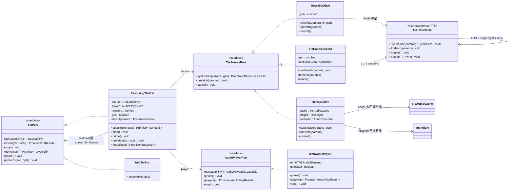

# TTS 集成方案 · 自建 TTS 服务 HTTP 接入（Wails 落地版）v3.0

> 版本：**v3.0**（Wails 落地版，描述当前仓库的真实实现）｜ 日期：2026-09-13 ｜ 状态：**已落地，以实现为准**
> v2.0（2026-09-13，Lynx 基线）在迁移完成后**整体作废为设计依据**，仅留 §0.4 变更对照与 §1.2 决策记录供回溯。
> 上游输入：① 自建 TTS 服务 `ttsedservice` 接入文档 `/Users/champliu/workspace/apps/ttsedservice/docs/tts.md`
> （本文 §2 事实来源，服务端契约已实测结案）；② `docs/design/ARCH-系统设计.md` **v2.0**（现状架构，本文承接其编号与端口-适配器风格）。
> 配套文件：
> - `docs/design/tts-class-diagram.mermaid` —— 类图（⚠️ 仍含 `NativeModules` 引用，待随图更新，见 §14）
> - `docs/design/tts-sequence-diagram.mermaid` —— 时序图（⚠️ 同上）
> - 落地证据：`docs/migration/PORTING-NOTES.md` §3.4（CORS 实测）/ §5（门禁全绿）

---

## 0. 阅读指引

- 本文只描述 **TTS 垂直切片**：合成源选路、Go 合成服务、播放、编排、缓存/预取、文案。ARCH 通用约定（端口隔离、store、样式）见 ARCH v2.0，不重复。
- v2.0 的 Part B（T01–T05 施工任务）已全部落地，收敛到 §11「已落地盘点」；字段级契约以本文件 §3–§6 为准。
- 路径前缀：前端一律 `frontend/src/**`，Go 侧 `internal/**`。v2.0 中的 `src/**`、`lynx.config.ts`、`src/native/*`、
  `src/typing.d.ts` 均已不存在或作废（见 §0.4）。

### 0.4 v2.0 → v3.0 变更总表（回溯用）

| # | v2.0（Lynx，已作废） | v3.0（Wails，现状） |
|---|---|---|
| 合成通道 | 前端 `fetch` 直连服务（`tts-client.ts` 为主路径） | **Go `TTS` 服务为主路径**（CORS 实测拦截）；`tts-client.ts` 退为浏览器调试回退；新增 `tts-client.wails.ts`（绑定）+ `tts-handler.ts`（APK 同源） |
| 播放通道 | 原生 `AudioPlayer`（`playBytes`）+ Web `<audio>` 双实现 | 仅 **Web `<audio>` + Blob URL**（`player.web.ts`）；`player.native.ts` 已删除 |
| 原生契约 | 独立 `NativeModules.AudioPlayer`（§4.5 全节 + README + `typing.d.ts`） | **整节作废**：无 NativeModules、无 `src/native/*`、无 `typing.d.ts`；对应契约移入 Go `internal/services/tts.go`（见 §4.5） |
| 修订 R1 | `NativeModules` 白名单 2→3 | 作废；改为 **bindings import 白名单**（见 §12.3） |
| 实时合成兜底 | `TTSEngine`（原生）+ `speechSynthesis`（Web） | 仅 **`speechSynthesis`**（`tts.web.ts`）；M1/M2 中的 realtime 侧恒为它 |
| M4 | 原生 `AudioPlayer` 内部先停后播 | 作废（模块已不存在）；M1–M3、M5 保留 |
| base URL | `__TTS_BASE_URL__` 经 `lynx.config.ts` 的 `source.define` 注入 | **Go `config.TTSBaseURL()`**（env > 构建注入 > 默认）；前端 `VITE_TTS_BASE_URL` 仅服务调试回退（见 §6.1） |
| V-1~V-12 | Lynx `fetch` / Worker DOM / `platform.ts` 待实测 | 多数结案或问题消失（见 §13.1）；`services/platform.ts`、`pagerSeek.ts`、`swipe.ts` 已删除 |
| 缓存 | 仅前端内存 LRU | **双层**：Go LRU（权威）+ 前端 `tts-client.ts` LRU（仅调试回退路径） |
| 取消 | AbortController（待定）+ gen 兜底 | **三层**：Go `Cancel()` 真中断 + AbortController（有即用）+ `gen`/`stale-gen` 丢弃 |

---

## 1. 方案总览

### 1.1 v3.0 一句话

> **合成下沉 Go：前端经 Wails 绑定（桌面）/ 同源 handler（APK）/ 直连 fetch（浏览器调试）调用自建 TTS 服务拉取 MP3，经 DOM `<audio>` 出声；拿不到或播不了时，依次降级到系统语音 `speechSynthesis` → 「明确文案 + 复制假名」。**

### 1.2 v1.x / v2.0 决策记录（留痕，不再作为依据）

| 项 | v1.1（构建期预生成） | v2.0（Lynx 运行期 HTTP） | v3.0（Wails，现状） |
|---|---|---|---|
| 合成时机 | 构建期离线预生成（`scripts/gen-tts/*`） | 运行期前端 `fetch` 按需拉取 | 运行期 **Go 按需拉取**（前端只做编排） |
| 播放 | 包内文件 | 原生 `AudioPlayer` / DOM `<audio>` | **DOM `<audio>` 单实现** |
| 包体 | seed 0.4MB → 目标 28–40MB | 无音频产物 | 无音频产物（不变） |
| 原生播放决策 | — | 独立 `AudioPlayer` 模块（§1.5 仲裁） | **决策对象已不存在**，互斥 M1–M3 由 facade 对「Go 通道 vs 系统语音」继续执行 |

v1.1 作废产物（`scripts/gen-tts/**`、`data/build/audio*/**`、`src/types/audio.ts`、npm scripts `gen:tts*`）**从未落地**，
v2.0 的 `src/native/AudioPlayer/README.md`、`src/typing.d.ts` 改动、`lynx.config.ts` 注入亦**从未落地**——
三者均为纯设计替换，无回滚成本。

### 1.3 本期做 / 不做（现状口径）

- **已落地**：Go 合成服务（参数映射对齐 + 超时/重试/缓存/去重/取消 + 同源 handler）、三合成源选路、
  Web 播放 + 手势解锁、facade 降级编排 + M1–M3、预取（Study 下一词 + VocabDetail 前 2 句）、文案 3 新增键。
- **不做**（与 v2.0 一致）：持久化音频缓存、客户端熔断、音色选择 UI、`/v1/tts/languages` 调用、gRPC；
  原生播放器实现**不再需要**（播放已统一 Web 实现）。
- **保持不动**：`TtsButton` / `Study` / `VocabDetail` / `Quiz` / `Me` 的调用方式（一律 `ttsController.speak(text, settings)`）。

---

## 2. 事实基线

### 2.1 服务端事实（H1–H13，沿用 v2.0，服务端未变故继续有效）

| # | 事实 | 对本设计的影响 |
|---|---|---|
| H1 | HTTP/1.1 + gRPC 双协议，**无鉴权**；默认 `0.0.0.0:8000`；客户端**只用 HTTP** | base URL 配置化（§6.1）；生产补鉴权则扩展 header（后续） |
| H2 | `GET/POST /v1/tts/speech`（裸字节流）、`POST /v1/tts/synthesize`（JSON：`audio` base64 / `content_type` / `voice` / `cached`）、`GET /v1/tts/languages` | 默认走 **JSON**（§3.7）；`languages` **不调用** |
| H3 | 参数：`text`（trim，上限 2000 rune）、`lang`（BCP-47，别名 `ja`/`jp`）、`voice`（**优先于 lang**，不校验）、`rate`（`^[+-]\d+%$`）、`volume`（同）、`pitch`（`^[+-]\d+(Hz\|%)$`）、`format`（`webm`/`mp3`/`mp3-hq`） | 客户端做参数格式化与 clamp（§3）；错音色 → 503 → 去 voice 重试（§6.4） |
| H4 | 音色解析：`voice` → `lang` 默认 → 服务端 `default_voice`（**中文 `zh-CN-XiaoxiaoNeural`**）；全缺省 → 中文音色 | **`lang=ja-JP` 恒传**，绝不省略（最强约束，进单测） |
| H5 | Kratos 错误体 `{"code","reason","message"}`：400 `TTS_INVALID_ARGUMENT` / `TTS_LANGUAGE_UNSUPPORTED`、503 `TTS_UPSTREAM_UNAVAILABLE`、504 `TTS_UPSTREAM_TIMEOUT` | 按 `reason` 分类重试与文案（§4.8）；裸流出错也回 JSON → 先判状态码 |
| H6 | 服务端缓存 `golang-lru/v2`（256 条，单条 1MiB，key = `sha256(format\0voice\0rate\0volume\0pitch\0text)`）+ singleflight，进程内、重启失效 | 客户端 key 同序同字段（§5.2）；服务端命中无保证 → 客户端仍要有缓存（现由 Go 侧持有） |
| H7 | 非流式：首字节延迟 = 整段合成；单次 deadline **20s**；server timeout 30s | 客户端超时必须**早于**服务端（用户 8s / 预取 15s）；需要缓存 + 预取 |
| H8 | 无鉴权、无限流；上游无 SLA | 超时 + 重试 + 降级；熔断本期不做（§6.7） |
| H9 | 响应头 `Content-Type` / `X-TTS-Cache` / `X-TTS-Voice` / `Cache-Control: private, max-age=86400`；跨域读 `X-TTS-*` 需 Expose-Headers | `voice`/`cached` 为可选元数据；JSON 路径下二者在**响应体**内，不受 CORS 限制 |
| H10 | 语料：词假名均 ~3 字、例句均 ~14 字 → 音频 **10–60KB** | base64 +33%、缓存容量、超时余量均无压力 |
| H11 | （原 Lynx `fetch` 子集未知） | **问题消失**：权威路径走 Go `net/http`（全能力）；浏览器回退路径为标准 Chromium `fetch` |
| H12 | （原 Worker 内 DOM 可用性未知） | **已结案**：桌面 WebView 即标准 DOM，`player.web.ts` 以 `typeof Audio === 'function'` 探测，缺失即降级 |
| H13 | query 编码坑：`+` 解码为空格、裸 `%` 非法 → `rate`/`pitch` 正则失配 → 400 | `buildSpeechUrl` 用 `URLSearchParams`（前端）/ `url.Values.Encode()`（Go，禁 `Sprintf`）；JSON body 路径无此问题；Android 转发层丢 `+` 由 `repairPlusSign` 回补（见 §4.5） |

> **服务端实测结案（2026-09-12，主理人实跑，仍有效）**：基准 webm **9348 字节**（`X-Tts-Voice: ja-JP-NanamiNeural`）；
> `rate=+0%`（已编码）→ 200 同量级；`rate=-50%` → 200 / **18228 字节**（语速生效）；未编码 `rate=+0%`/`-50%` → **400**；
> `format=mp3` → `audio/mpeg`；不传 `lang` → `zh-CN-XiaoxiaoNeural`（H4 成立）；空文本/坏 lang → 400、坏 voice → 503。

### 2.2 Wails 侧新增事实（W1–W6，v3.0 硬约束来源）

| # | 事实 | 对本设计的影响 |
|---|---|---|
| W1 | 桌面 WebView（WKWebView / WebView2）执行同源策略；实测前端直连 `127.0.0.1:8000` 被 CORS 拦截（无 `Access-Control-Allow-Origin`，见 PORTING-NOTES §3.4） | 合成请求**统一下沉 Go**；前端 `fetch` 直连仅保留为浏览器调试回退 |
| W2 | Wails 方法绑定：Go 方法经 `frontend/bindings/` 生成 TS（**不入库**，按需 `wails3 generate bindings -ts` 重生成） | 前端经 `TTS.Synthesize/Prefetch/Cancel` 绑定调用 Go；仅 `engine/tts/tts-client.wails.ts`（+ storage 与 clipboard 例外）允许 import bindings |
| W3 | APK WebView 只把 `/wails/*` 转发给 Go（query 保留、**body 丢弃**；Java 侧把非 200 映射成 500 `"{}"`；桌面 asset server 对 Route 前缀匹配、无保留前缀） | `TTS.ServeHTTP` 挂 `Route "/wails/tts"`：**只支持 GET**（query 传参）、**恒写 200** + JSON 信封 + `Access-Control-Allow-Origin: *` |
| W4 | Android 转发链对 query 做额外百分号解码：前端正确发出的 `rate=%2B0%25` 到 Go 侧变成字面 `+0%`，再经 form 解析 `+`→空格 → 上游收到 `" 0%"` → 400（H13 的跨层复现） | `repairPlusSign`：`rate/volume/pitch` 出现**前导空格**时修回 `+`（合法值永不以前导空格开头；`text` 等不走此函数） |
| W5 | 桌面 WebView 即完整 Chromium 级 DOM（含 `Audio` / `Blob` / `URL.createObjectURL` / `atob` / `AbortController` / `URLSearchParams`） | 播放统一 DOM `<audio>`；各实现仍做存在性探测（缺失即降级，不崩），以覆盖单测/预览等非宿主环境 |
| W6 | 原 Lynx 专有：`NativeModules.*`、`SystemInfo.platform`（`services/platform.ts`）、`<viewpager>` 相关 `pagerSeek.ts`/`swipe.ts`、`lynx.config.ts`（`source.define`）、`src/typing.d.ts`、`src/native/*` | **全部不存在**：`platform.ts` 等已删除；base URL 注入改走 Go（§6.1）；线程指令概念消失（§12.4） |

---

## 3. 接口参数映射（字段级，已落地）

### 3.1 总表（客户端字段 → 服务参数）

| 客户端来源 | 服务参数 | 取值规则 | 边界 / 格式 |
|---|---|---|---|
| `word.kana`（整卡 / P3 / C1）<br>`sentence.ja`（P3 / P5 例句）<br>`STRINGS.me.previewText`（P9 试听） | `text` | 原样传递（服务端 trim） | 空字符串 → **不发起请求**，直接 `empty-text` 走降级；>2000 rune 不截断（宁可降级） |
| **常量** | `lang` | **恒 `'ja-JP'`** | **禁止省略**（H4） |
| `constants/tts.ts` 的 `TTS_VOICE` | `voice` | 默认 `'ja-JP-NanamiNeural'`，置 `''` 则省略只传 `lang` | 服务端不校验 → 503 时去 voice 重试（§6.4） |
| `StudySettings.rate`（`[0.5,1.5]`，默认 `1`） | `rate` | `pct = round((rate-1)*100)` → `±n%` | 0.5→`-50%`、1.0→`+0%`、1.5→`+50%`；越界 clamp；`undefined`/NaN→`+0%` |
| `StudySettings.pitch`（同） | `pitch` | `delta = round((pitch-1)*100)` → `±nHz`（`TTS_PITCH_UNIT='Hz'`） | 0.5→`-50Hz`、1.0→`+0Hz`、1.5→`+50Hz` |
| **无对应设置** | `volume` | **恒 `'+0%'`，显式发送**（对齐服务端缓存 key 第 4 段） | 本期不暴露音量设置 |
| 平台 / 常量 | `format` | **`mp3`**（全平台统一，iOS WebM/Opus 为硬阻塞） | `TTS_FORMAT`，不做平台分支 |

实现（`frontend/src/engine/tts/request.ts`，纯函数）：`normalizeText`（trim 判空，不截断）、
`toRateParam` / `toPitchParam`（clamp + 格式化）、`buildSynthesisParams`（`lang` 恒 `ja-JP`，单测强制断言）。

### 3.2 传输方式：JSON 默认，stream 保留两处用途

| 路径 | 用途 | 说明 |
|---|---|---|
| **JSON** `POST /v1/tts/synthesize`（`TTS_TRANSPORT='json'`，默认） | Go → 上游（`tts.go` 组 body 直发）；浏览器调试回退（`tts-client.ts`） | body 字段与服务文档逐字一致；`voice` 省略时不出现；`+`/`%` 在 body 内无需编码 |
| **query** `GET /v1/tts/speech?...` | **APK 同源 handler**（`tts-handler.ts` → `GET /wails/tts?...`，W3 约束只能 query） | `buildSpeechUrl` 经 `buildQuery` 组装：优先平台 `URLSearchParams`，缺失时回退**等价自实现**（`encodeURIComponent` + 补编码 `!'()*`，与 `URLSearchParams` 行为对齐）；`voice` 为空时不带该参数 |

### 3.3 请求构造与冒烟

`buildSpeechUrl(base, params)` / `buildSynthesizeRequest(params, base)` / `cacheKey(params)` 见 `request.ts`
（全部纯函数，永不 throw）。query 路径纪律不变：**禁止模板串拼接**，
单测断言最终 URL 含 `rate=%2B0%25` 且无裸 `+`、无非法 `%` 转义。

### 3.4 curl 冒烟（服务端未变，脚本沿用有效；实测值见 §2.1 末）

```bash
C() { curl -s --noproxy '*' "$@"; }
BASE=http://127.0.0.1:8000

# ① 基准裸流（默认 webm）→ 200 / audio/webm / 9348 字节 / X-Tts-Voice: ja-JP-NanamiNeural
$C -D /tmp/h1.txt -o /tmp/w1.webm "$BASE/v1/tts/speech?text=%E3%81%AD%E3%81%93&lang=ja-JP"
# ② mp3 → 200 / audio/mpeg
$C -o /tmp/w1.mp3 "$BASE/v1/tts/speech?text=%E3%81%AD%E3%81%93&lang=ja-JP&format=mp3"
# ③ rate 已编码：+0% → 200（同量级）；-50% → 200 / 18228 字节（语速生效）
$C -o /tmp/r_plus.webm  "$BASE/v1/tts/speech?text=%E3%81%AD%E3%81%93&lang=ja-JP&rate=%2B0%25"
$C -o /tmp/r_minus.webm "$BASE/v1/tts/speech?text=%E3%81%AD%E3%81%93&lang=ja-JP&rate=-50%25"
# ④ 等价写法：curl 自动编码
$C -G -o /tmp/r_plus2.webm --data-urlencode 'text=ねこ' --data-urlencode 'lang=ja-JP' \
   --data-urlencode 'rate=+0%' --data-urlencode 'pitch=+0Hz' "$BASE/v1/tts/speech"
# ⑤ 编码回归：未编码 rate=+0% / -50% → 400；已编码 -50%25 → 200
# ⑥ JSON 默认路径（body 内 "+0%" 原样写，无 query 解码）→ 200 {"audio":"GkXfowEAAA…}
$C -X POST "$BASE/v1/tts/synthesize" -H 'Content-Type: application/json' \
   -d '{"text":"ねこ","lang":"ja-JP","voice":"ja-JP-NanamiNeural","rate":"+0%","pitch":"+0Hz","format":"mp3"}' | head -c 120
# ⑦ 探活：GET /v1/tts/languages → 200
# ⑧ 反例：不传 lang → X-Tts-Voice: zh-CN-XiaoxiaoNeural（H4 成立）
# ⑨ 错误码：空文本 → 400；lang=xx-YY → 400；voice=NotExist → 503
```

> ⚠️ query 路径必读（H13）：`rate`/`pitch`/`volume` 的 `+`/`%` 必须编码（`URLSearchParams` /
> `url.Values.Encode()`），手工拼接漏编码即 400；JSON body 路径无此问题。

---

## 4. 端口与播放通道设计

### 4.1 职责划分（三层 + 编排，Wails 版）

| 关注点 | 端口 | 实现 | 位置 | 说明 |
|---|---|---|---|---|
| **合成源（Go，权威）** | `TtsSourcePort` | Go `TTS` 服务（参数→`fetchWithRetry`→错误映射→缓存→去重→重试→取消） | `internal/services/tts.go` | 超时 / 重试 / LRU / singleflight / `Cancel()` 真中断（context） |
| 合成源适配（桌面） | `TtsSourcePort` | `TtsWailsClient`（绑定 `TTS.Synthesize/Prefetch/Cancel` + `gen` 丢弃 + 判别映射） | `frontend/src/engine/tts/tts-client.wails.ts` | 绑定 throw → `network`；迟到 → `error`/`stale-gen`；`toAudioClip` 解 base64 供 Blob 播放 |
| 合成源适配（APK） | `TtsSourcePort` | `TtsHandlerClient`（`GET /wails/tts?...` + 可选 abort + `gen` 丢弃） | `frontend/src/engine/tts/tts-handler.ts` | 客户端**无缓存无重试**（Go 侧拥有）；`fetch` 可注入 |
| 合成源适配（浏览器调试） | `TtsSourcePort` | `TtsHttpClient`（`fetch` 可注入 + 前端 LRU + `TtsInflight` + 重试） | `frontend/src/engine/tts/tts-client.ts` | 仅 `npm run dev` 回退；`setTtsFetch` 供测试注入 |
| **缓存（前端侧）** | `TtsAudioCache` | 内存 LRU（条目 + 字节双限，淘汰 revoke `objectUrl`） | `frontend/src/engine/tts/audio-cache.ts` | 仅调试回退路径使用；权威缓存 在 Go |
| **并发去重（前端侧）** | `TtsInflight` | singleflight（失败不缓存，settle 即删） | `frontend/src/engine/tts/inflight.ts` | 同上；Go 侧另有独立去重 |
| **播放（唯一实现）** | `AudioPlayerPort` | `WebAudioPlayer`（DOM `<audio>` 单例 + Blob URL + `prime()` 解锁） | `frontend/src/engine/tts/player.web.ts` | `player.ts` 只做探测 + 委托 + 单例 |
| **合成兜底** | `TtsPort` | `WebTtsPort`（`speechSynthesis` + `ja` 前缀过滤 + `voiceschanged` 800ms 兜底）/ `UnsupportedTtsPort` | `frontend/src/engine/tts/tts.web.ts` | `rate` clamp 0.5–2、`pitch` 0–2；`speak` 前先 `cancel()` |
| **编排** | `TtsPort`（对外**不变**） | `ResolvingTtsPort` | `frontend/src/engine/tts/index.ts` | 见 §4.3 |

页面 / store / service 一律只 import `frontend/src/engine/tts/index.js`；
`tts-client*.ts` / `tts-handler.ts` / `player*.ts` / `request.ts` / `audio-cache.ts` / `inflight.ts` /
`types.ts`（`frontend/src/types/tts.ts`）均为引擎内部文件，外部禁止 import。

### 4.2 类型定义（已落地，摘要）

`frontend/src/types/tts.ts`：`TtsAudioFormat`（`'mp3'|'webm'|'mp3-hq'`）/ `TtsTransport`（`'json'|'stream'`）/
`TtsSynthesisParams`（`lang` 恒 `'ja-JP'`）/ `TtsAudioClip`（`bytes` + `base64` 双持，按通道取用）/
`TtsSourceFailure`（`empty-text|bad-request|unavailable|timeout|network|error`）/ `TtsSourceResult` /
`TtsSourcePort`（`synthesize(params, gen)` + `prefetch` + `cancel`）/ `AudioPlayerPort` /
`AudioPlayResult`（`native|web` 成功通道——`native` 分支保留类型位，当前实现恒走 `web`）/
`RequestInitLike` / `ResponseLike` / `FetchLike`（能力子集最小结构 + 可注入签名）。

`frontend/src/types/ports.ts`（v2.0 修订 R2 已落地）：`TtsEngine = 'http'|'native'|'web'`（`'http'` 为 Go 合成通道；
`'native'` 分支保留类型位，当前无实现），`TtsFailureReason` 含 `service-unavailable` / `service-rejected` /
`no-player`，`TtsPort` 含可选 `prime?()` / `prefetch?()`。`ttsController` 的 `switch` 带 `default`，加宽安全。

### 4.3 编排 `ResolvingTtsPort`（已落地，与 v2.0 伪代码同序，realtime 侧恒为系统语音）

- 合成源选路（`createTtsSource`）：Android UA → `createTtsHandlerClient()`；Wails 宿主 → `createTtsWailsClient()`；
  否则 → `createTtsHttpClient()`（调试回退）。
- `getCapability()`：播放器可用即 `supported`，否则回落实时合成能力。
- `speak()`：gen 递增 → **M1**（`realtime.stop()`，即 `speechSynthesis.cancel()`）→ 播放器可用时合成+播放
  （迟到响应丢弃，返回良性成功不出声；空文本不记 HTTP 失败；失败映射见 §4.8）→ **M2**（`player.stop()`）→
  实时合成 → 全失败返回 `finalReason`（`no-ja-voice` / `blocked` 优先保留，否则取 HTTP 侧记录）。
- `stop()`：**M3**（`source.cancel()` + `player.stop()` + `realtime.stop()` + gen 递增）。
- `prefetch()`：仅播放器可用时透传（否则纯浪费流量）。
- 对外仍是同一个 `ttsPort: TtsPort` 单例；`TtsButton` / 各页面调用方式零改动。

### 4.4 Web 播放实现（`player.web.ts`，已落地）

- **Blob URL**（非直连）：可读状态码、可精确分类、可进缓存、可取消；直连仅为理论备选，未启用。
- 单例 `<audio>`（`ensureEl` 惰性创建并全程复用）；能力探测 `typeof globalThis.Audio === 'function'`，
  缺失即 `null` → 降级，不崩。
- `prime()` 同步、`必须在手势调用栈内`（由 `ttsController.speak()` 第①步同步调用）：静音 WAV data URI
  （`SILENT_AUDIO_DATA_URI`，8kHz 8bit 80 字节静音，**由 Node 片段生成后内联，勿手写 base64**）`play()` 解锁，
  成功记 `unlocked`。
- `play()` 失败映射：`NotAllowedError` / `SecurityError` → `blocked`，其余 → `play-error`（不 throw）；
  `stop()`：`pause()` + `currentTime = 0`（幂等；不 revoke Blob URL，缓存仍可复用）。
- HTTP 路径优先于 `speechSynthesis`（音色一致走 Nanami），由编排顺序天然实现；`tts.web.ts` 本身不改（M5）。

### 4.5 Go 合成服务契约（`internal/services/tts.go`，取代 v2.0 §4.5 原生契约）

> v2.0 §4.5（独立 `AudioPlayer` 模块 + `typing.d.ts` + 三端实现 + README）**整节作废**（实现对象已不存在）；
> 本节为替代后的唯一真相。`internal/services/tts_test.go` / `tts_servehttp_test.go` 覆盖合成 / 缓存 / 预取 / 特殊字符。

| 方法 / 项 | 契约 |
|---|---|
| `Synthesize(params) SynthesizeResult` | 永不 panic、不返回 error：空文本 → `empty-text`；缓存命中直返；同 key 在途则等待（超时按 `timeout`）；否则 `fetchWithRetry`（用户超时 **8s**）→ 成功写缓存。失败体现在 `Reason` |
| `Prefetch(params)` | fire-and-forget（goroutine）：命中/在途则跳过；否则预取超时 **15s** 拉取并写缓存；失败静默 |
| `Cancel()` | 中断在途请求（context cancel）；前端 `gen` 代数丢弃已到达结果，二者互补 |
| `ServeHTTP`（`Route "/wails/tts"`） | 仅 `GET`（query 传参，无 body）；忽略子路径；**恒写 200** + `application/json` + `Access-Control-Allow-Origin: *`，把 `SynthesizeResult` 原样编码；非 GET → `reason:'error'`（`method-not-allowed`）；Go 缓存/重试/去重全复用 |
| 重试 | `network` / `timeout` / `unavailable` 重试 **1 次**（退避 300ms）；**503 且带 `voice` 时去 voice 重试**；400 只记日志不重试；失败不进缓存，inflight 即删 |
| 状态码映射 | 400→`bad-request`、503→`unavailable`、504/408→`timeout`、其余→`error`；透传服务端 `reason` 字段为 `serviceReason` |
| 缓存 | LRU（条目 64 + 字节双限，命中触碰 `lastUsed`）；`estimateBase64Size` 由 base64 长度估算字节 |
| `repairPlusSign` | 仅 `rate/volume/pitch`：前导空格 → 修回 `+`（W4；桌面直达路径为 no-op） |
| `SynthesizeParams` | `text/lang/voice/rate/volume/pitch/format/key`（JSON）；`key` 由前端 `cacheKey()` 算好，与服务端 `sha256(format\0voice\0rate\0volume\0pitch\0text)` 同序同字段 |

### 4.6 修订 R1（作废说明）

v2.0 修订 R1（`NativeModules` 白名单 2→3）**作废**——引用对象已不存在（无 `*.native.ts`、无 `typing.d.ts`）。
替代约束见 §12.3（bindings import 白名单）。ARCH v2.0 已同步为 Go 版描述，无需回填旧章节。

### 4.7 降级优先级链（已落地）

```
点击发音（ttsController.speak(text, settings)）
  │ ① 同步置视觉反馈（speakingText，500–1800ms 按字数保持）+ ttsPort.prime?.()（手势内解锁）
  ▼
  ├─(1) Go 合成 + 播放        player 可用才尝试（否则跳过，不浪费流量）
  │       [M1] 先 realtime.stop()（= speechSynthesis.cancel()）
  │       source.synthesize → player.play → ok:true, engine:'http'
  │       ✗ 合成失败（network/timeout/unavailable/bad-request/error）→ (2)
  │       ✗ 播放失败（play-error / no-player / blocked）             → (2)
  ├─(2) 系统语音 speechSynthesis   capability !== 'unsupported'
  │       [M2] 先 player.stop()（el.pause + currentTime=0）
  │       → ok:true, engine:'web' ｜ ✗ no-ja-voice / error
  └─(3) 明确提示 + 复制假名    notice 文案 + fallbackText（零静默失败）

[stop()] [M3] 切卡 / 页面卸载 / 主动停止 → source.cancel() + player.stop() + realtime.stop() 全停
```

最终 `reason`：HTTP 侧记 `lastHttpFailure`（`bad-request`→`service-rejected`；
`network`/`timeout`/`unavailable`→`service-unavailable`；空文本不记录；播放器不可用记 `no-player`），
(2) 也失败后按它映射；若 (2) 返回 `no-ja-voice` / `blocked` 则优先保留更具体的原因。

### 4.8 失败 → 文案映射（已落地：`describeTtsFailure` + `strings.ts` `tts` 分组）

| 对外 `reason` | 文案键 | 中文文案 |
|---|---|---|
| `service-unavailable` | `tts.serviceDown` | 语音服务暂时不可用，已尝试系统语音；仍无声请用「复制假名」。 |
| `service-rejected` | `tts.serviceRejected` | 语音服务拒绝了本次请求（参数或语种异常），请用「复制假名」。 |
| `no-player` | `tts.noPlayer` | 当前环境没有可用的音频播放器，请用「复制假名」。 |
| `blocked` | `tts.blocked`（既有） | 首次播放需在点击内触发，请再点一次「试听」。 |
| `no-ja-voice` | `tts.noJaVoice`（既有） | 当前环境缺少日语语音包，已降级为「复制假名」。 |
| `no-tts` | `tts.unsupportedBody`（既有） | 当前运行环境不支持日语语音合成，请用「复制假名」自行朗读。 |
| 其它 | `tts.error`（既有） | 语音播放失败，请重试或使用「复制假名」。 |

新增键置于既有 `tts` 分组内（`copied` / `copyFallback` 为复制反馈键）。**降级成功不打扰**：
HTTP 失败但 (2) 成功时 `ok:true` → 无文案。`ttsController` 另有 `gesture-required` 能力分支
（speak 成功后补 `blocked` 提示）与 `unsupported` 短路（直接 `no-tts`，不调端口）。

---

## 5. 缓存与预取（已落地）

### 5.1 双层缓存（权威在 Go）

| 层 | 持有者 | 容量 | 说明 |
|---|---|---|---|
| Go LRU | `internal/services/tts.go` | 条目 64 + 字节双限 | 三条合成路径（绑定 / handler / 预取）共享；失败不进缓存 |
| 前端 LRU | `frontend/src/engine/tts/audio-cache.ts` | `64` 条 / `4MiB` | **仅浏览器调试回退路径**（`tts-client.ts`）使用；淘汰时 `revokeObjectURL` |

命中更新 `lastUsedAt`；进程内缓存，不持久化（`StoragePort` 只存字符串）。

### 5.2 缓存 key（与服务端语义对齐，已修正）

```ts
// frontend/src/engine/tts/request.ts（现状；v2.0 文档中的 '+0%' 占位写法已修正）
export function cacheKey(p: TtsSynthesisParams): string {
  const text = p.text.length > 64
    ? `${p.text.length}#${p.text.slice(0, 24)}#${p.text.slice(-24)}`
    : p.text
  return [p.format, p.voice ?? '', p.rate, p.volume, p.pitch, text].join('\u0000')
}
```

`volume` 取 `p.volume`（恒 `'+0%'` 显式发送），与服务端 key 第 4 段真正一致。key 含 `rate`/`pitch` →
改语速/音调后重新合成，无需播放期变速。

### 5.3 预取（已落地）

- 触发：`Study` 切卡后预取**下一词** `kana`；`VocabDetail` 渲染后预取前 **2** 条例句 `ja`。
- 编排：`services/ttsPrefetch.ts` 队列 + 并发上限 `TTS_PREFETCH_MAX_CONCURRENCY = 2`
 （`prefetch` 为 fire-and-forget 无完成回调，实现以「每 tick 释放槽位」近似节流）；`clear()` 供切模块/卸载清空。
- 语义：失败**静默**（不写 notice、不降级、无文案——唯一的静默例外）；仅播放器可用时预取
  （`ResolvingTtsPort.prefetch` 内过滤）；超时 `TTS_PREFETCH_TIMEOUT_MS = 15000`。
- Go 侧 `Prefetch` 与前端 `prefetch` 语义一致（命中/在途跳过、失败静默）。

### 5.4 `X-TTS-Cache` / `X-TTS-Voice`

JSON 路径下二者在**响应体**内（可靠）；同源 handler 路径为 Go 转发的 JSON 信封（可靠）；
浏览器直连裸流跨域时读不到 → 置 `undefined`，不影响播放（仅调试/埋点）。

---

## 6. 网络配置与健壮性（已落地）

### 6.1 base URL 配置化（禁止硬编码）

| 使用方 | 地址来源 | 说明 |
|---|---|---|
| Go 合成（权威） | `internal/config.TTSBaseURL()`：**`NIJAPL_TTS_BASE_URL` > 构建期 ldflags 注入（Android 用）> 默认 `http://127.0.0.1:8000`** | 前端不再需要感知域名（W2） |
| APK 同源 | 相对地址 `TTS_HANDLER_BASE = '/wails/tts'`（`GET /wails/tts?...`，不含任何 host） | 业务代码禁 IP 红线天然满足 |
| 浏览器调试回退 | `constants/tts.ts` 的 `TTS_BASE_URL`：`VITE_TTS_BASE_URL`（构建期）未设置时回落 `http://127.0.0.1:8000` | 唯一真相仍是该常量；业务代码禁 IP 字面量（例外仅此默认 + `.env.example`） |

> ⚠️ 附带发现（非本文改动）：`frontend/.env.example` 的注释仍写着 `lynx.config.ts` / `__TTS_BASE_URL__`
> 注入机制（该文件与变量均已不存在），需另起一改更新注释；`TTS_BASE_URL=http://127.0.0.1:8000` 示例值本身仍有效。

### 6.2 端点与路径常量（`constants/tts.ts`）

`TTS_PATH_SPEECH`（`/v1/tts/speech`，handler query 用）/ `TTS_PATH_SYNTHESIZE`（`/v1/tts/synthesize`，
Go/调试回退用）/ `TTS_HANDLER_BASE`（`/wails/tts`）；`/v1/tts/languages` 本期不调用。

### 6.3 超时 / 6.4 重试

- 用户触发 **8s**（`TTS_TIMEOUT_MS`），预取 **15s**：早于服务端 deadline（20s）掐断，拿到可控降级。
- 重试（Go 侧 `fetchWithRetry`，前端调试回退客户端同语义）：`network`/`timeout`/`unavailable` 重试 **1 次**
  （退避 300ms）；`bad-request`/`error` 不重试（400 记日志）；503 且带 `voice` 时**去 voice 重试**。
  1 次封顶的理由：移动端抖动收益 vs 用户等待上限（与 ≤100ms 反馈目标冲突）。

### 6.5 请求取消（三层）

1. **Go `Cancel()`**：真中断在途连接（context cancel），由前端 `cancel()` 经绑定/handler 触发；
2. **`AbortController`**（有即用、无则跳过）：`tts-client.ts` / `tts-handler.ts` 构造时探测，全程守卫式；
3. **`gen` 代数丢弃（最后防线）**：三客户端每次 `synthesize` 按外来 `gen` 同步、`cancel()` 递增；
   迟到响应返回 `error`/`stale-gen` 且不出声——覆盖「响应在途、用户已切卡」竞态。
   `stop()` 三通道全停 + gen 递增（**M3**）。

### 6.6 并发去重（双层 singleflight）

Go `inflight`（绑定/handler/预取共享，失败即删）+ 前端 `TtsInflight`（仅调试回退客户端）。
服务端 singleflight 防上游击穿，客户端防连点/多组件同求——互补。

### 6.7 熔断（本期不做）

后续优化：连续 N 次 HTTP 失败后短时跳过 HTTP 路径。列为 §13 P-6。

---

## 7. 文件清单（现状，以实现为准）

### 7.1 类型与常量

| 文件 | 职责 |
|---|---|
| `frontend/src/types/tts.ts` | HTTP 合成与播放契约（`TtsSynthesisParams`/`TtsAudioClip`/`TtsSourcePort`/`AudioPlayerPort`/`FetchLike` 等） |
| `frontend/src/types/ports.ts` | `TtsPort` / `TtsEngine`（含 `'http'`）/ `TtsFailureReason`（含 3 新增）/ `StoragePort` |
| `frontend/src/constants/tts.ts` | `TTS_BASE_URL`（`VITE_TTS_BASE_URL` 回退）/`TTS_LANG`/`TTS_VOICE`/`TTS_FORMAT`/`TTS_TRANSPORT`/路径与 handler 基址/超时重试缓存预取常量/`SILENT_AUDIO_DATA_URI` |
| `frontend/.env.example` | `TTS_BASE_URL` 示例（⚠️ 注释仍提 `lynx.config.ts`，待修） |

### 7.2 Go 侧（`internal/`）

| 文件 | 职责 |
|---|---|
| `internal/services/tts.go` | 合成权威实现 + `ServeHTTP`（`/wails/tts`）+ `repairPlusSign` |
| `internal/services/tts_test.go` / `tts_servehttp_test.go` | 合成 / 缓存 / 预取 / 特殊字符与 handler 信封测试（服务不可达用例自动跳过并标注「未执行」） |
| `internal/config/config.go` | `TTSBaseURL()`（env > 构建注入 > 默认）+ `DataDir()` |
| `main.go` | 注册 `TTS` 服务（`Route: "/wails/tts"`） |

### 7.3 前端引擎（`frontend/src/engine/tts/**`）

| 文件 | 职责 |
|---|---|
| `index.ts` | `ResolvingTtsPort` 编排 + 三源选路 + 单例 `ttsPort` |
| `request.ts` | 纯函数：参数映射 / `buildSpeechUrl` / `buildSynthesizeRequest` / `cacheKey`（含 `URLSearchParams` 缺失回退） |
| `audio-cache.ts` / `inflight.ts` | 前端 LRU / singleflight（仅调试回退路径） |
| `tts-client.wails.ts` | 桌面绑定适配（含 `gen`、`toAudioClip`、`decodeBase64`、`toSourceFailure`） |
| `tts-handler.ts` | APK 同源适配（GET + 可选 abort + `gen`） |
| `tts-client.ts` | 浏览器调试回退（可注入 `fetch`/cache/inflight/baseUrl/transport/超时/重试/delay） |
| `player.ts` / `player.web.ts` | 播放探测 facade / DOM `<audio>` 实现 + `prime()` |
| `tts.web.ts` | `speechSynthesis` 兜底（`ja` 过滤 + `voiceschanged` 800ms） |
| `__tests__/request|audio-cache|tts-client|tts-handler|resolve.test.ts` | 参数/URL/key、淘汰、fake fetch 全分支、handler 信封、编排+M1–M3 |

### 7.4 服务 / 文案 / 页面接线（已落地）

| 文件 | 职责 |
|---|---|
| `frontend/src/services/ttsController.ts` | 视觉反馈先行（500–1800ms）+ 同步 `prime?.()` + `describeTtsFailure`（7 分支）+ `unsupported` 短路 + `gesture-required` 补提示 + `copyKana` |
| `frontend/src/constants/strings.ts` | `tts` 分组：`serviceDown` / `serviceRejected` / `noPlayer`（新增）+ 既有 `blocked/noJaVoice/unsupportedBody/error/copied/copyFallback` |
| `frontend/src/services/ttsPrefetch.ts` | 预取队列编排（上限 2，tick 节流，失败静默） |
| `frontend/src/pages/Study/index.tsx` | 切卡预取下一词 |
| `frontend/src/pages/VocabDetail/index.tsx` | 预取前 2 例句 |

### 7.5 作废 / 不再新增

| 作废项 | 状态 |
|---|---|
| `src/native/**`、`src/typing.d.ts`、`lynx.config.ts`、`src/engine/tts/{tts.native,player.native}.ts`、`src/engine/storage/storage.native.ts`、`src/services/platform.ts` | **不存在**（迁移删除；R1 修订对象消失） |
| `scripts/gen-tts/**`、`data/build/audio*/**`、`src/types/audio.ts`、`audio-catalog.ts`、`msedge-tts`、`gen:tts*` | **从未落地**（v1.1 作废延续） |
| v2.0 Part B 的 T01–T05 | **全部结案**，见 §11 |

---

## 8. 接口定义（类图摘要）

> `tts-class-diagram.mermaid` 仍为 v2.0 版（含 `Native*` 类），以**下述现状图为准**，mermaid 文件待随图更新（见 §14）。



**平台文件职责边界**：`player.ts` 仅探测 + 委托 + 单例；`player.web.ts` 仅 DOM；`tts.web.ts`
仅 `speechSynthesis`；`request.ts` / `audio-cache.ts` / `inflight.ts` 纯 TS；
三 source 适配各守一通道，互不引用；`index.ts` 为对外唯一入口。

---

## 9. 调用流程（现状，风格对齐 ARCH §4.2）

> `tts-sequence-diagram.mermaid` 仍为 v2.0 版（4 链路骨架可用，凡涉 `TTSEngine`/`AudioPlayer`
> 原生模块处以本节为准），待随图更新（见 §14）。

### 9.1 链路 A：点击发音 → Go 合成 → Web 播放（主链路，桌面）

```
TtsButton/整卡   ttsController     Resolving          TtsWailsClient   Go TTS    服务   player.web
  | tap 热区 -------->|                  |                    |             |        |          |
  | ① 同步 speakingText（≤100ms）+ prime()（手势内解锁）------------------->| 解锁    |          |
  |                  | ② getCapability() → player 可用 → supported                           |          |
  |                  | ③ speak(kana,{rate,pitch})                                            |          |
  |                  |                  | [M1] realtime.stop()（= speechSynthesis.cancel）     |          |
  |                  |                  |------------->| Synthesize(params+key, gen)              |          |
  |                  |                  |             | 空文本短路 / 缓存命中 / 在途等待 / fetchWithRetry(8s, 503去voice重试) |
  |                  |                  |             |------------POST /v1/tts/synthesize----------->|          |
  |                  |                  |             |<-----------{audio,content_type,voice,cached}--|          |
  |                  |                  |<-- {ok,clip} -| 迟到(gen)丢弃 → stale-gen不出声      |          |
  |                  |                  | play(clip) ----------------------------------->| Blob→el.play() |
  |                  |<-- {ok,engine:'http'} --------------------------------|          |          |
  |                  | 播放结束 → speakingText=null ----------------------------------------->| 复原    |
```

APK 路径把 `TtsWailsClient/Go TTS` 换成 `TtsHandlerClient → GET /wails/tts?... → ServeHTTP → 同一 Synthesize 管道`；
浏览器调试路径换成 `TtsHttpClient → fetch → 前端缓存/去重/重试`。其余编排一致。

### 9.2 链路 B：服务不可用 / 超时 → 降级链

合成失败（`network`/`timeout`/`unavailable`→`service-unavailable`；`bad-request`→`service-rejected`）
或播放失败（`play-error`/`no-player`/`blocked`）→ **[M2]** `player.stop()` → `speechSynthesis`
（`engine:'web'`，成功则**无文案不打扰**）→ 仍失败 → `describeTtsFailure` 文案 + `fallbackText` + 「复制假名」。

### 9.3 链路 C：全通道不可用 → 提示 + 复制假名

`player` 不可用（无 DOM `Audio`，非宿主/极简环境）→ 跳过合成（不浪费流量，`lastHttpFailure='no-player'`）→
`speechSynthesis` 亦缺失 → `unsupported` → `tts.noPlayer` + 假名兜底。应用不崩。

### 9.4 链路 D：`stop()` 三通道全停（M3）

`TtsPort.stop()` → `source.cancel()`（Go 真中断 + 各客户端 abort + gen++）+ `player.stop()`
（`pause` + `currentTime=0`）+ `realtime.stop()`（`speechSynthesis.cancel()`）。切卡/卸载/主动停止必经此。

**红线**：① 视觉反馈先于能力检测与出声；② `prime()` 必须在手势调用栈内同步执行；
③ 朗读文本恒取 `word.kana` / `sentence.ja`；④ 除预取外每个失败分支必有文案。

---

# Part B · 已落地盘点（取代 v2.0 任务分解）

v2.0 的 T01–T05（Lynx 施工顺序）已**全部结案**（对应实现见 §7；`AudioPlayer/README.md` 项因模块删除而取消），
本节仅保留验收口径。门禁见 ARCH v2.0 §11（`typecheck` + `check` + `vitest run` + `test:audit` +
`gen:data` + `go build/vet/test` + `wails3 build`）；TTS 相关测试分布：

- 前端单测 `frontend/src/engine/tts/__tests__/`（5 文件）+ QA `frontend/tests/qa/tts/`
 （`tts-http.integration` + `tts-adversarial`，服务不可达时自动跳过并标注「未执行」）；
- Go `internal/services/tts_test.go` / `tts_servehttp_test.go`（同上跳过语义）；
- `resolve.test.ts` 覆盖四链路 + **M1–M3 调用顺序断言**。

---

## 10. 依赖包列表（现状：运行期与开发期均零新增）

| 包 / 做法 | 结论 |
|---|---|
| `axios` / 任何 HTTP 库 | 不引入：Go 用 `net/http`，前端用平台 `fetch` |
| `msedge-tts` / `edge-tts*` / WebSocket 库 | 不引入（v1.1 作废延续；只用 HTTP） |
| `zustand` / `react-router` 等 | 已存在，不新增 |
| TTS 地址写法 | 唯一真相 `constants/tts.ts`（+ Go `config`）；业务代码禁 IP 字面量 |

---

## 11. （本版无施工任务，章节号保留以便与 v2.0 回溯对照）

见 Part B 头部盘点。原 T04 第 4b 条（M1–M3 单测）与 T05 实测结案已分别由 `resolve.test.ts`
与本文件 §13.1 承接。

---

## 12. 共享知识 / 跨文件约定（Wails 版，承接 ARCH v2.0 §12）

### 12.1 服务契约（冻结）

- 朗读依据：词恒 `word.kana`，句恒 `sentence.ja`；`Grammar.pattern` 不直接朗读；`text` 不截断。
- `lang` 恒 `'ja-JP'`（H4，进单测）；`voice` 默认 `ja-JP-NanamiNeural`（`''` 则省略）；
  `format` 全平台 `'mp3'`；传输默认 `'json'`；`TtsResult.engine` 成功取值统一 `'http'`（不采用 `'remote'`）。
- 缓存 key 六段同序（format/voice/rate/volume/pitch/text），两端对齐。

### 12.2 引用与入口约定

- 页面 / store / service 只 import `frontend/src/engine/tts/index.js`；
  引擎内部文件外部禁 import；相对导入带 `.js` 后缀（JSON import 例外）。

### 12.3 bindings import 白名单（取代作废的 R1，为唯一真相）

```
✅ frontend/src/engine/tts/tts-client.wails.ts   （TTS 绑定；只碰 TTS 服务）
✅ frontend/src/engine/storage/storage.wails.ts  （KVStore 绑定；只碰 KVStore）
✅ frontend/src/services/clipboard.ts            （唯一例外：直连 System 绑定，未定义 Clipboard 端口）
❌ 其他任何文件（含页面 / store / 引擎其余部分）
```

### 12.4 线程与手势规则（Wails 版）

- 无 `'main thread'` / 后台线程指令概念（Lynx 专有，已随迁移消失）。
- `prime()` 必须在**用户手势调用栈内同步执行**（由 `ttsController.speak()` 第①步调用，内部禁 `await`/网络）。
- 合成 / 播放 / 网络不得阻塞手势回调除 `prime()` 外的任何同步段；视觉反馈先行。

### 12.5 错误处理与文案

- `TtsSourcePort` / `AudioPlayerPort` / `TtsPort` 永不 throw；失败走判别联合。
- 用户可见失败必有文案且只来自 `strings.ts`；**预取是唯一的静默例外**。

### 12.6 ARCH 同步状态（已完成）

ARCH 已升级为 **v2.0 Wails 版**（Go 服务 / 端口 facade / 双域数据 / 门禁），
v2.0 的 R1/R2/R3 回填项中：R2（`TtsResult` 加宽）与 R3（`ttsController` 接线）已在实现中成立；
R1（`NativeModules` 白名单）随对象消失而取消，由 §12.3 替代——**无需再回填旧 ARCH 章节**。

### 12.7 双通道互斥编排（M1–M3 现状，M4 作废、M5 保留）

| # | 约定 | 落点 |
|---|---|---|
| M1 | HTTP 播放前必停实时合成（= `speechSynthesis.cancel()`） | `ResolvingTtsPort.speak()` |
| M2 | 实时合成前必停播放（= `el.pause(); el.currentTime = 0`） | 同上 |
| M3 | `stop()` 三通道全停 + gen 递增 | `ResolvingTtsPort.stop()` + 各 source `cancel()`（Go 真中断） |
| M4 | ~~原生 `AudioPlayer` 内部先停后播~~ | **作废**（模块不存在；单例 `<audio>` 天然串行） |
| M5 | Web 端 `speechSynthesis` 与 `<audio>` 共用输出，重叠即叠音 | facade 统一执行；`tts.web.ts` 不改 |

纪律不变：无脑先停（全部幂等，不查 `isPlaying`）；互斥责任在 facade，通道实现互不感知；
`resolve.test.ts` 断言调用顺序；`stop()` 内 try/catch，永不 throw。

### 12.8 通道可用性判别（现状：播放器 × 系统语音两维）

| 场景 | DOM `Audio` | `speechSynthesis`（含 ja 语音） | 实际行为 |
|---|---|---|---|
| 双可用（桌面正常态） | ✅ | ✅ | Go 主链路 + 系统语音兜底（M1–M3 保证互斥） |
| 仅播放器 | ✅ | ❌ | Go 主链路可用；降级直达明确文案（`no-ja-voice` 不适用） |
| 仅系统语音 | ❌ | ✅ | 跳过合成（不浪费流量），直接系统语音 |
| 双无 | ❌ | ❌ | 链路 C：提示 + 复制假名，不崩 |

---

## 13. 待明确事项

### 13.1 实测清单结案（v2.0 的 V-1~V-15 → v3.0 口径）

| # | v2.0 原项 | v3.0 结论 |
|---|---|---|
| V-1/V-2 | Lynx `fetch` 的 `arrayBuffer` / AbortController | **问题消失**：权威路径为 Go `net/http`；浏览器回退为标准 `fetch`；前端仍保留守卫式探测（缺失则跳过 abort，走 gen 兜底） |
| V-3 | POST+JSON 可用性 → transport 默认值 | **结案**：`TTS_TRANSPORT='json'`（Go 直发 body；handler 侧因 W3 约束走 query，两分支并存） |
| V-4 | `X-TTS-*` 可读性 | **结案**：JSON/同源信封可靠；裸流跨域读不到置 `undefined`（§5.4） |
| V-5/V-14 | iOS WebM 支持 / 三端 mp3 可播性 | **沿用 mp3 决策**；桌面三端随 `wails3 build` 冒烟确认（Windows/Linux 尚未冒烟，见 ARCH §13） |
| V-6 | Worker 内 DOM 可用性 / 宿主注册 AudioPlayer 备选 | **问题消失**：桌面即标准 DOM；备选①（第 4 引用点）**永久取消** |
| V-7 | 静音解锁实效 | **已落地**（`prime()` + `SILENT_AUDIO_DATA_URI`）；`blocked` 文案为回退 |
| V-8 | `source.define` 生效性 | **问题消失**：注入机制改为 Go（§6.1）；`frontend/.env.example` 注释待修（§6.1 附注） |
| V-9 | 生产域名 / HTTPS / 明文限制 | 未变：dev 用 `127.0.0.1:8000`；Android 明文限制为原生工程事项 |
| V-10 | 首字节延迟 | 沿用 8s/15s 超时；短文本预期 0.5–2s（量级见 H10） |
| V-11 | `SystemInfo.platform` 分支 | **问题消失**：`platform.ts` 已删除；选路改用 `hasWailsRuntime()` / `isAndroid()`（`engine/wails.ts`） |
| V-12 | Native Module `ArrayBuffer` 传参 | **问题消失**：绑定传 JSON 字符串（含 base64），无二进制传参 |
| V-13 | `pitch` 单位主观听感 | 未变：默认 `Hz`，切常量即可，待验收试听 |
| V-15 | 服务端契约全量 | **结案有效**（实测值见 §2.1 末，脚本见 §3.4） |

### 13.2 产品 / 工程侧需拍板项（沿用 v2.0 P-1~P-7，状态更新）

| # | 问题 | 状态 |
|---|---|---|
| P-1 | 服务鉴权 | 未变：不传 token；加鉴权则在常量层加 header（业务结构不变） |
| P-2 | 降级成功不打扰（音色变化无提示） | **已按此落地**（`ok:true` 无文案） |
| P-3 | P9 显示发音来源 | 不做（会改 controller 状态结构） |
| P-4 | 音色选择 | 不做；仅常量可配 |
| P-5 | 预取落地 | **已落地**（Study + VocabDetail） |
| P-6 | 客户端熔断 | 不做（§6.7） |
| P-7 | 保留「复制假名」 | **保留**（零静默底线） |

---

## 14. 附

- v2.0 类图 / 时序图：`docs/design/tts-class-diagram.mermaid`、`docs/design/tts-sequence-diagram.mermaid`
  （⚠️ 二者仍含 `NativeModules.AudioPlayer` / `TTSEngine` / `player.native.ts` 表述，与 §8/§9 现状图不一致，
  需另起一改同步；本文 §8/§9 的内联图为当前唯一真相）。
- `frontend/.env.example` 注释涉 `lynx.config.ts`（见 §6.1 附注），需同批顺手更新。
- 本设计以 ARCH v2.0 与 `ttsedservice` 服务契约为基线；若服务接口变更（鉴权/限流/新格式），§3/§4.5/§6 需重新评估。
