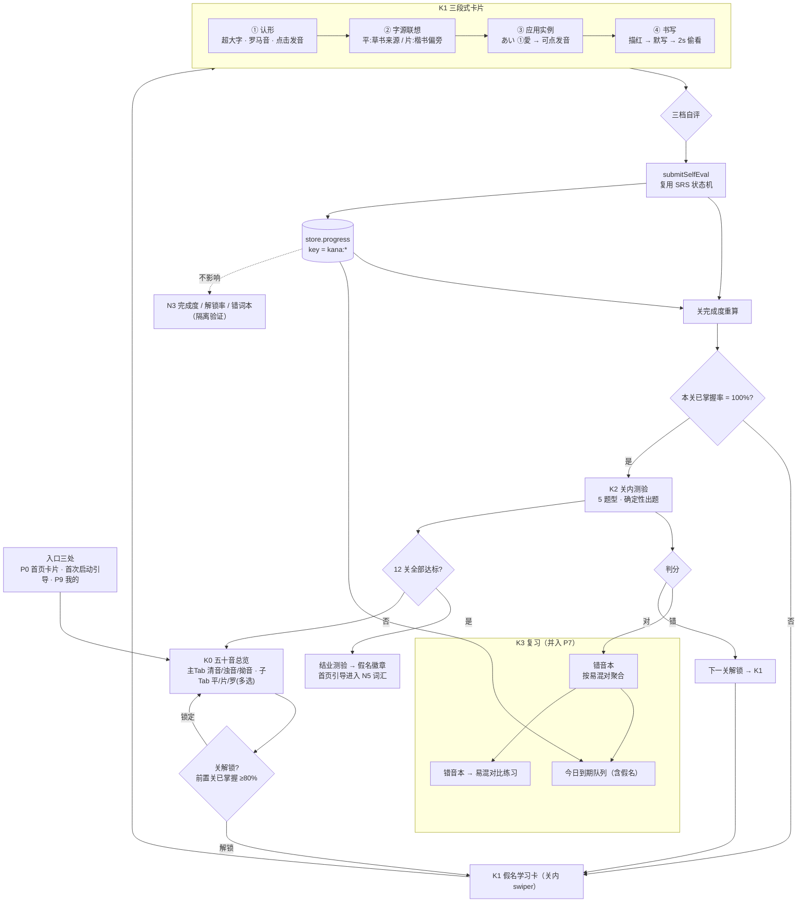

# 五十音图学习流程设计（K 能力域）

> 角色：产品 小策 ｜ 版本：**v1.1（已落地，实施偏差见 §15）** ｜ 日期：2026-09-13
> 输入基线：`docs/prd/PRD-JLPT-N3-词汇学习App.md`、`docs/design/ARCH-系统设计.md`、`AGENTS.md`（红线）
> 参考产品：有道词典「日语五十音图」H5 <https://c.youdao.com/dict/miniprogram/japanese50.html>
> 交付对象：架构师 → 研发 → 测试
>
> **落地状态**：MK1–MK5 全部完成；`docs/design/` 的设计已对应到代码，
> 实施期与设计不一致的 5 处集中在 **§15 实施记录**，Q1/Q2 已拍板（§13）。

---

## 0. 结论摘要

当前 App 从 **N5 基础期** 直接开始学词，隐含假设「用户已具备假名识读能力」。这对 JLPT N3 备考者成立，但对零基础/刚起步用户是**断路**——不会读假名，就点不动任何一个词。

本设计补上这一环，但**不把它做成"另一个词汇表"**：

1. 五十音是**独立能力域（K 域）**，与现有 `STAGE/MODULE/WORD` 的 N3 进度体系**完全隔离**，只共用 SRS 状态机与三档自评；
2. 学习梯度是 **看全表 → 认形知音 → 挂应用实例 → 描红/默写 → 测验闭环 → 并入复习**，共 6 段；
3. 拆 **12 关 + 1 场结业测验**（清音 5 关 / 浊音·半浊音 3 关 / 拗音 4 关），解锁口径与阶段解锁统一为「上一关已掌握率 ≥ 80%」；
4. 复用参考产品三个高价值交互：**多选子 Tab 的音表**、**假名字源（楷书/草书）联想**、**「不会写，偷看一眼」2 秒遮挡**；
5. 明确**不做**手写识别判分——只做描红画布 + 自评默写，避免误判伤体验（理由见 §10.3）。

---

## 1. 现状分析：缺了什么

| # | 缺口 | 证据 | 影响 |
|---|------|------|------|
| G1 | **无假名数据** | `data/build/` 只有 `stages/modules/words/grammar/sentences.json`；全仓库 `grep -i "kana\|五十音"` 仅命中 `WORD.kana` 字段（词条读音）与 TTS 文案，无假名实体 | 无法渲染音表，无从学起 |
| G2 | **无入门关卡** | `stages.ts` 首阶段 `s1 = N5 基础期`，`order: 1`，`hasContent: true`。首页主按钮直接 `goStudy(m03)` | 零基础用户第一击即遇陌生文字，流失 |
| G3 | **无「形–音–义」绑定训练** | 现有学习单元是 `WORD`（假名+汉字+词性+释义），三档自评「认识/模糊/不认识」是**复习导向**；没有"这个字形念什么"的正向识记环节 | 词汇学习时把「不认识字」误判为「不认识词」，SRS 数据失真 |
| G4 | **无书写维度** | `engine/` 无笔顺/画布概念；`WritingBoard` 类组件不存在；TTS 只解决「听」 | 五十音的核心是「读写」，缺失一半 |
| G5 | **无「辨认」题型** | `services/quiz.ts` 是词条三题型（日→中/中→日/听音选词），选项池来自 `MODULE` | 假名的难点是**形近混淆**（シ/ツ、ソ/ン、ね/れ/わ），词条测验覆盖不到 |
| G6 | **进度体系不兼容** | `engine/progress.ts` 三级完成度按 `stage → module → word` 求均值；`selectWeakWords` 遍历 `repository.getAllWords()`。把假名当词条塞进去会**污染 N3 完成度与错词本** | 阶段解锁率被假名稀释，首页进度失真 |

**结论**：需要新增 K 域，而不是复用 W 域。

---

## 2. 参考产品拆解（有道日语五十音图 1.2.6）

### 2.1 结构还原（读其 `app.js` / `app.css` 与运行时 DOM）

| 层 | 内容 | 实现证据 |
|---|------|---------|
| 主 Tab（3） | 清音 `voiceless` / 浊音 `turbid` / 拗音 `hard` | `c.main=[{name:"清音",id:"voiceless"},{name:"浊音",id:"turbid"},{name:"拗音",id:"hard"}]` |
| 子 Tab（3，**多选**） | 平假名 / 片假名 / 罗马音 | `r.sub=["hiragana","katakana","romaji"]`，`subTabHandler` 做 include/push/splice |
| 音表 `JTable` | 行 = あかさたなはまやらわ + ん；列 = あいうえお 段；行首有 `row-key` | 类名 `j-table / row-key / row-value_table / row-value_cell` |
| 单音层 `MemoryStudy` | 全表铺平为 `memoryList`，swiper 定位到被点的那一格 | `_a.row.value.forEach(...concat(t))` → `findIndex(hiragana)` → `slideTo(index)` |
| 「学习模式」开关 | **只给音表加高亮描边**，不改变展示数据 | `.voiceless-study .j-table .row-value_table{box-shadow:0 0 0 2px #e1ebff;background:rgba(225,235,255,.15)}` |

### 2.2 单音卡片（`MemoryStudy`）包含的信息层

| 区块 | 内容 | 证据 |
|---|------|------|
| 罗马音 + 发音 | `romaji` 文本 + 点击 `playVoice(hiragana)`，播放中 1s 高亮 `voicing` | `new da.Howl({src:[genParamV3(...)]})`，`setTimeout(...1000)` 复位 |
| 字形联想图 | 平/片各一张静态图，有 `_dark` / `_small` 变体 | `getMemoryImg(i, type, appMode, maxH)` → `static/{hiragana\|katakana}/{kana}{_small}{_dark}.png` |
| 字源 | 「阿的楷书 / 阿的草书」等——**假名的汉字来源** | 打包文案 `"阿的楷书 [阿]"`、`"安的草书 [安]"` |
| 应用实例 | 假名词 + 声调 + 汉字，如 `あい` `①愛`；点「详细释义」跳有道词典 | 文案 `"あい①愛"`、`"罗 马 音"`、`"应用实例"`、`"详细释义"` |
| 书写练习区 | `WritingBoard` 画布 | 文案 `"书写练习区"`、组件 `WritingBoard` |
| 默写 | 开关 `switchMemory` → 遮盖层 `write-memory_cover` 覆盖字形图 | `position:absolute; top/left/right/bottom:-.1rem; z-index:1` |
| 偷看 | 「不会写，偷看一眼」→ `seeSeconds`：隐藏遮盖，**2000ms 后自动恢复** | `C=function(){s.value=!1; j&&clearTimeout(j); j=setTimeout(()=>{s.value=!0},2e3)}` |
| 翻页 | `swiper_item-pre / next`，循环（越界回卷） | `S=function(a){o.value+a>=O.length?0:o.value+a<0?O.length-1:...}` |
| 主题 | `appMode` = `dark \| light`，资源切 `_dark` 变体 | `"dark"===e?"_dark":""` |

### 2.3 可取之处（4 条，本设计直接继承）

1. **「矩阵地图 + 焦点卡片」两段式**：音表一眼看到全貌与位置（行/段），点进去才是单音。**与本项目 P1 阶段地图 → P2 学习卡的范式同构**，用户心智零迁移成本。
2. **多选子 Tab**：同一张表切平/片/罗三个显示维度，信息密度高、实现成本极低。
3. **字源联想 + 应用实例**：解决两件不同的事——`あ ← 安（草书）` 解决"形怎么记"，`あい ①愛` 解决"学它有什么用"。后者把孤立字符立刻挂到真实词汇上，是最强的"学以致用"钩子。
4. **默写 + 2 秒偷看**：比"判分对错"压力低得多的自测方式，且**无需手写识别**。

### 2.4 不足之处（5 条，本设计补足）

| # | 参考产品缺陷 | 本设计对策 |
|---|------------|-----------|
| D1 | **无进度体系**：不知道哪些已掌握、哪些没学 | 复用 SRS 五态 + 关完成度（§6） |
| D2 | **无复习排程**：学完就散了 | 并入 P7 复习队列 + 错音本（§5.5） |
| D3 | **无解锁/闯关**：104 个假名平铺，不知从哪开始、何时算学完 | 12 关 + 依赖前置（§5.2） |
| D4 | **无听辨**：只解决"看→听"，没解决"听→认" | K2 测验题型①听音选假名（§5.3） |
| D5 | **无易混专练**：シ/ツ、ソ/ン 这类形近是真实痛点，靠用户自己发现 | 易混集常量 + 对比练习视图（§6.3） |

---

## 3. 设计目标与原则

### 3.1 目标（与 PRD §2.1 的三个目标正交）

| # | 目标 | 判据 |
|---|------|------|
| KG1 | **能入门** | 零基础用户从首页 ≤3 击进入第 1 关；学完清音 5 关可独立读出 N5 词条假名 |
| KG2 | **能写** | 每个假名可描红、可默写、可 2 秒偷看；零手写识别失败场景 |
| KG3 | **不污染** | 五十音进度**不影响** N3 阶段完成度、解锁率、错词本（回归用例保证） |

### 3.2 五条设计原则

| # | 原则 | 说明 |
|---|------|------|
| P1 | **能力域隔离** | K 域独立数据文件、独立 repository 方法、独立 selector；`progress` 共用但 key 前缀 `kana:` |
| P2 | **引擎复用不重写** | 五态机（`engine/srs.ts`）、完成度算法（`engine/progress.ts` 的 `STATE_SCORE` 均值法）、TTS 端口、三档自评全部复用 |
| P3 | **不判分书写** | 只提供画布 + 自评，不做 OCR（§10.3 有完整取舍理由） |
| P4 | **零随机** | 出题、干扰项、翻页顺序全部确定性（对齐 AGENTS.md 红线） |
| P5 | **同构优先** | 页面结构、五态徽章、完成度口径、解锁阈值一律对齐现有 P1/P2/P7，不发明新范式 |

---

## 4. 学习流程全图



配套源文件：`docs/design/kana-flow.mermaid`。

---

## 5. 逐段流程设计（重点章节）

### 5.1 阶段 A · 零门槛总览（K0）

**定位**：让用户在 3 秒内理解「五十音是什么、有多少、我在哪」。

| 区块 | 内容 |
|------|------|
| 顶部主 Tab | 清音 46 / 浊音 20 / 半浊音 5 / 拗音 33（**4 个主 Tab**，比参考产品多拆一个"半浊音"，避免 ぱ行 混在浊音里造成认知混淆） |
| 子 Tab（多选） | 平假名 / 片假名 / 罗马音 —— 默认全选 |
| 音表 | 行 = あかさたなはまやらわ+ん；列 = あいうえお 段；**每格右上角五态小圆点**（`NodeStateBadge` 复用）；行首显示行完成度 `3/5` |
| 学习模式开关 | 继承参考产品：仅给音表加高亮描边，把"浏览态"切换为"可点学习区"（**不隐藏罗马音**——参考产品的实现就是加框，我们保持语义一致，不额外发明） |
| 底部 CTA | 「开始入门」→ 跳到**当前关**的第一个未掌握假名；全达标时变为「开始结业测验」 |
| 与 N3 的关系 | 音表下方一行提示：「已学 `n/104`，达标后可开始 N5 词汇」 |

**空态 / 降级**：假名数据未产出时显示 `STRINGS.kana.empty`，不白屏（对齐"零静默失败"）。

### 5.2 阶段 B · 关卡推进（K1，核心）

**关卡切分（12 关 + 1 结业考，共 104 音）**

| 关 | 名称 | 内容 | 音数 | 前置关 |
|---|------|------|-----|-------|
| G01 | あ・か行 | あいうえお / かきくけこ | 10 | — |
| G02 | さ・た行 | さしすせそ / たちつてと | 10 | G01 |
| G03 | な・は行 | なにぬねの / はひふへほ | 10 | G02 |
| G04 | ま・や行 | まみむめも / やゆよ | 8 | G03 |
| G05 | ら・わ行・ん | らりるれろ / わを / ん | 8 | G04 |
| G06 | が・ざ行 | がぎぐげご / ざじずぜぞ | 10 | G01 |
| G07 | だ・ば行 | だぢづでど / ばびぶべぼ | 10 | G02, G03 |
| G08 | ぱ行（半浊音） | ぱぴぷぺぽ | 5 | G03 |
| G09 | きゃ・しゃ・ちゃ | 拗音 9 | 9 | G01, G02 |
| G10 | にゃ・ひゃ・みゃ | 拗音 9 | 9 | G03, G04 |
| G11 | りゃ・ぎゃ・じゃ | 拗音 9 | 9 | G05, G06 |
| G12 | びゃ・ぴゃ | 拗音 6 | 6 | G07, G08 |

> **依赖显式化**：前置关系写进数据字段 `prerequisiteGroupIds`，**不从 `baseKanaId` 隐式推导**——显式列表可单测、可运营调整，隐式推导会在脏数据下产生循环依赖。

**解锁口径**：前置关**全部**满足「已掌握数 / 总数 ≥ 80%」（复用 `STAGE_UNLOCK_RATIO = 0.8`）。无前置 = 解锁。`settings.kanaGateEnabled = false` 时全部解锁（对齐 P9 现有的「解锁规则」开关心智）。

**K1 卡片四段（关内 swiper，循环翻页）**

| 段 | 内容 | 交互 |
|---|------|------|
| ① 认形 | 假名超大字（平/片切换按钮） + 罗马音 + 五态徽章 | 点字形 → 发音（TTS，文本 = `hiragana`）；左/右滑或点箭头翻页 |
| ② 字源联想 | 平假名：`あ ← 安（草书）`；片假名：`ア ← 阿（楷书偏旁）`，配来源汉字与一句助记 | 点击来源汉字可再听一次该音 |
| ③ 应用实例 | `あい ①愛 / 爱恋、爱情` | 点实例词 → 发音；`KanaWord.wordId` 命中 N3 词表时显示「已在词表」chip → 跳 P3 |
| ④ 书写 | 描红画布（半透明底字）+ 「清空 / 重写」+ 「默写」开关 | 开「默写」→ 遮盖字形图；「不会写，偷看一眼」→ 显示 **2000ms** 后自动恢复（对齐参考产品） |

**底部三档自评**：不认识（红）/ 模糊（黄）/ 认识（绿）——**文案与配色与 P2 完全一致**，直接复用 `appActions.submitSelfEval`（唯一差异：`targetId = "kana:ka"`）。

**翻页与完成**：关内 swiper 循环；本关全部「已掌握」→ 自动弹「本关测验」（K3 规则，见 §6.2）。提供「跳过本音」（复用 `applySkip` 语义：`学习中 → 未学`，不计分）。

### 5.3 阶段 C · 测验闭环（K2）

每关学完后自动进入，也可从 K0 手动作答。**五题型，全部确定性出题**：

| # | 题型 | 题干 | 选项/作答 | 训练的能力 |
|---|------|------|----------|-----------|
| ① | 听音选假名 | TTS 播 `hiragana` | 4 选 1（假名） | 听 → 认 |
| ② | 假名选罗马音 | 显示假名 | 4 选 1（roma​ji） | 认 → 读 |
| ③ | 罗马音选假名 | 显示 romaji | 4 选 1（假名） | 读 → 认 |
| ④ | 平片互译 | 显示平假名 | 4 选 1（片假名，含反向） | 双书写体系 |
| ⑤ | 输入罗马音 | 显示假名 | **键盘输入**（非选择） | 主动产出 |

**确定性出题规则（对齐 AGENTS.md「零随机 / 固定契约」红线）**：

- 题序：`index % pool.length`，不用 shuffle；
- 干扰项池优先级：① 本音 `confusable` 易混集 → ② 同关同段（あ段↔あ段）→ ③ 同关按 `order` 顺序补齐；不足 4 项时从同主 Tab 补；
- 每音每题型只出一次，一轮题数 = 关内音数。

**题型⑤ 罗马音容错表**（`constants/kana.ts`，必须显式枚举，禁止模糊匹配）：`し→shi|si`、`ち→chi|ti`、`つ→tsu|tu`、`ふ→fu|hu`、`じ→ji|zi`、`じゃ→ja|zya|jya`、`しゃ→sha|sya`、`ぢゃ→ja|dya|zya`、`を→wo|o`、`ん→n|nn`。

**判分与回写**：`appActions.submitReviewResult(kanaId, correct)`（复用），并累加 `session.todayReviewCount`。错题入错音本。

### 5.4 阶段 D · 结业与衔接

- 12 关全部达标 → 自动生成「结业测验」（104 音全表抽样 20 题，确定性取样 `i * 5 % 104`）；
- 通过（≥ 80%）→ 首页出现**「假名基础已达标」徽章**，主按钮下方出现「进入 N5 词汇」引导；
- 未通过 → 回到错音本，提示「还有 n 个音需要巩固」。

### 5.5 阶段 E · 复习与错音（K3）

并入现有 P7 复习页，新增第三个分区（现有为「今日到期」「错词本」）：

| 分区 | 数据来源 | 交互 |
|------|---------|------|
| 今日到期 · 假名 | `dueTargetIds(progress)` 中 `kana:` 前缀的目标 | 点入 → K1 复习模式（隐藏字源，直接考） |
| 错音本 | `需强化 / 模糊` 的假名，按 `wrongCount` 降序 | 点入 → K1；顶部显示「易混对」聚合 |
| 易混对比练习 | 易混对（如 シ↔ツ）错 ≥ 2 次 | 左右并排显示形/音/片假名，双侧可分别发音 |

**易混集常量**（`constants/kana.ts` 的 `KANA_CONFUSABLE`，按视觉相似度人工核定，可单测）：

| 组 | 集合 |
|---|------|
| 平假名 | `し/つ`、`ね/れ/わ`、`ぬ/め`、`る/ろ`、`い/り`、`は/ほ`、`き/さ`、`あ/お` |
| 片假名 | `シ/ツ`、`ソ/ン`、`ク/ケ/ワ/ウ`、`ナ/メ`、`フ/ワ`、`テ/チ` |
| 浊音同音 | `じ/ぢ`、`ず/づ`（同音异形，非形近） |
| 拗音同音 | `じゃ/ぢゃ`、`じゅ/ぢゅ`、`じょ/ぢょ` |
| 拗音形近 | `きゃ/ぎゃ`、`しゃ/じゃ`、`ひゃ/びゃ/ぴゃ` |

### 5.6 阶段 F · 与主链路衔接

| 衔接点 | 设计 |
|-------|------|
| 首页（P0） | 新增「假名基础」卡：进度环 `n/104` + 「继续 / 开始」→ K1；全达标后变徽章 + N5 引导 |
| 阶段地图（P1） | 树顶新增一个特殊节点「K · 五十音入门」，五态徽章与模块节点同构 |
| 词汇详解（P3） | 词条卡片的 `kana` 区新增「拆音」按钮：把词的假名按音拆成可点格子 → 每个格子可发音、可跳 K1 复习该音 |
| 我的（P9） | 新增「假名基础」设置组：解锁规则开关（`kanaGateEnabled`）、重置假名进度 |
| 知识图谱（P6） | **v1 不接入**。理由：图谱是 W 域关系图（词/语法/模块），塞入 104 个假名节点会让首屏 ≤1.5s 指标失守。列为 v2 备选「假名派生层」 |

---

## 6. 状态、进度与解锁口径

### 6.1 progress key 命名（关键决策）

统一前缀 **`kana:<romaji>`**，如 `kana:ka`、`kana:gya`。

| 决策 | 理由 |
|------|------|
| 复用 `Progress` / `SRS` 五态 / `ReviewRecord` | 零新增状态机，五态单测直接覆盖 |
| key 前缀 `kana:` | 与 `WORD.id` / `GRAMMAR.id` 的 id 空间**物理隔离** |
| **不写入 `data/build` 的任何现有实体** | `selectWeakWords` 遍历 `repository.getAllWords()`，假名不在其中 → **错词本天然不受污染**；`stageCompletion` 只统计 `words` → **阶段完成度天然不受污染** |

> 这是本设计最重要的一条：**利用现有实现的遍历边界实现隔离，而不是加 if 判断**。隔离是"免费"的，且可写回归用例钉死（§12）。

### 6.2 完成度与解锁

| 指标 | 口径 |
|------|------|
| 单音完成度 | 复用 `engine/progress.ts` 的 `STATE_SCORE`（未学 0 / 学习中 .25 / 模糊 .5 / 需强化 .5 / 已掌握 1），`seen=false` → 0 |
| 关完成度 | 关内音完成度**均值** |
| 关已掌握率 | 已掌握数 / 总数（**解锁判据用这个**） |
| 关解锁 | 前置关**全部**已掌握率 ≥ 0.8；`kanaGateEnabled=false` → 全解锁 |
| 五十音总完成度 | 12 关完成度均值（`overallKanaCompletion`） |

### 6.3 章节小结：复用清单

| 复用对象 | 位置 | 复用方式 |
|---------|------|---------|
| SRS 五态机 | `engine/srs.ts` | `applyPresented / applySelfEval / applyReviewResult / applySkip` 直接调用 |
| 完成度算法 | `engine/progress.ts` | 抽出 `STATE_SCORE` 与 `mean` 复用（新增 `kanaCompletion`），**不改原函数签名** |
| TTS | `services/ttsController.ts` + `engine/tts` | `speak(hiragana)`；降级链路与文案原样继承 |
| 五态徽章 | `components/NodeStateBadge` | 音表格子右上角小圆点 |
| 进度环 | `components/ProgressRing` | 首页假名卡 |
| 自评三档 | `appActions.submitSelfEval` | 直接调用（`targetId` 换成 `kana:*`） |
| 完成面板 | `pages/Study` 的完成面板 | 关完成面板复用同一套版式 |

---

## 7. 数据设计

### 7.1 实体（新增 `types/kana.ts`）

```ts
/** 音类（主 Tab）。半浊音独立成类，不并入浊音。 */
export type KanaVoiceType = '清音' | '浊音' | '半浊音' | '拗音'
/** 书写体系（子 Tab）。 */
export type KanaScript = 'hiragana' | 'katakana'
/** 段（列）。ん 独列为 'n'。 */
export type KanaVowel = 'a' | 'i' | 'u' | 'e' | 'o' | 'n'

/** 关卡：学习/解锁的最小单位。 */
export interface KanaGroup {
  id: string                     // 'g01'
  name: string                   // 'あ・か行'
  voiceType: KanaVoiceType
  order: number                  // 1..12
  /** 前置关（显式声明，不从 baseKanaId 推导） */
  prerequisiteGroupIds: string[]
  kanaIds: string[]
  source: Source
}

/** 假名（平片成对，一个"音"）。 */
export interface Kana {
  id: string                     // 'ka'（即 progress key 的 kana:ka）
  groupId: string
  voiceType: KanaVoiceType
  vowel: KanaVowel
  romaji: string                 // 'ka'
  /** 允许的罗马音输入变体（题型⑤ 判分用） */
  romajiAliases: string[]        // ['ka']
  hiragana: string               // 'か'
  katakana: string               // 'カ'
  /** 浊音/半浊音/拗音的基准清音（仅作展示与关联，不作解锁依据） */
  baseKanaId?: string            // 'ka' → が 则 baseKanaId='ka'
  /** 字源：平假名（草书来源）/ 片假名（楷书偏旁） */
  origin: { hiragana: { char: string; note: string }; katakana: { char: string; note: string } }
  /** 笔顺：归一化 0..1 坐标的 SVG path，按笔序 */
  strokePaths: string[]
  /** 易混（形近/同音），供干扰项与对比练习 */
  confusable: string[]
  /** 应用实例（该音打头的常用词） */
  examples: KanaWord[]
  source: Source
}

/** 应用实例。 */
export interface KanaWord {
  text: string        // 'あい'
  accent?: string     // '①'
  kanji: string       // '愛'
  meaning: string     // '爱恋、爱情'
  /** 可选：指向 N3 词表 WORD.id → 详解跳转 */
  wordId?: string
}

export interface KanaData {
  groups: KanaGroup[]
  kana: Kana[]
}
```

### 7.2 数据来源与文件

| 项 | 决策 | 理由 |
|---|------|------|
| 源文件 | `frontend/data/source/kana/{groups,kana}.ts` | 与 `seed/` **平级**，不混入 |
| `source` 标记 | `'human'` | 五十音是**标准化事实**（104 音固定），不是待替换的种子数据。PRD §7.2 的 seed 语义是"真实数据未到位前的占位"，此处不适用 |
| 构建产物 | **独立文件** `frontend/data/build/kana.json` | 不扩展 `BuildData`——`ARCH §8.7` 明确「数据契约（冻结）」，扩展会波及 `schema.ts` / `validate.ts` / 全部引擎测试 |
| 加载 | `repository.ts` 新增 `kanaJson` import + 6 个查询方法 | `getKanaGroups / getKanaGroupById / getKanaByGroup / getKanaById / getKanaByIds / getAllKana` |
| 管线 | `scripts/gen-data/build-kana.ts` + `kana-schema.ts`，并入 `gen-data/index.ts` 的 outputs | 沿用 `npm run gen:data` 一键产出 |
| 校验项 | `baseKanaId` 引用存在；`prerequisiteGroupIds` 无环且存在；`kanaIds` 双向一致；`romaji` 唯一；`hiragana`/`katakana` 唯一且单字符（拗音为 2 字符）；`strokePaths` 为合法 SVG path；`examples[].wordId`（若存在）必须在词表内 | 沿用现有 `validate.ts` 风格，失败退出码 1 |

### 7.3 数据规模

| 音类 | 数量 |
|------|-----|
| 清音 | 46（含 ん） |
| 浊音 | 20 |
| 半浊音 | 5 |
| 拗音 | 33 |
| **合计** | **104** |

### 7.4 字源对照（数据内容，可直接作为录入基线）

**平假名（草书来源）**

| 行 | 对照 |
|---|------|
| あ行 | あ←安 い←以 う←宇 え←衣 お←於 |
| か行 | か←加 き←幾 く←久 け←計 こ←己 |
| さ行 | さ←左 し←之 す←寸 せ←世 そ←曽 |
| た行 | た←太 ち←知 つ←川 て←天 と←止 |
| な行 | な←奈 に←仁 ぬ←奴 ね←祢 の←乃 |
| は行 | は←波 ひ←比 ふ←不 へ←部 ほ←保 |
| ま行 | ま←末 み←美 む←武 め←女 も←毛 |
| や行 | や←也 ゆ←由 よ←与 |
| ら行 | ら←良 り←利 る←留 れ←礼 ろ←呂 |
| わ行 | わ←和 を←遠 |
| ん | ん←无 |

**片假名（楷书取偏旁）**

| 行 | 对照 |
|---|------|
| ア行 | ア←阿 イ←伊 ウ←宇 エ←江 オ←於 |
| カ行 | カ←加 キ←幾 ク←久 ケ←介 コ←己 |
| サ行 | サ←散 シ←之 ス←須 セ←世 ソ←曽 |
| タ行 | タ←多 チ←千 ツ←川 テ←天 ト←止 |
| ナ行 | ナ←奈 ニ←二 ヌ←奴 ネ←祢 ノ←乃 |
| ハ行 | ハ←八 ヒ←比 フ←不 ヘ←部 ホ←保 |
| マ行 | マ←万 ミ←三 ム←牟 メ←女 モ←毛 |
| ヤ行 | ヤ←也 ユ←由 ヨ←与 |
| ラ行 | ラ←良 リ←利 ル←流 レ←礼 ロ←呂 |
| ワ行 | ワ←和 ヲ←乎 |
| ン | ン←尔 |

> 这正是参考产品里「阿的楷书 / 阿的草书」那批数据的完整形态。**文字化即可上线**，不需要图片资源。

### 7.5 资源策略（重要取舍）

| 方案 | 体积 | 决策 |
|------|------|------|
| 参考产品做法：104 × 2 张 PNG 联想图 | 打进 bundle 会显著增加体积；改远端加载则引入网络依赖与失败态 | **v1 不用** |
| **本设计 v1：字源文字 + 笔顺 SVG path** | 纯文本，KB 级 | **采用** |
| v2 备选：联想图 | 需远端 CDN + 缓存 + 失败降级文案 | 后置 |

理由：字源（安→あ）本身已是**最强的形音联想**，且 100% 离线、可国际化、可单测。图片联想是锦上添花，不应成为阻塞项。

---

## 8. 引擎 / selector / action 契约

### 8.1 新增引擎 `engine/kana.ts`（纯函数，零框架零端口，QA 单测对象）

```ts
/** 关完成度（0..1）：关内音完成度均值；空关返回 0。 */
export function kanaGroupCompletion(group: KanaGroup, kana: Kana[], pm: Record<string, Progress>): number

/** 关已掌握率（0..1）：解锁判据。 */
export function kanaGroupMasteredRatio(group: KanaGroup, kana: Kana[], pm: Record<string, Progress>): number

/** 总完成度（0..1）：12 关完成度均值。 */
export function overallKanaCompletion(groups: KanaGroup[], kana: Kana[], pm: Record<string, Progress>): number

/** 关是否解锁：前置关全部已掌握率 ≥ 0.8。 */
export function isKanaGroupUnlocked(group, groups, kana, pm, ratio = STAGE_UNLOCK_RATIO): boolean

/** 关内首个未掌握音（续学定位）。 */
export function firstUnmasteredIndex(group, kana, pm): number

/** 出题（确定性，禁 shuffle）。 */
export function buildKanaQuiz(group, kana, kind: KanaQuizKind): KanaQuizQuestion[]

/** 干扰项：confusable → 同段 → 同关按 order 补齐。 */
export function pickKanaDistractors(target: Kana, pool: Kana[], count: number): Kana[]

/** 罗马音作答判定（含变体容错，大小写不敏感，去空格）。 */
export function matchKanaRomaji(input: string, target: Kana): boolean
```

### 8.2 新增 selector（`store/selectors.ts`，纯函数、返回**原始值或稳定引用**）

```ts
export function selectKanaGroupCompletion(state, groupId): number
export function selectKanaGroupNodeState(state, groupId): NodeState      // 复用 NodeState
export function selectKanaUnlocked(state, groupId): boolean
export function selectKanaContinueTarget(state): { groupId: string; index: number } | null
export function selectKanaOverallCompletion(state): number
export function selectKanaWeak(state): Kana[]                            // 错音本
export function selectKanaDueQueue(state, now): Kana[]                   // 今日到期（假名）
export function selectIsKanaMastered(state): boolean                     // 结业判据
```

> **红线**：selector 内**禁止**构造新对象/数组返回（会引起无限重渲染）；上列返回 number / boolean / `Kana[]`（`repository` 返回的新数组除外，与现有 `selectTodayReviewQueue` 同规格）。

### 8.3 新增 action（`store/actions.ts`，写操作唯一入口）

```ts
/** 打开某关（读关内续学断点）。 */
startKanaGroup(groupId: string, now?: number): void
/** 切到关内第 index 个音（循环取模）。 */
setKanaIndex(index: number, now?: number): void
/** 切换平/片显示。 */
setKanaScript(script: KanaScript): void
/** 切换默写态（遮盖字形图）。 */
toggleKanaMemory(): void
/** 「不会写，偷看一眼」：解除遮盖，2000ms 后自动恢复。 */
revealKanaPeek(now?: number): void      // 内部 setTimeout 不在 action 内，由 service 编排
```

> 自评 / 复习 / 跳过**不新增 action**：直接复用 `submitSelfEval / submitReviewResult / skipWord`（`targetId = "kana:*"`）。这是有意的——**同一套 SRS 只有一个写入口**。

**默写计时归属**：`setTimeout` 属于副作用，放进 `services/kanaWriteSession.ts`（编排层），action 只切状态。对齐现有 `services/studySession.ts` 的分层。

### 8.4 新增常量

| 文件 | 内容 |
|------|------|
| `constants/kana.ts` | `KANA_VOICE_TYPES`、`KANA_SCRIPTS`、`KANA_VOWELS`、`KANA_CONFUSABLE`（易混集）、`KANA_ROMAJI_ALIASES`（容错表）、`KANA_PEEK_MS = 2000`、`KANA_UNLOCK_RATIO = 0.8`（复用 `STAGE_UNLOCK_RATIO` 值但独立命名，便于单独调参） |
| `constants/routes.ts` | `kana: '/kana'`、`kanaStudy: '/kana/study/:groupId'`、`kanaQuiz: '/kana/quiz'` + 构造器 `kanaStudyPath(groupId, mode?)` |
| `constants/strings.ts` | 新增 `STRINGS.kana.*`（**全部中文文案，禁止页面硬编码**） |

---

## 9. 页面清单

| ID | 页面 | 类型 | 路由 | 一句话定位 |
|----|------|------|------|-----------|
| **K0** | 五十音总览 | 二级（显性入口） | `/kana` | 音表全景 + 关卡进度 + 入口 |
| **K1** | 假名学习卡 | 二级 | `/kana/study/:groupId` | 四段式卡片（认形/字源/应用/书写）+ 三档自评 |
| **K2** | 假名测验 | 二级 | `/kana/quiz` | 5 题型确定性出题 + 判分回流 |
| **K3** | 假名复习 | 并入 P7 | `/review` | 今日到期（假名）+ 错音本 + 易混对比 |
| **KC1** | 描红画布 | 组件 | — | Canvas 2D 描红 / 默写画布 |
| **KC2** | 易混对比卡 | 组件 | — | 形近假名左右并排对照 |

**编号说明**：K 系列**不重排 P0–P9**（`routes.ts` 是路由唯一来源，重排会波及全部页面与测试）。K0/K1/K2 是**新增**，TabBar 仍为 5 个不变——K 域通过**首页卡片 + 阶段地图节点 + 我的设置**三处进入，不占 Tab 位（与 P6 知识图谱的入口策略一致）。

---

## 10. 交互与工程红线对齐

### 10.1 必须遵守的既有红线（逐条映射）

| # | 红线 | K 域落法 |
|---|------|---------|
| R1 | 平台能力隔离 | 发音只经 `services/ttsController` → `engine/tts` facade；**禁止**页面直连 Wails 绑定 |
| R2 | 端口永不 throw | 发音失败→ `ttsController` 三级降级文案原样继承；无新增失败面 |
| R3 | 写操作唯一入口 | 页面/service 只 dispatch `appActions.*`；禁止 setState |
| R4 | selector 纯函数 + 稳定引用 | §8.2 已声明 |
| R5 | 零随机 | 出题/干扰项/翻页全部确定性（§5.3 规则） |
| R6 | 文案集中 | 全部进 `STRINGS.kana.*` |
| R7 | JS 尺寸常量写 `calc(N * var(--rpx))` | 超大字（K1 字形）若用 `FONT` 令牌外的尺寸，必须写成 calc 形式 |
| R8 | 事件阻断 | K1 卡片内「发音按钮」与「卡片翻页」必须 `event.stopPropagation()`，否则一次点击双触发（同 `WordCard` 历史坑） |
| R9 | CSS 用 `rpx`，构建期 PostCSS 转换 | K 域新增 CSS 一律写 `rpx` |
| R10 | 文本/容器语义 | 音表格子内含 `<span>`（假名）+ `<span>`（罗马音）+ `<svg>`（状态点）时，容器必须显式 `display:flex; flex-direction:column` |

### 10.2 新增红线（本设计提出，建议写回 AGENTS.md）

| # | 红线 |
|---|------|
| RK1 | `progress` 中 K 域 key **必须**为 `kana:` 前缀；新增假名实体**禁止**进入 `BuildData` / `data/build` 的现有五个文件 |
| RK2 | 假名锁死朗读文本 = `hiragana`，`lang` 恒 `'ja-JP'`，不新增朗读依据 |
| RK3 | `KANA_CONFUSABLE` / `KANA_ROMAJI_ALIASES` 必须显式枚举，**禁止**用字符包含/正则模糊匹配判定（同 `POS_VERB` 的历史教训） |
| RK4 | 关卡前置关系来自 `prerequisiteGroupIds` 显式字段，**禁止**从 `baseKanaId` 运行时推导 |

### 10.3 为什么不做手写识别判分（决策记录）

| 维度 | 分析 |
|------|------|
| 体验 | 假名笔画少（1–3 笔），手写识别误判率显著高于汉字；一次误判"你写错了"比不给反馈更伤初学者信心 |
| 成本 | 端内 OCR 需引模型/服务；远端需网络 + 失败降级；两端都要新增失败面 |
| 与红线冲突 | 端口"零静默失败"意味着识别失败必须给用户可见文案——这会污染一个本来纯 UI 的交互 |
| 参考产品 | 有道也不判分，只给画布 + 默写自测，说明这是被验证过的取舍 |
| 替代方案 | **描红校准 + 自评**：虚影底字让用户自己比对；「默写 → 偷看 2 秒」提供低压力反馈 |

**结论**：v1 只做画布 + 自评。若后续要判分，走**独立端口**（`engine/writing`）并明确"识别失败 = 不判分、只提示重写"。

---

## 11. 里程碑

| 里程碑 | 内容 | 完成判据 |
|--------|------|---------|
| **MK1 · 数据地基** | `types/kana.ts`、`data/source/kana/*`（104 音全量 + 字源 + 笔顺 + 易混 + 应用实例）、`build-kana.ts`、`kana-schema.ts`、`repository` 6 方法 | `npm run gen:data` 一键产出 `kana.json` 且校验全绿；104 音、104 组字源、每音 ≥1 应用实例 |
| **MK2 · 引擎与状态** | `engine/kana.ts` 7 函数 + 单测；`selectors` 8 个 + 单测；`actions` 5 个；`constants/kana.ts`；`services/kanaWriteSession.ts` | `npm test` 全绿；出题确定性用例、干扰项补位用例、解锁依赖用例、**隔离回归用例**（§12）全部通过 |
| **MK3 · 页面** | K0 音表 + K1 四段卡片 + KC1 描红画布 + KC2 易混对比 + K2 五题型测验 | 12 关可从 G01 连续跑到 G12；2 秒偷看时序正确；三档自评回写进度实时可见 |
| **MK4 · 衔接与打磨** | 首页假名卡、P1 树顶节点、P3「拆音」、P9 设置、P7 三分区、结业测验与徽章、文案与降级 | 零基础用户 ≤3 击进入 G01；假名全达标后首页出现 N5 引导；H5/桌面端 TTS 降级路径一致 |

---

## 12. 验收标准（可度量）

| # | 项 | 判据 |
|---|----|------|
| A1 | 入门可达 | 首页 → K1（G01 首音）≤ **3 次点击** |
| A2 | 进度隔离 | 假名进度任意值下，`selectStageCompletion` / `selectOverallCompletion` / `selectWeakWords` 结果**与不学假名时逐位相同**（回归用例钉死） |
| A3 | 出题确定性 | 同一进度状态连续调用 `buildKanaQuiz` 两次，题目与选项**完全一致**（无 shuffle） |
| A4 | 干扰项补位 | 4 选项场景下任意音均可补满 4 项；不足池时按 order 顺序补，不重复、不含题干 |
| A5 | 解锁正确性 | 前置关 79% 锁定、80% 解锁；`kanaGateEnabled=false` 全解锁；前置无环 |
| A6 | 偷看时序 | 点「偷看一眼」后遮盖隐藏，**2000ms ± 100ms** 自动恢复；连点不产生叠加计时器 |
| A7 | 发音链路 | 点字形/实例词/题型①播放按钮，**≤100ms 内出视觉反馈**；无 TTS 环境 100% 出现降级文案（零静默失败） |
| A8 | 测验闭环 | 5 题型均可完成一轮并回写 `progress`；错题进错音本；假名测验**不**累加 `todayReviewCount`（配额隔离，见 §15.2） |
| A9 | 结业判据 | 12 关全达标 → `selectIsKanaMastered` 为 true；缺 1 音为 false |
| A10 | 数据完整性 | 104 音；romaji/hiragana/katakana 唯一；拗音 2 字符；`row` 共 27 行且不跨关 / 不跨音类；`strokePaths` v1 恒为空（Q2 裁决） |
| A11 | 门禁 | `npm run typecheck && npm run check && npm test && npm run test:audit` 全绿 |

---

## 13. 待拍板问题（含裁决结果）

| # | 问题 | 影响 | 建议 | 裁决 |
|---|------|------|------|------|
| Q1 | **是否加"入门门控"**：五十音清音 5 关达标前，首页主按钮是否强制指向 K 域？ | 决定零基础用户的路径，也决定是否改动 P0 主按钮逻辑（现为 `selectContinueTarget`） | 建议默认开启，但可关（`kanaGateEnabled`，P9 可切） | ✅ **已拍板：默认开，P9 可关**。实现见 `selectKanaGateActive`——达标后**自动放行**，不需要用户手动关（否则「学完还拦着」是明显 bug 体感） |
| Q2 | **笔顺数据从哪来** | 阻塞 MK1 | 需人工按标准笔顺录入（104 音 × 1–3 笔）。拿不到可靠源时可降级为"只描红不显示笔顺动画" | ✅ **已拍板：按建议降级**。v1 `strokePaths` 恒为空数组，`KanaCanvas` 只做描红 + 默写；字段保留，后续补数据后只改 `KanaCanvas` 的绘制分支，调用方零改动 |
| Q3 | **字源联想是否够用**（替代参考产品的图片联想） | 决定是否需要图片资源管线 | 建议 v1 先上纯文字字源，上线后看数据再决定是否补图 | ⏳ 未答，实现按建议：纯文字字源（`Kana.origin`），不引入图片管线 |
| Q4 | **K 域是否进知识图谱（P6）** | 影响图谱首屏 ≤1.5s 指标 | 建议 v1 **不进** | ⏳ 未答，实现按建议：**不进**图谱 |
| Q5 | **是否保留"学习模式"开关** | 参考产品该开关只加高亮描边，价值偏弱 | 建议保留但重新定义为"只看未掌握"过滤；若求 1:1 复刻参考产品则保持描边 | ⚠️ **实现取了 §5.1 的描边语义**（开关 = 浏览态 ↔ 可点学习区，不过滤内容），并把格子可点性与它绑定，让开关有实际作用。**若你要的是"只看未掌握"过滤语义，这是一处需要回改的点** |
| Q6 | **片假名是否单独成关** | 现在平/片成对出现在同一音卡（同关同步学） | 建议 v1 **平片同步**；若反馈"片假名认不出"，v2 再拆"片假名专练关" | ⏳ 未答，实现按建议：平片同步（K1 卡内切换 + 音表子 Tab 可分别显示） |
| Q7 | **题型⑤ 键盘输入的容错边界** | 决定判分宽严 | 建议采用 §5.3 的显式别名表；**不**接受 `tya`/`tsyi` 之类非主流拼写 | ⏳ 未答，实现按建议：只认 `romajiAliases` 显式枚举（数据驱动，可单测） |

---

## 14. 附：与 PRD / AGENTS 的关系

- **不改动 PRD 的 5 条原始需求**：K 域是**新增维度**，不改 P0–P9 既有行为；
- **不触发"不要顺手修好"红线**：现有页面的反直觉行为（Quiz 无入口、Graph 暗色白圈边线等）**一律保持**，K 域只在既定位置**新增**入口；
- **建议同步更新**：
  1. `AGENTS.md` 目录结构补 `data/source/kana/`、`pages/Kana*/`、`engine/kana.ts`、`constants/kana.ts` —— ✅ 已同步；
  2. `AGENTS.md` 红线补 RK1–RK5（RK5 为实现期新增：计数器口径也要隔离）—— ✅ 已同步；
  3. `docs/design/learning-flow.mermaid` 新增 K 域子图（源文件见 `kana-flow.mermaid`）—— ✅ 两文件并列存在，主图未合并（避免改动既有迁移产物）。

---

## 15. 实施记录（MK1–MK5 落地，v1.1）

本节记录**实现与设计不一致的地方**。凡是与上文冲突处，以本节为准。

### 15.1 数据模型补了一个字段：`Kana.row`

设计 §7.1 的 `Kana` 只声明了 `vowel`（段，音表**纵轴**），但 §5.1 要求音表按
「行 × 段」渲染、且行首要显示行完成度 `3/5`。**「行」在数据里不存在**，
落到实现时只能靠罗马音前缀反推——`shi/chi/tsu/fu/ji/wo` 这些不规则音必然反推错。

故补 `Kana.row`：数据源 `KanaRowSpec.id`（本来就有）直接透出，
`kana-schema.ts` 加字段校验，`validate-kana.ts` 加「同一行不跨关 / 不跨音类」规则。
行首显示标签（「あ行」/「きゃ」/「ん」）由**行首音的字形**派生，避免在数据里再存一份名字。

### 15.2 §8.3「不新增 action」保留，但写入口补了**计数器隔离**

§8.3 的裁决（自评 / 复习 / 跳过复用 W 域 action，只换 `targetId`）**保持不变**。
但实现时发现一个设计漏掉的点：§6.1 说「隔离靠遍历边界、不靠 if 判断」，
而 `todayNewCount` / `todayReviewCount` 是**计数器**，不是遍历——复用写入口就会被 +1。

后果是用户学 10 个假名，首页「今日新词」直接跳 10（104 个假名能把配额一次性刷满），
与「K 域与 W 域完全隔离」直接矛盾。

修法：在 `submitSelfEval` / `submitReviewResult` 内显式跳过 `kana:` 前缀目标
（`isKanaProgressKey`）。这是**全仓库唯一**处为此加的 if 判断，已写进 AGENTS.md 的 RK5，
并由 `store/__tests__/kana-isolation.test.ts` 的「每日配额隔离」组钉死。

### 15.3 §8.1 引擎契约的三处扩充

| 新增函数 | 为什么不在原契约里 |
|---|---|
| `buildKanaQuestions(targets, all, kinds)` | §8.1 只有 `buildKanaQuiz(group, all)`，它按 `groupId` 过滤——**结业测验要跨关抽样**，无法用关粒度函数表达。故把「一关」变成「一份 target 列表」的特例：`buildKanaQuiz` 现在只是它的一层薄包装，出题 / 干扰项 / 选项轮转逻辑**没有第二份实现** |
| `pickFinalQuizTargets(all, count, stride)` | §5.4 要求「104 音全表抽样 20 题，`i * 5 % 104`」，但没给出函数归属。放进引擎以复用零随机契约；`count >= 总数` 时按原序返回全表（抽样步长只服务于「跨关铺开」） |
| `splitKanaMora(text)` / `buildKanaGlyphIndex(all)` | §5.6 的 P3「拆音」所需，§8.1 未列出。音拍切分规则（小写假名合并、促音 / 长音 / 拨音各自成拍）与「字形 → 音」索引都在引擎层，页面不重复实现 |

### 15.4 §5.2 的「swiper」在 Web 上实现为「单卡 + 上下翻页按钮」

原 Lynx 的 P2 用的是 `<viewpager>`；K1 是新页面，没有 Lynx 原型。桌面 WebView 下
「四段卡片 + 横向滑动」会与卡内的纵向滚动（长内容）抢手势，
故 K1 采用**按序号渲染单卡 + 底部翻页按钮**（`prevKana` / `nextKana`），
循环语义（末张的下一张回首张）由 `actions.setKanaIndex` 的取模保证，与设计一致。

### 15.5 易混关系的落点是**数据**，不是 `constants/kana.ts`

§5.5 / §8.4 建议把易混集做成 `constants/kana.ts` 的 `KANA_CONFUSABLE` 常量表。
实现改放在数据里（`KANA_CONFUSABLE_EDGES` → 对称闭包 → `Kana.confusable`），理由：

1. 干扰项挑选（§5.3 的优先级①）必须读它——放常量会让引擎同时依赖数据与常量两份真相；
2. 同音异形对（`じ↔ぢ`）的「罗马音是否安全」判定要**数据驱动**（§5.3 的 `isRomajiQuizSafe`），
   常量表做不到「改数据即跟随」；
3. 易混对的排列顺序（人工核定的相似度序）属于内容，不属于代码。

`constants/kana.ts` 只保留枚举、阈值与派生键。

### 15.6 门禁结果

| 门禁 | 结果 |
|---|---|
| `npm run typecheck` | ✅ 0 error |
| `npm run check`（biome） | ✅ 0 error（2 处 `biome-ignore` 均带理由：`input` 的 `autoFocus`、选项键用下标） |
| `npm test` | ✅ 406 passed / 10 skipped（TTS 真实集成用例，服务不可达时按约定跳过并标注「未执行」） |
| `npm run test:audit` | ✅ 35 passed |
| `npm run build` | ✅ 构建通过 |
| `npm run gen:data` | ✅ 校验通过（104 音 / 12 关 / 27 行） |

