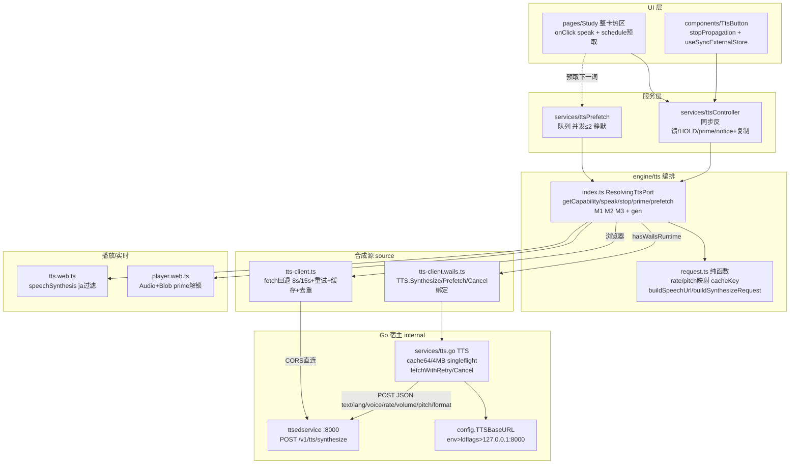

# TTS 发音架构与流程（当前工程实装）

> 基线：Wails v3（Go + WebView + React + Vite）。本文以代码为准，
> 覆盖 `frontend/src/engine/tts/*`、`frontend/src/services/tts*`、
> `frontend/src/components/TtsButton`、`frontend/src/pages/Study`、
> `internal/services/tts.go`、`internal/config/config.go`。
> 旧 Lynx 设计见 `docs/design/TTS-集成方案.md` 及其 `tts-sequence-diagram.mermaid`；
> 本文档描述**迁移后实际落地的 Wails 形态**（`tts.native.ts` / `player.native.ts` 已删除）。

## 1. 一句话链路

`Study 整卡 / TtsButton` → `services/ttsController.ts`（C1 单例，同步视觉反馈）
→ `engine/tts/index.ts:ResolvingTtsPort`（编排 + M1~M3）
→ 三通道：`source`（合成）/ `player`（播放）/ `realtime`（实时合成兜底）
→ `ttsedservice :8000`（`POST /v1/tts/synthesize`）。

## 2. 分层与职责

| 层 | 模块 | 职责 |
|---|---|---|
| UI | `pages/Study/index.tsx`、`components/TtsButton/index.tsx` | 整卡热区 `speak(kana)`；按钮 `stopPropagation()` 防一次点两次；`useSyncExternalStore` 订阅 `speakingText/notice/copyNotice`；切卡 `clearNotice()` + 预取下一词 |
| 服务 | `services/ttsController.ts` | 同步置 `speakingText`（≤100ms 有反馈）；手势内同步 `prime()`；`HOLD 500~1800ms`（每字符 150ms）清高亮；能力检测；失败写明确文案 + `fallbackText=kana` 复制兜底，零静默 |
| 服务 | `services/ttsPrefetch.ts` | 预取编排：队列 + 并发上限 2 + 失败静默（唯一静默例外），不阻塞点击 |
| 编排 | `engine/tts/index.ts:ResolvingTtsPort` | `getCapability/speak/stop/prime/prefetch`；M1~M3 互斥；`gen` 丢弃迟到响应；`player` 不可用直接跳过 HTTP |
| 参数 | `engine/tts/request.ts`（纯函数） | `buildSynthesisParams/cacheKey/buildSpeechUrl/buildSynthesizeRequest`；`lang` 恒 `ja-JP`；`rate/pitch` 映射；`volume` 恒 `+0%` 显式发送；`format=mp3` |
| 合成源 | `engine/tts/tts-client.wails.ts` | Wails 绑定适配：`TTS.Synthesize/Prefetch/Cancel`；空文本短路；`gen` 同步；`stale-gen` 丢弃；Go reason → 前端判别联合；`base64→bytes` |
| 合成源 | `engine/tts/tts-client.ts` | 浏览器回退：`fetch` 直连（仅非宿主调试用） |
| 宿主 | `internal/services/tts.go:TTS` | `Synthesize/Prefetch/Cancel`；LRU `64条/4MB`；`singleflight` 去重；`fetchWithRetry`（用户 8s / 预取 15s；400 不重试；503 去 voice 重试 1 次 + 300ms 退避） |
| 配置 | `internal/config/config.go` | `env NIJAPL_TTS_BASE_URL > 构建期 ldflags > 默认 http://127.0.0.1:8000`；前端 `constants/tts.ts:TTS_BASE_URL` 仅服务回退路径 |
| 播放 | `engine/tts/player.web.ts`（+ `player.ts` facade） | DOM `Audio` + Blob URL；`prime()` 放静音 wav 解锁；`NotAllowed→blocked`；探测不到返回 `null` 回落实时合成 |
| 实时 | `engine/tts/tts.web.ts` | `speechSynthesis` + `ja` 前缀过滤 + `voiceschanged 800ms` 兜底；永不 throw |

下沉 Go 的原因：桌面 WebView 同样执行同源策略，`wails://` 页面直连
`http://127.0.0.1:8000` 会被 CORS 拦截；超时 / 重试 / 缓存 / 去重 / 取消是 Go 强项，
且可用 `context` 真中断。前端降级链与 M1~M3 完全不变，只是数据源换成绑定调用。

装配（`index.ts:createTtsSource`）：

```ts
hasWailsRuntime() ? createTtsWailsClient() : createTtsHttpClient()
createAudioPlayer() // 仅 probe(createWebAudioPlayer)
detectRealtimePort() // 仅 probe(createWebTts)，否则 Unsupported
```

## 3. 参数契约（不得漂移）

- 请求：`POST {base}/v1/tts/synthesize`，JSON
  `text/lang/rate/volume/pitch/format[/voice]`。
- `lang` 恒 `ja-JP`（省略会落服务端中文兜底音色 H4）。
- `rate`：`StudySettings.rate 0.5~1.5 → -50%~+50%`（1.0 → `+0%`）；`pitch` 同理（单位 `Hz`）。
- `volume` 恒 `+0%` 且**显式发送**（对齐服务端缓存 key 第 4 段）。
- `voice` 默认 `ja-JP-NanamiNeural`；置 `''` 则只传 `lang`；服务端不校验音色，
  上游不识别时 503 → Go 重试时去掉 `voice`。
- 客户端 `cacheKey = [format\0voice\0rate\0volume\0pitch\0text]`（超长文本缩短），
  与服务端 `sha256` 同序同字段。
- 裸流备选 `GET /v1/tts/speech` 必须经 `URLSearchParams` 编码
 （`+→%2B、%→%25`），裸拼接漏编码即 400（H13）；JSON body 内 `+0%` 原样写。
- 错误映射：Go `400→bad-request / 503→unavailable / 504,408→timeout / 其余 error`；
  前端 `mapSourceFailure`：`bad-request→service-rejected`，
  `network/timeout/unavailable→service-unavailable`。
- 最终 `reason` 优先保留实时合成更具体的原因（`no-ja-voice/blocked`）。

## 4. 运行时序（A / P / B / C / D）

- **A 主链路**：tap → `speak(kana)` 同步反馈 + `prime()` → `getCapability()=supported`
  → M1 `realtime.stop()` → `synthesize(params,gen)`（Go：空短路→缓存→去重→POST）
  → `gen` 校验 → `player.play(clip)` → `engine:http`。
- **P 预取**：切卡 `schedule(下一词)` → 并发≤2 → `Prefetch`（Go goroutine 15s）→ 命中写缓存；
  失败静默、无文案。
- **B 降级**：`synthesize` 报 `network/timeout/unavailable` → M2 `player.stop()`
  → `realtime.speak()`（`speechSynthesis`）→ 成功则透传；全败则
  `serviceDown + fallbackText=kana` 复制假名。
- **C 无能力**：`player` 与 `realtime` 均 `unsupported` → 跳过 HTTP（不浪费往返）→
  `no-player` 文案 + 复制。
- **D 全停**：`stop()` → `gen++` + `source.cancel()`（断连接）+ `player.stop()` +
  `realtime.stop()`，三条缺一即可能留残声。
- 空文本：不发请求，直接 `empty-text` 走降级（避免必 400）。

## 5. 架构图



## 6. 流程图


## 7. 实测（`192.168.0.137:8000`，2026-09-12）

- `GET /v1/tts/languages` → 200，含 `ja-JP-NanamiNeural`。
- `POST /v1/tts/synthesize {"text":"ねこ","lang":"ja-JP","format":"mp3"}` → 200，返回 base64 `audio`。
- `GET /v1/tts/speech?text=ねこ&lang=ja-JP&format=mp3` → 200 `audio/mpeg` 8784 字节，
  `X-Tts-Voice: ja-JP-NanamiNeural`，本地校验为有效 MP3。
- `/`、`/health` 等 404 属正常，该服务只有 `/v1/tts/*` 契约接口。

完整 curl（默认 JSON 链路）：

```bash
# 合成并存成可播放 mp3
curl -s -m 15 -X POST http://192.168.0.137:8000/v1/tts/synthesize \
  -H 'Content-Type: application/json' \
  -d '{"text":"ねこ","lang":"ja-JP","voice":"ja-JP-NanamiNeural","rate":"+0%","pitch":"+0Hz","format":"mp3"}' \
  | python3 -c "import sys,json; d=json.load(sys.stdin); open('/tmp/neko.mp3','wb').write(__import__('base64').b64decode(d['audio'])); print('voice=',d.get('voice'),'cached=',d.get('cached'),'content_type=',d.get('content_type'))"
ls -l /tmp/neko.mp3 && file /tmp/neko.mp3

# 裸流备选（同等价，200 audio/mpeg）
curl -s -m 15 -D - -o /tmp/neko2.mp3 \
  "http://192.168.0.137:8000/v1/tts/speech?text=%E3%81%AD%E3%81%93&lang=ja-JP&format=mp3" \
  | grep -iE '^HTTP|content-type|x-tts'
ls -l /tmp/neko2.mp3 && file /tmp/neko2.mp3
```

## 8. 红线（摘录，勿违反）

- 页面 / store / service 只 import `engine/tts/index.js`；`tts-client/request/audio-cache/inflight/player*` 为 engine 内部文件。
- 端口永不 throw；无 TTS 能力必须给明确文案 + 复制假名，不得静默失败（预取是唯一静默例外）。
- 朗读文本恒取调用方传入的 `word.kana` / `sentence.ja`；`request.ts` 不截断不替换。
- 业务代码禁止出现 IP/域名字面量；地址唯一真相：Go `config.TTSBaseURL()`，前端常量仅回退路径。
- `stopPropagation()`（`TtsButton` / `WordCard-reveal`）不得删除，否则一次点击发音两次。
- M1~M3 与 `gen` 不得省略；`player` / `realtime` 禁止交叉调用对方 `stop()`。
