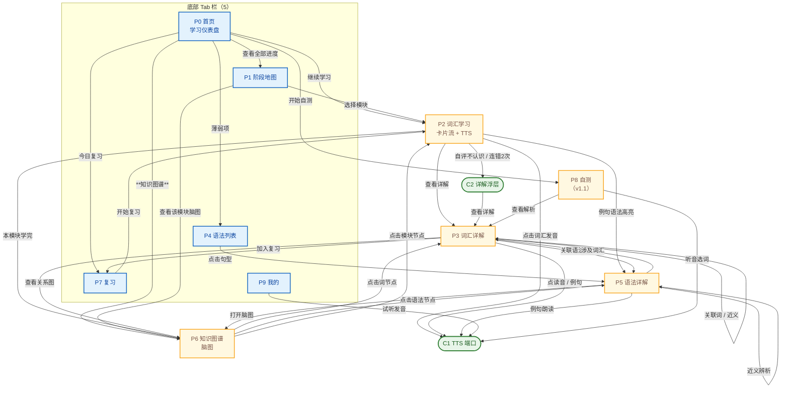
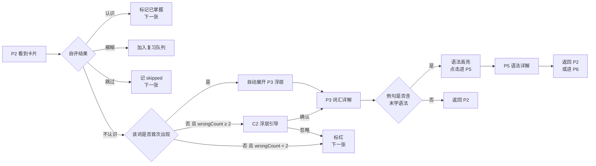
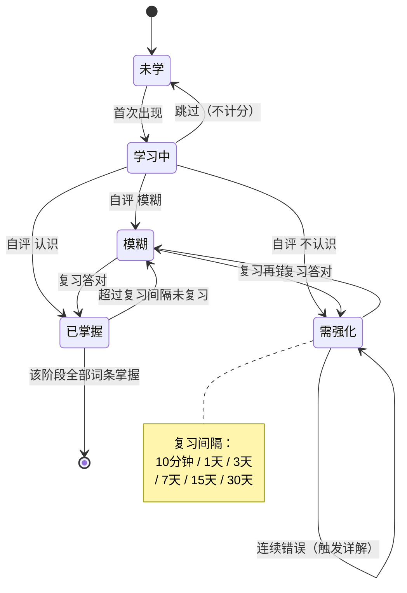
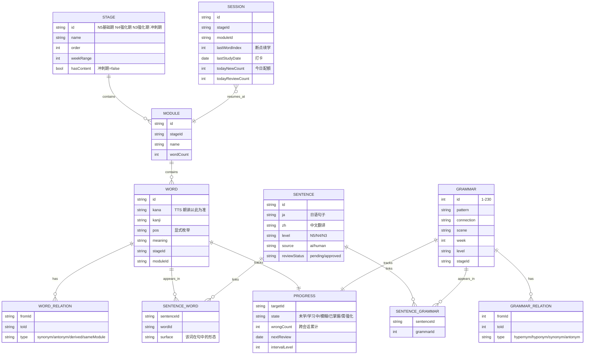

# JLPT N3 词汇学习 App（Lynx 跨平台）· 页面规划说明书

> 角色：产品经理 ｜ 版本：**v1.1（Lynx 修订版）** ｜ 日期：2026-09-10
> 前序版本：v1.0（H5/Vite 版，见 `docs/H5-词汇学习应用-页面规划.md`）
> 评审依据：`docs/reviews/2026-09-10-H5页面规划-评审报告.md`
> 技术依据：Lynx 官方文档（`lynxjs.org/next/llms.txt` / `llms-full.txt`）

---

## 零、v1.1 修订说明

### 0.1 三条已拍板决策

| # | 决策 | 影响范围 |
|---|------|---------|
| D1 | **运行时 = Lynx 跨平台**，同一套代码可打包为原生 App 与 **H5**（Lynx for Web） | 推翻 v1.0 §十 §十一 全部技术选型 |
| D2 | **例句数据 = 自建 + AI 生成** | 新增数据工程章节与 `SENTENCE` 实体 |
| D3 | **v1.0 保留 P6 三视图 + P4 语法 Tab** | 工期重估，P6 交互方案重做 |

### 0.2 v1.0 问题处置对照

| v1.0 问题 | 严重度 | v1.1 处置 |
|-----------|--------|-----------|
| 技术栈写 React18+Vite+Web，与 Lynx 仓库冲突 | P0 | 见 §十一，全章重写为 Lynx 方案 |
| 引用的 4 个数据源文件在仓库中不存在 | P0 | §二 显式标注数据交付状态与责任人；未到位前以"待生成"占位 |
| 无例句数据、无 `SENTENCE` 实体 | P0 | §二·§二.3 例句数据工程方案；§八 新增 SENTENCE 实体 |
| 微信内置浏览器 TTS 失效、训读/音读不可实现 | P0 | §十 平台抽象 + 改为"按假名朗读" |
| P6 无 Tab、站点图缺 P0→P6 边 | P1 | §三 P6 升为 Tab；§四 补边 |
| 阶段数 3 vs 4 不自洽、冲刺期算 NaN | P1 | §八 STAGE 增 `hasContent/reviewOnly`；§六 定义算法 |
| 状态术语 需强化/需复习 混用；"四态"列 5 个 | P1 | §六 §七 统一为五态，术语表见 §七.2 |
| 断点续学/打卡/配额 无模型 | P1 | §八 新增 SESSION / STREAK / QUOTA |
| MD 与 HTML 双版本不一致 | P2 | **本文档为唯一事实源**；HTML 版标注为"v1.0 展示稿，已过期" |
| 周次 20 组 vs 26 周 | P2 | §二.2 定义为「语法分段 20 组」叠在「备考 26 周」之上，待数据确认 |
| 验收 200ms 出声 | P2 | §十三 改为可控指标 |
| v1.0「2 周」工期失真 | P2 | §十二 重排为 4 个里程碑 |

---

## 一、需求 → 功能映射

| # | 原始需求 | 产品解读 | 承担页面 | MVP |
|---|---------|---------|---------|-----|
| 1 | 词汇学习功能 | 按「阶段 → 模块 → 词条」三级组织，卡片式学习 + SRS 复习 | P1 阶段地图、P2 词汇学习、P7 复习 | ✅ |
| 2 | 点击词汇可以发音 | 全局 TTS 能力，点词/点句即读，日语 | `tts` 端口 + P2/P3/P5/P8 | ✅ |
| 3 | 按规划阶段看学习进度 | 三阶段进度可视化（阶段 → 模块 → 词条） | P0 首页、P1 阶段地图 | ✅ |
| 4 | 词汇/语法可详解，适时跳转 | 详解页 + **跳转时机规则引擎**，而非用户自己找 | P3 词汇详解、P5 语法详解、C2 浮层、`jumpRules` | ✅ |
| 5 | 脑图呈现关联知识点 | 知识图谱页，三视图 + 节点可点跳转 | **P6 知识图谱（Tab）** | ✅ |

---

## 二、数据基础

### 2.1 现状与交付状态

| 数据 | 规模 | 字段 | 交付状态 |
|------|------|------|---------|
| 词条 | 992 | 假名 / 汉字 / 词性 / 阶段 / 模块 / 中文 | ⚠️ **源文件未入库，待补** |
| 阶段 | 3（含词）+ 1（冲刺期，无新词） | — | ⚠️ 需显式映射 |
| 模块 | 41 | 13 + 14 + 14 | ⚠️ 待补 |
| 语法句型 | 230 | 句型 / 接续 / 场景 / 周次 / 层级 | ⚠️ **源文件未入库，待补** |
| **例句** | 约 1,700–2,600 | 日语 / 中文 / 涉及词 / 涉及语法 / 难度 | 🔴 **无来源，按 D2 自建 + AI 生成** |

> ⚠️ **数据是当前唯一的一号风险**。v1.0 表格里的规模数字来自未入库的源文件，**在源文件补齐前，所有规模数字都应视为待验证**。
> **行动**：把 `JLPT-N3-词汇总表-Anki.csv`、三阶段词汇表、语法句型总表、备考计划四份文件先入库到 `data/source/`，作为构建期输入与版本基线。

### 2.2 阶段口径（修正 v1.0 的 3 vs 4 矛盾）

以「备考计划」（基础期 / 强化期 / 冲刺期）为准，**渲染 4 个阶段节点**，其中第 4 个为纯复习：

| 阶段节点 | 对应词汇阶段 | 含新词 | 说明 |
|---------|-------------|-------|------|
| N5 · 基础期 | 第一阶段 | ✅ 424 | |
| N4 · 强化期（前） | 第二阶段 | ✅ 274 | |
| N3 · 强化期（后） | 第三阶段 | ✅ 294 | |
| 冲刺期 | — | ❌ 0 | 第 23–26 周，纯复习 + 模考 |

**关键修正**：STAGE 增加布尔字段 `hasContent`。凡涉及"完成度"的计算，`hasContent === false` 时**短路为不参与**（避免 0/0 = NaN）；解锁规则改为 **「上一含词阶段完成度 ≥ 80%」**。

### 2.3 例句数据工程方案（D2 落地）

例句是本产品的**内容底座** —— 需求 2/4/5 全部依赖它。方案如下：

**产出规模**：992 词 × 1–2 句 + 230 句型 × 2–3 句 ≈ **1,700–2,600 句**

**流水线（离线批处理，不进端内）**

```
data/source/*.csv|md
   ↓ ① 抽取目标（词条 / 句型）
   ↓ ② 提示词构造（含难度约束 N5→N3、词性、目标语法点）
   ↓ ③ LLM 批量生成（日语例句 + 中文翻译 + 标注涉及的语法点）
   ↓ ④ 机器校验（见下）
   ↓ ⑤ 人工抽检（≥10%）
   ↓ data/build/sentences.jsonl  → 构建期打进 bundle
```

**机器校验（自动门槛，任一不过即回炉）**

| 校验项 | 规则 |
|-------|------|
| 含目标 | 例句必须包含目标词（或其活用形）或目标句型 |
| 形态正确 | 动词活用与词性一致；サ变/一段/五段需分别校验 |
| 难度 | 汉字与语法不得超出该阶段层级（N5 例句不得用 N3 语法） |
| 标注完整 | 涉及的语法点必须在 `grammarIds` 中，且该语法点已在句型总表中存在 |
| 去重 | 与已有例句相似度超阈值即丢弃 |

**质量门槛**：人工抽检 10%，语法错误率 **< 2%** 方可入库；文体统一为**敬体（です/ます）**，避免口语/书面语混用。

> 备注：AI 生成的例句**不标注为"权威数据"**，端内不做低权限提示，但需保留 `source: ai|human` 与 `reviewStatus` 字段，便于后续逐步替换为人工精选例句。

---

## 三、页面清单（IA）

| ID | 页面 | 类型 | 一句话定位 |
|----|------|------|-----------|
| **P0** | 首页 · 学习仪表盘 | Tab | 今天学什么、学到哪了、还差多少 |
| **P1** | 阶段地图 | Tab | 全局进度树：阶段 → 模块 → 词条 |
| **P2** | 词汇学习 | 二级 | 卡片流，点词发音，三档自评 |
| **P3** | 词汇详解 | 二级 | 单词全档案 + 例句 + 关联跳转 |
| **P4** | 语法列表 | Tab | 230 句型按周次/层级检索 |
| **P5** | 语法详解 | 二级 | 句型接续 + 场景 + 辨析 + 关联 |
| **P6** | 知识图谱 | **Tab**（v1.0 为二级，本次升级） | 脑图/关系图，节点可点跳转 |
| **P7** | 复习 | Tab | 今日待复习 + 错词本 |
| **P8** | 自测 | 二级 | 日→中 / 中→日 / 听音选词 |
| **P9** | 我的 | Tab | 发音设置、目标、统计、数据导出 |
| **C1** | 全局 TTS 播放器 | 组件 | 单例语音端口，跨页调用 |
| **C2** | 详解跳转浮层 | 组件 | 「查看详解」半屏引导 |

**底部 Tab 定为 5 个：首页 / 阶段 / 语法 / 复习 / 我的**，**P6 图谱采用首页显性卡片入口 + 各页按钮入口**（Tab 位已满，不再挤占；但绝不再依赖"长按"这种隐藏手势）。

> 说明：v1.0 把需求 5（脑图）的唯一入口设计成"长按模块"，是本次 IA 最大的可发现性缺陷。v1.1 明确 P6 必须有一个**可见、可文案描述**的入口。

---

## 四、页面关系总图（站点地图）



**关系要点**

- **P2 是流量枢纽**：首页、阶段地图、复习三条主路径都汇入它。
- **P3 / P5 是知识沉淀层**：出口是 P6（图谱）或回到 P2。
- **P6 是连接器**：不产生新内容，横向串起 P2 / P3 / P5，是需求 5 的落点；本次已补 **P0→P6** 与 **P1→P6** 两条显性入口。
- **C1 横切所有页面**：发音不是某一页的功能，而是全局能力。

---

## 五、跳转触发规则（需求 4 的"适当时候"）



**规则表（落地为 `jumpRules.ts` 配置）**

| 触发时机 | 条件 | 动作 | 目标 |
|---------|------|------|------|
| 首次遇词 | `word.seen === false` 且自评「不认识」 | 自动展开详解浮层 | P3 |
| 连续答错 | `word.wrongCount >= 2`（**按会话累计，见 §七.3**） | 弹「要不要看看详解」 | P3（确认后） |
| 例句含生语法 | `grammar.learned === false` | 语法高亮 + 下划线 | P5（点击后） |
| 模块学完 | `learned / total === 1` 且 `total > 0` | 弹「本模块知识脑图」 | P6 |
| 词性为动词 | `pos ∈ POS_VERB`（**显式枚举，见下**） | 详解页附「变形表」 | P3 内锚点 |
| 存在关联词 | `word.related.length > 0` | 详解页显示关联 chips | P3 → P3 |

> **修正（v1.0 缺陷）**：
> 1. 词性判定不再用 `pos ∈ {五, 一, サ, 不}` 这种单字匹配（原文若写「動詞」「五段動詞」都会漏判/误判），改为**显式枚举映射表** `POS_VERB = ['五段動詞','一段動詞','サ変動詞','カ変動詞','不規則動詞']`，并配单元测试。
> 2. 补「跳过」分支，并定义其状态（见 §七）。
> 3. `wrongCount` 明确为**按会话内累计**，跨会话从 `PROGRESS.wrongCount` 读取。

---

## 六、核心页面设计要点

### P0 首页 · 学习仪表盘
- 顶部：今日日期 + 连续打卡 N 天 + 今日目标进度环（如 24/40 词）
- 继续学习卡：读 **SESSION** 快照（阶段/模块/第 N 词）→ 一键续学
- 阶段进度条：4 段横向（含冲刺期，标注"纯复习"），点击进 P1
- 今日任务：新学 20 + 复习 35 + 语法 2，各自可点直达
- 薄弱预警：错词 ≥3 次的 TOP5，点进 P7
- **知识图谱入口**：显性卡片（本次新增，修复可发现性问题）

### P1 阶段地图
- 树形：**4 阶段** → 41 模块 → 词条数
- **节点五态**（v1.0 误写为"四态"）：🔒 未解锁 ／ ⬜ 未学 ／ 🟡 学习中 ／ ✅ 已掌握 ／ 🔴 需强化
- 解锁规则：**上一含词阶段**完成度 ≥ 80% 才解锁下一阶段（P9 可关）
- 冲刺期节点：`hasContent=false`，完成度不参与计算，文案「冲刺期 · 纯复习」
- 模块长按 → 进 P6 看该模块脑图（保留，但不再是唯一入口）

### P2 词汇学习（核心页）
- 卡片正面：假名超大字 + 汉字 + 词性徽章
- **点击卡片任意位置 → 发音**（整卡热区）
- 卡片背面：中文释义 + 例句（整句可点朗读）
- 三档按钮：不认识（红）／ 模糊（黄）／ 认识（绿）；**左右滑翻页，跳过 = 左滑**
- 顶部：模块名 + 进度 12/27 + 发音开关 + 退出
- 手势：上滑看详解、双击发音

### P3 词汇详解
读音与汉字 → 词性与活用（动词给变形表）→ 中文释义 → **例句（TTS + 语法高亮）** → 关联语法 chips → P5 → 关联词 chips → 自身/P6 → 记忆状态时间线

### P5 语法详解
句型大字 → 接续规则 → 场景标签 → **例句（TTS）** → 近义句型辨析表（P5 互跳）→ 涉及词汇 → P3 → 掌握度自评

### P6 知识图谱（需求 5）

三种视图：

| 视图 | 内容 | 入口 |
|------|------|------|
| 全景脑图 | 4 阶段 → 41 模块 折叠展开 | P0 卡片、P1 模块长按 |
| 词条局部图 | 中心词 → 近义/反义/同模块/派生/相关语法 | P3「查看关系图」 |
| 语法关系图 | 句型 → 上位/下位/近义/对立 | P5「打开脑图」 |

**⚠️ Lynx 落地约束（本次评审的重大技术修正）**

Lynx 的 `<svg>` 是**静态渲染**：整个 SVG 以字符串传入、在后台线程解析、作为**单个 native view** 渲染，共支持 17 个标签 / 40+ 属性，**没有 SVG 子节点事件**。因此 **v1.0 的「mermaid.js 渲染 + SVG 节点可点 + 双指缩放」在 Lynx 上无法实现**。替代方案：

| 需求 | Lynx 方案 |
|------|----------|
| 画边/连线 | `<svg content={svgString}>` 作**背景层**（静态，性能好） |
| 节点可点 | 节点用**绝对定位的 `<view>`** 叠在 SVG 上层，`bindtap` / `bindlongpress` |
| 双指缩放 | 外层容器 `transform: scale()` + 手势处理（`'main thread'` 主线程脚本保证跟手） |
| 聚焦高亮 | 选中节点时重算 SVG 字符串（换颜色）+ 其余节点降透明度 |
| 布局算法 | 预计算（构建期）或运行期轻量力导向（**不依赖 DOM**），坐标写进节点定位 |

> 明确**移除 mermaid.js 依赖**：它依赖浏览器 DOM，在原生端不可用，且体积大。
> 交互指标相应下调（见 §十三）：不再承诺"自由度极高的画布"，而是"可缩放、可点、可聚焦"。

---

## 七、词条状态机（SRS）

### 7.1 状态流转



> **修正（v1.0 缺陷）**：
> 1. v1.0 写 `已掌握 --> [*]: 全部阶段完成` —— 一个词只属于一个阶段，语义错误；改为「**该阶段全部词条掌握**」。
> 2. 新增 `学习中 --> 未学: 跳过`，把 P2 的"左滑跳过"手势纳入状态机（v1.0 有手势无状态）。

### 7.2 术语表（统一口径）

| 状态 | 含义 | 判定 |
|------|------|------|
| 未学 | 从未出现 | 初始态 |
| 学习中 | 首次出现后 | 首次作答 |
| 模糊 | 自评"模糊"或复习答错 | `wrongCount < 2` |
| 需强化 | 自评"不认识"或连续错 ≥2 | `wrongCount >= 2` |
| 已掌握 | 自评"认识"或复习答对 | 进入长间隔 |

> **统一说明**：全部界面文案与代码标识一律使用「**需强化**」；v1.0 在 P1 里写的「需复习」全部替换。

### 7.3 会话口径

- `wrongCount` 说明为**会话内累计**；跨会话累计值存于 `PROGRESS.wrongCount`。
- 「不认识」首次触发详解只针对 `word.seen === false`，会话内重复不再打断。

---

## 八、数据模型



**本次新增/修正的实体与字段**

| 变更 | 说明 |
|------|------|
| ➕ `SENTENCE` + `SENTENCE_WORD` + `SENTENCE_GRAMMAR` | 补上 v1.0 缺失的**例句底座**，让"例句语法高亮"「WORD ↔ GRAMMAR 经例句关联」真正可计算 |
| ➕ `SESSION` | 支撑断点续学、连续打卡、今日配额（v1.0 三处功能无模型） |
| ➕ `STAGE.hasContent` | 修复冲刺期 0/0 = NaN |
| ➕ `WORD.stageId`、`GRAMMAR.level`、`GRAMMAR.stageId` | 对齐 v1.0 两版不一致的字段（HTML 版曾缺 `stageId` / `level`） |
| ➕ `WORD.kana` 明确为 TTS 朗读依据 | 见 §十：用假名朗读，从根上避免汉字误读 |
| ➕ `WORD_RELATION.type` / `GRAMMAR_RELATION.type` | v1.0 有关系表但无关系类型 |

---

## 九、发音方案（需求 2）

### 9.1 平台抽象

发音在 Lynx 中**没有内置能力**（官方文档无 TTS / 无 `<audio>` 元素，`<video>` 仍为实验性），因此必须做**端口抽象**：

```
src/engine/tts/
  index.ts        # speak(text, opts) / stop() / getVoices() —— 统一端口
  tts.native.ts   # 原生实现：调用 NativeModule「TTSEngine」
  tts.web.ts      # Web/H5 实现：speechSynthesis
```

| 平台 | 实现 | 说明 |
|------|------|------|
| iOS | Native Module → `AVSpeechSynthesizer`，`AVSpeechSynthesisVoice(language: "ja-JP")` | 系统自带 Kyoko 等日语音色 |
| Android | Native Module → `android.speech.tts.TextToSpeech`，`Locale.JAPANESE` | 依赖系统日语语音包 |
| HarmonyOS | Native Module → 系统 TTS | 同上 |
| **H5（Lynx for Web）** | `speechSynthesis` + `lang="ja-JP"` | 需检测存在性（见下） |
| 降级 | 预置音频 mp3 → **同样走 Native Module 播放器**（Lynx 无 `<audio>`） | 保证"点了有声音" |

### 9.2 关键修正

1. **朗读文本用 `kana` 而不是 `kanji`**：v1.0 的「训读/音读切换」在 TTS 层根本不支持（引擎无法被指令指定读音），且数据只有一列假名。v1.1 直接**以假名朗读**，既消除歧义又免去数据缺口。P9 移除「读音选择」配置项。
2. **H5 端必须做能力检测**：`speechSynthesis` 在**微信内置浏览器**中普遍不可用。检测失败时：
   - 不静默失败，展示明确提示「当前浏览器不支持语音，建议用 App 端或系统浏览器打开」
   - 提供「复制假名」等替代动作
3. **iOS 首次调用必须在用户手势内**：首屏做一次静音解锁；P9 提供「试听」按钮。
4. **音色选择**：不硬编码 `Google 日本語 / Otoya / Kyoko` 名单（跨平台不一致），改为**按语言前缀 `ja` 过滤 + `voiceschanged` 事件兜底**。

### 9.3 可配置项（P9）

语速 0.5–1.5、音调、卡片出现即读（自动播放）。~~读音选择（训读/音读）~~ ← 已移除。

---

## 十、技术方案（Lynx 版）

### 10.1 选型

| 项 | 选型 | 理由 |
|----|------|------|
| 框架 | **ReactLynx（`@lynx-js/react`）+ Rspeedy + TypeScript** | 与仓库现状一致；一套代码出 iOS/Android/H5 |
| 目标平台 | 原生（iOS/Android/HarmonyOS）+ **Lynx for Web（H5）** | 决策 D1 |
| 状态 | Zustand（**vanilla store**，不启用 persist 中间件） | 框架无关；persist 依赖 localStorage，在 Lynx 不可用 |
| 存储 | **`StoragePort` 端口**：原生 → Native Module；H5 → 宿主页面桥接 | Lynx 无 localStorage；官方持久化示例即 Native Module |
| 路由 | `react-router`（Lynx 官方集成） | 10+ 页面需要；Tab 用路由状态切换 |
| 长列表 | **`<list>`** | 992 词 / 230 语法检索列表的性能保障 |
| 卡片流 | **`<viewpager>` + `<viewpager-item>`** | 原生横向翻页，天然承接"左右滑" |
| 浮层 | **`position: fixed`** | 官方明确：纯 Lynx 页面不用 `<overlay>`，用 fixed |
| 图谱 | **`<svg>`（静态边）+ 绝对定位 `<view>`（可点节点）+ `transform: scale()`** | 见 §六 P6；**不使用 mermaid.js** |
| 动画 | `@lynx-js/motion` + `'main thread'` 主线程脚本 | 手势跟手 |
| 发音 | `tts` 端口 → Native Module / `speechSynthesis` | 见 §九 |
| 数据 | 构建期 CSV/MD → JSON 打进 bundle | 992 词 + 例句全量离线，无后端 |
| 离线 | 原生：bundle 内置；H5：宿主 web 工程侧加 Service Worker | |

### 10.2 目录结构

```
src/
  data/                 # 构建产物：words.json / grammar.json / sentences.json / stages.json
  engine/
    tts/                # C1：index.ts + tts.native.ts + tts.web.ts
    storage/            # StoragePort：storage.native.ts + storage.web.ts
    srs.ts              # 间隔重复调度
    jumpRules.ts        # 需求 4 跳转规则
    progress.ts         # 阶段/模块/词条 三级进度
    graph/              # P6：layout.ts（坐标计算）+ svg.ts（生成 SVG 字符串）
  native/
    TTSEngine/          # iOS / Android / HarmonyOS 原生实现
    LynxStorage/        # SharedPreferences / NSUserDefaults 实现
  pages/
    Home/ StageMap/ Study/ VocabDetail/
    Grammar/ GrammarDetail/ Graph/ Review/ Quiz/ Me/
  components/
    WordCard/ TtsButton/ DetailSheet/ GraphCanvas/ ProgressRing/
  store/                # Zustand vanilla store + 持久化适配
scripts/
  gen-sentences/        # §二.3 例句生成流水线（离线）
data/
  source/               # 4 份源文件（入库基线）
  build/                # 生成产物
```

### 10.3 构建与发布

| 产物 | 命令 / 方式 |
|------|------------|
| 原生调试 | `npm run dev` → 终端二维码 → LynxExplorer 扫码 |
| 原生生产 | `npm run build` → bundle 交宿主 App 集成（autolink 装原生模块） |
| **H5** | Lynx for Web：`@lynx-js/web-core` 产出 web 产物，宿主 Rsbuild 工程加载（`fetchBundle`）→ 静态托管 |
| 质量 | `npm run check`（Biome check --write）/ `npm run format` / `pluginTypeCheck` |

---

## 十一、MVP 范围与迭代

| 里程碑 | 内容 | 交付物 |
|--------|------|-------|
| **M1 · 数据地基** | 4 份源文件入库；例句生成流水线跑通；`SENTENCE` 数据产出并通过抽检；`words/grammar/sentences/stages.json` 构建可用 | 可校验的数据集 |
| **M2 · 学习主链路** | P0 / P1 / P2 / P3 / P7 + C1 + C2；`srs` / `jumpRules` / `progress` 三引擎；`tts` + `storage` 双端端口 | 能学、能听、进度准、跳转对 |
| **M3 · 语法与图谱** | P4 / P5 / P6（三视图）+ P8；`graph` 布局与交互 | 需求 5 完整 |
| **M4 · 打磨与验收** | P9 设置、H5 产物、微信/浏览器 TTS 降级路径、验收清单逐项过 | 可发布 v1.0 |

**v1.0 范围（本次决策 D3 确认保留）**：P0–P7 + P8 + P9 + P6 三视图 + C1 + C2，全量数据导入。
**明确不做**：社区、账号体系、云端同步、社交打卡。

> ⚠️ **工期提示**：v1.0 原写「2 周」，与范围严重不符 —— 10 个页面 + 4 个引擎 + 2 套原生模块（TTS/Storage）+ 3 种图谱视图 + 1 套数据生成流水线，**建议按里程碑推进，不要用 2 周挤兑现**。
> **建议的风险砍单顺序（如工期紧）**：① P6 语法关系图 → ② P6 全景脑图 → ③ P8 自测。**P6 词条局部图不建议砍**（价值最高、数据依赖最小）。

---

## 十二、验收标准

| 需求 | 验收点（可控指标） |
|------|------------------|
| 1 词汇学习 | 从首页 ≤3 次点击开始任一模块；三档自评后进度实时更新（单测覆盖 `progress`） |
| 2 点击发音 | 点击整卡热区 **≤100ms 内出现视觉反馈**；音频起播中位延迟：原生 ≤300ms、H5 视浏览器而定；**不支持 TTS 的环境给出明确提示**（不得静默失败） |
| 3 阶段进度 | 阶段/模块/词条三级完成度与本地数据一致（**误差 0，单测覆盖**）；冲刺期不参与计算且不报错 |
| 4 详解跳转 | 6 条 `jumpRules` 均有可复现用例；首次不认识 → 自动详解；连错 2 次 → 引导；例句语法可点进 P5 |
| 5 知识脑图 | 三视图在 992 词 + 2600 例句全量数据下**首屏 ≤1.5s**；节点点击跳转正确；缩放/聚焦可用；已掌握节点有视觉区分 |
| 6 数据质量 | AI 例句抽检错误率 **< 2%**；含目标词/语法校验通过率 100% |

---

## 附录 A：Web 方案 → Lynx 方案 对照

| v1.0（Web） | v1.1（Lynx） | 原因 |
|------------|-------------|------|
| React 18 + Vite | ReactLynx + Rspeedy | 仓库现状，一套代码多端 |
| localStorage | `StoragePort` → Native Module / 宿主桥接 | Lynx 无 localStorage |
| Zustand + persist | Zustand vanilla + 自定义适配 | persist 依赖 localStorage |
| mermaid.js | `<svg>` 静态边 + `<view>` 节点 | SVG 静态渲染、无 DOM |
| Web Speech API | `tts` 端口 → Native Module / speechSynthesis | 原生端无 Web API |
| PWA | 原生自带离线；H5 侧 Service Worker | |
| 双指缩放（浏览器） | `transform: scale()` + 主线程手势 | |

## 附录 B：待办数据清单（M1 阻塞项）

- [ ] `JLPT-N3-词汇总表-Anki.csv` 入库 → `data/source/`
- [ ] `JLPT-N3-第一/二/三阶段词汇表.md` 入库
- [ ] `JLPT-N3-语法句型总表.md` 入库
- [ ] `JLPT-N3-备考计划.md` 入库（用于校准 20 语法组 ↔ 26 周映射）
- [ ] 词性枚举与源数据实际取值核对（确定 `POS_VERB` 映射表）
- [ ] 例句生成流水线产出 + 10% 抽检

---

*本文档为唯一事实源。v1.0 的 `docs/H5-页面规划-可视化.html` 为历史展示稿，已过期，技术方案部分不再有效。*
